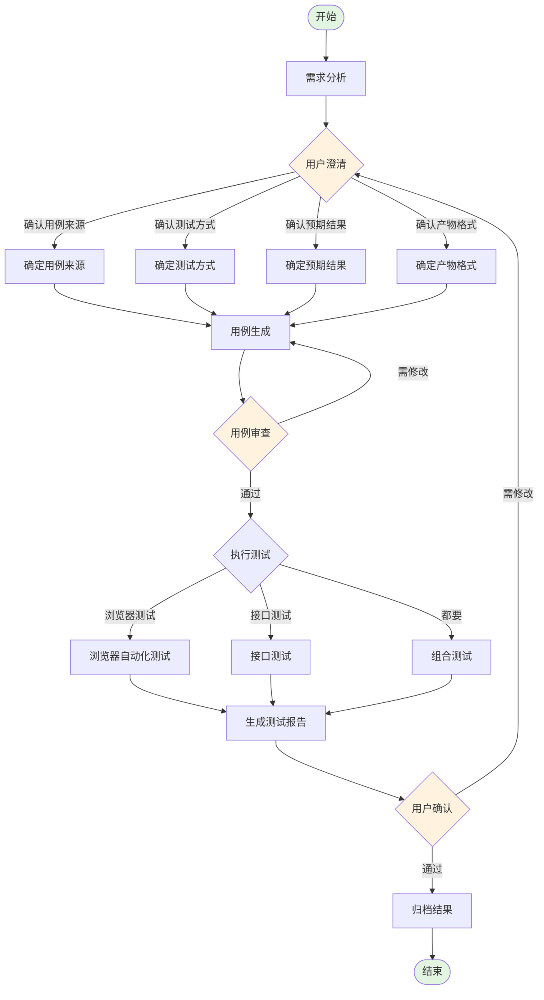

# 测试用例生成流程

## 变量说明

| 变量 | 说明 | 示例 |
|------|------|------|
| `$TASK_ID` | 任务ID | TASK-20260325-test |
| `$APPLICATION` | 应用名称 | trace |
| `$MODULE` | 模块名称 | 埋点探索 |
| `$RESULT_DIR` | 结果目录 | `.flou/test/$TASK_ID` |

## 流程概览



## 一、需求分析阶段

### 1.1 需求挖掘

**目的：** 理解用户的测试需求，挖掘潜在的测试点

**执行动作：**
1. 分析用户输入的测试需求
2. 识别测试目标（功能验证/性能测试/兼容性测试等）
3. 提取关键信息（URL、环境、数据等）

**输出问题清单：**

| 问题类型 | 问题内容 | 目的 |
|----------|----------|------|
| 用例来源 | 测试用例从哪里来？ | 确定用例获取方式 |
| 测试方式 | 需要接口测试还是浏览器测试？ | 确定测试执行方式 |
| 预期结果 | 测试通过的判断标准是什么？ | 确定验证条件 |
| 产物格式 | 需要什么样的测试报告？ | 确定输出格式 |

**门禁条件：**
- [ ] 已识别测试目标
- [ ] 已提取关键信息
- [ ] 已生成问题清单

---

## 二、用户澄清阶段

### 2.1 收集澄清信息

**目的：** 获取用户对测试用例的具体要求

**使用 AskUserQuestion 工具收集以下信息：**

#### 2.1.1 用例来源

```
问题：测试用例从哪里来？

选项：
[1] 手动描述（用户提供操作步骤）
[2] 探索发现（Agent 自动探索页面元素）
[3] 已有用例（从文件读取）
[4] 接口文档（从 BAM/API 文档获取）
```

#### 2.1.2 测试方式

```
问题：需要哪种测试方式？

选项：
[1] 接口测试（RPC/HTTP 接口验证）
[2] 浏览器测试（UI 自动化测试）
[3] 都要（接口 + 浏览器组合测试）
```

#### 2.1.3 预期结果

```
问题：测试通过的判断标准是什么？

选项：
[1] 操作成功（无报错、页面正常）
[2] 数据验证（数据库/接口返回正确）
[3] 截图验证（特定元素存在/正确显示）
[4] 自定义条件（用户描述具体条件）
```

#### 2.1.4 产物格式

```
问题：需要什么样的测试报告？

选项：
[1] 标准格式报告（默认，包含基本信息、测试结果、日志路径）
[2] 详细报告（包含每步截图、请求响应详情）
[3] 简洁报告（仅包含通过/失败状态）
[4] 自定义格式（用户指定模板）
```

### 2.2 确认澄清结果

**目的：** 确保收集的信息完整准确

**输出澄清摘要：**

```markdown
📋 测试用例确认

**用例来源**: <来源类型>
**测试方式**: <测试方式>
**预期结果**: <预期条件>
**产物格式**: <报告格式>

请确认以上信息是否正确？(y/n)
```

**门禁条件：**
- [ ] 用户已确认用例来源
- [ ] 用户已确认测试方式
- [ ] 用户已确认预期结果
- [ ] 用户已确认产物格式
- [ ] 用户已确认澄清摘要

---

## 三、用例生成阶段

### 3.1 根据来源生成用例

**目的：** 基于澄清信息生成具体的测试用例

**根据用例来源类型执行不同生成策略：**

#### 3.1.1 手动描述

**输入：** 用户提供的操作步骤描述

**生成动作：**
1. 解析用户描述的操作步骤
2. 转换为标准化的测试用例格式
3. 补充必要的验证点

**输出示例：**
```markdown
## 测试用例: <用例名称>

### 前置条件
- 已登录系统
- 环境配置: <环境>

### 测试步骤
| 序号 | 操作 | 定位方式 | 预期结果 |
|------|------|----------|----------|
| 1 | 打开页面 | navigate `<URL>` | 页面加载成功 |
| 2 | 点击按钮 | text="提交" | 触发提交 |
| 3 | 验证结果 | - | 显示成功提示 |

### 验证点
- [ ] 页面无报错
- [ ] 操作结果符合预期
```

#### 3.1.2 探索发现

**输入：** 目标 URL 和模块信息

**生成动作：**
1. 启动录制会话
2. 使用 agent-browser 探索页面元素
3. 识别可交互元素（按钮、输入框、链接等）
4. 生成元素定位方法

**执行命令：**
```bash
# 启动录制
flou-cli test record-req "<URL>" --task-id "$TASK_ID" --ignore-https-errors

# 连接浏览器
agent-browser --cdp 9222 navigate "<URL>"

# 获取页面快照
agent-browser --cdp 9222 snapshot -i

# 探索可交互元素
agent-browser --cdp 9222 eval "
const items = document.querySelectorAll('[data-popupid], button, a, input');
items.forEach((e, i) => console.log(i + ': ' + e.tagName + ' - ' + e.textContent.trim().substring(0, 30)));
"
```

**输出示例：**
```markdown
## 探索结果: <模块名称>

### 页面信息
- **URL**: <URL>
- **会话ID**: <SESSION_ID>

### 可交互元素
| 序号 | 类型 | 定位方式 | 文本/标识 |
|------|------|----------|-----------|
| 1 | button | text="用户输入" | 用户输入 |
| 2 | button | text="Query窗口" | Query窗口 |
| 3 | link | text="查看详情" | 查看详情 |

### 推荐测试路径
1. navigate `<URL>`
2. hover text="用户输入"
3. wait 1500
4. screenshot
```

#### 3.1.3 已有用例

**输入：** 用例文件路径

**生成动作：**
1. 读取用例文件
2. 解析用例格式
3. 转换为标准格式

**支持的用例格式：**
- Markdown 格式
- JSON 格式
- YAML 格式

#### 3.1.4 接口文档

**输入：** PSM 和方法名

**生成动作：**
1. 查询接口定义
2. 解析请求参数和响应结构
3. 生成测试用例

**执行命令：**
```bash
# 查询接口定义
flou-cli bam-api get --psm <PSM> --method <METHOD>
```

**输出示例：**
```markdown
## 接口测试用例: <方法名>

### 接口信息
- **PSM**: <PSM>
- **方法**: <METHOD>
- **请求类型**: Thrift/HTTP

### 请求参数
| 参数 | 类型 | 必填 | 说明 |
|------|------|------|------|
| param1 | string | 是 | 参数1说明 |
| param2 | int | 否 | 参数2说明 |

### 测试数据
```json
{
  "param1": "test_value",
  "param2": 123
}
```

### 预期响应
- **状态码**: 200
- **响应结构**: { "code": 0, "data": {...} }
```

### 3.2 保存用例文件

**文件路径：** `$RESULT_DIR/test_cases.md`

**门禁条件：**
- [ ] 测试用例已生成
- [ ] 用例格式符合标准
- [ ] 用例文件已保存

---

## 四、用例审查阶段

### 4.1 展示用例内容

**目的：** 让用户审查生成的测试用例

**输出内容：**
```markdown
📋 测试用例审查

**用例文件**: $RESULT_DIR/test_cases.md

### 用例列表
| 序号 | 用例名称 | 测试方式 | 验证点数量 |
|------|----------|----------|------------|
| 1 | <用例1> | 浏览器测试 | 3 |
| 2 | <用例2> | 接口测试 | 2 |

### 用例详情
<展示完整用例内容>

请审查以上测试用例：
```

### 4.2 收集审查反馈

**使用 AskUserQuestion 收集反馈：**

```
问题：测试用例是否通过审查？

选项：
[1] 通过，可以执行测试
[2] 需要修改用例内容
[3] 需要补充测试场景
[4] 需要调整验证点
```

### 4.3 处理审查结果

#### 4.3.1 审查通过

**动作：**
1. 记录审查通过时间
2. 进入测试执行阶段

#### 4.3.2 需要修改

**动作：**
1. 根据用户反馈修改用例
2. 重新展示修改后的用例
3. 再次收集审查反馈

**修改类型处理：**

| 反馈类型 | 处理方式 |
|----------|----------|
| 修改用例内容 | 更新操作步骤或定位方式 |
| 补充测试场景 | 添加新的测试用例 |
| 调整验证点 | 更新预期结果和验证条件 |

**门禁条件：**
- [ ] 用户已审查用例
- [ ] 用例审查通过
- [ ] 审查结果已记录

---

## 五、测试执行阶段

### 5.1 浏览器测试

**前置条件：**
- 用例审查已通过
- 测试 URL 已获取
- 环境配置已就绪

**执行流程：**

#### 5.1.1 启动录制会话

```bash
go run . test record-req "<URL>" \
  --task-id "$TASK_ID" \
  --application "$APPLICATION" \
  --domain-headers "<domain>:x-tt-env=<env>" \
  --ignore-https-errors \
  --record-response  # 如果需要录制响应体
```

#### 5.1.2 连接浏览器

```bash
agent-browser --cdp 9222 navigate "<URL>"
```

#### 5.1.3 执行测试操作

**元素定位优先级：**
1. `text` - 文本内容定位（推荐）
2. `role` - ARIA 角色定位
3. `label` - 标签定位
4. `testid` - 测试 ID 定位
5. ❌ 避免 `class` - 可能重复

**操作命令：**
```bash
# 点击元素
agent-browser --cdp 9222 find nth 0 "text=<文本>" click

# 输入文本
agent-browser --cdp 9222 find nth 0 "text=<文本>" type "<输入内容>"

# 悬停元素
agent-browser --cdp 9222 find nth 0 "text=<文本>" hover

# 等待
agent-browser --cdp 9222 wait 1500

# 截图
agent-browser --cdp 9222 screenshot
```

#### 5.1.4 验证结果

根据预期结果类型执行验证：
- **操作成功**：检查无报错、页面正常
- **数据验证**：检查接口返回、数据库记录
- **截图验证**：检查截图文件、元素存在

#### 5.1.5 结束录制

```bash
go run . test stop-record -s <SESSION_ID>
```

**门禁条件：**
- [ ] 所有测试操作已执行
- [ ] 预期结果已验证
- [ ] 录制会话已结束

---

### 5.2 接口测试

**前置条件：**
- 用例审查已通过
- 接口信息已获取（PSM、方法名、参数）
- 测试数据已准备

**执行流程：**

#### 5.2.1 获取接口信息

```bash
# 查询 PSM 信息
flou-cli psm-info <PSM>

# 查询接口定义
flou-cli bam-api get --psm <PSM> --method <METHOD>
```

#### 5.2.2 执行接口调用

```bash
# 使用 bam-query 执行接口测试
flou-cli bam-query --psm <PSM> --method <METHOD> --body '<JSON_BODY>'
```

#### 5.2.3 验证响应

- 检查响应状态码
- 检查响应体结构
- 检查业务逻辑正确性

**门禁条件：**
- [ ] 接口调用成功
- [ ] 响应符合预期
- [ ] 业务逻辑验证通过

---

### 5.3 组合测试

**执行顺序：**
1. 先执行接口测试（准备数据）
2. 再执行浏览器测试（验证 UI）
3. 最后执行接口测试（验证数据）

**门禁条件：**
- [ ] 接口测试通过
- [ ] 浏览器测试通过
- [ ] 数据一致性验证通过

---

## 六、报告生成阶段

### 6.1 标准报告格式

**文件路径：** `$RESULT_DIR/test_report.md`

```markdown
# 测试报告

## 基本信息
- **任务ID**: $TASK_ID
- **应用名称**: $APPLICATION
- **模块名称**: $MODULE
- **测试时间**: YYYY-MM-DD HH:MM:SS
- **测试耗时**: X分X秒
- **测试方式**: 浏览器测试/接口测试/组合测试

## 测试用例来源
- **来源类型**: 手动描述/探索发现/已有用例/接口文档
- **来源详情**: <具体描述>
- **审查状态**: 已通过

## 预期结果
- **预期类型**: 操作成功/数据验证/截图验证/自定义
- **预期条件**: <具体条件>

## 测试结果
- **测试状态**: 通过/失败
- **失败说明**: <仅失败时填写>

## 测试产物
- **用例文件**: $RESULT_DIR/test_cases.md
- **日志文件**: $RESULT_DIR/<session_id>.log
- **截图目录**: $RESULT_DIR/screenshots/
- **请求录制**: $RESULT_DIR/<session_id>.log

## 测试步骤
| 步骤 | 操作 | 结果 |
|------|------|------|
| 1 | <操作描述> | 通过/失败 |
| 2 | <操作描述> | 通过/失败 |
```

### 6.2 详细报告格式

在标准报告基础上增加：

```markdown
## 详细步骤记录

### 步骤 1: <操作名称>
- **操作命令**: <具体命令>
- **截图**: <截图路径>
- **请求**: <请求详情>
- **响应**: <响应详情>
- **耗时**: X秒

### 步骤 2: <操作名称>
...
```

### 6.3 简洁报告格式

```markdown
# 测试结果

- **任务ID**: $TASK_ID
- **测试状态**: ✅ 通过 / ❌ 失败
- **用例文件**: $RESULT_DIR/test_cases.md
- **日志路径**: $RESULT_DIR/<session_id>.log
```

**门禁条件：**
- [ ] 报告文件已生成
- [ ] 报告格式符合用户要求
- [ ] 所有必要信息已记录

---

## 七、用户确认阶段

### 7.1 展示测试结果

**目的：** 让用户确认测试结果是否符合预期

**输出内容：**
1. 测试报告摘要
2. 关键截图（如有）
3. 失败原因（如有）

### 7.2 收集用户反馈

```
问题：测试结果是否符合预期？

选项：
[1] 符合预期，可以归档
[2] 需要补充测试
[3] 需要修改测试用例
[4] 需要调整报告格式
```

**门禁条件：**
- [ ] 用户已确认测试结果

---

## 八、归档阶段

### 8.1 整理产物

**产物清单：**
- 测试用例（`test_cases.md`）
- 测试报告（`test_report.md`）
- 请求日志（`<session_id>.log`）
- 截图文件（`screenshots/*.png`）
- 探索结果（如有）

### 8.2 归档到记忆

```bash
flou-cli memory add "测试用例: $APPLICATION/$MODULE, 结果: 通过/失败, 路径: $RESULT_DIR" --tags "测试用例,$APPLICATION"
```

**门禁条件：**
- [ ] 所有产物已整理
- [ ] 记忆已归档

---

## 最佳实践

### 元素定位

1. **优先使用 text 定位**
   ```bash
   agent-browser find nth 0 "text=用户输入" hover
   ```

2. **避免使用 class 定位**（可能重复）

3. **动态元素处理**
   - 先用 `eval` 获取元素列表
   - 再用 `find` 定位具体元素

### 测试数据

1. 使用测试账号，避免污染生产数据
2. 测试完成后清理测试数据
3. 敏感数据不要记录到日志

### 错误处理

1. **元素定位失败**
   - 检查页面是否加载完成
   - 尝试等待后重试
   - 使用 `snapshot` 查看当前页面状态

2. **接口调用失败**
   - 检查 PSM 配置
   - 检查参数格式
   - 检查环境配置

---

## 故障排查

### 常见问题

| 问题 | 可能原因 | 解决方案 |
|------|----------|----------|
| 元素定位失败 | 页面未加载完成 | 增加 wait 时间 |
| 截图为空白 | 页面渲染未完成 | 等待后重新截图 |
| 接口超时 | 网络问题/服务问题 | 检查服务状态 |
| 录制日志为空 | 未触发请求 | 检查操作是否正确 |
| 用例审查不通过 | 用例覆盖不全 | 补充测试场景 |

### 调试命令

```bash
# 查看当前页面快照
agent-browser --cdp 9222 snapshot

# 查看浏览器日志
agent-browser --cdp 9222 eval "console.log(document.body.innerHTML)"

# 检查录制会话
go run . test list-sessions
```
