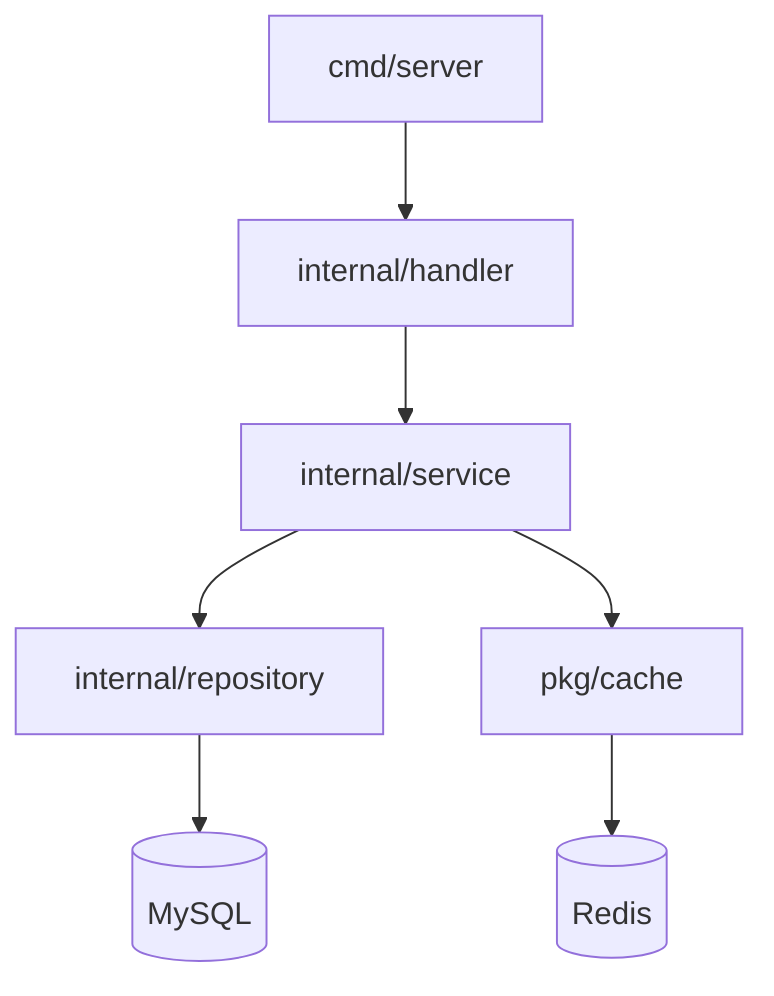

# Architecture Documentation Templates

## 1. architecture/overview.md — Repository Architecture Overview

| Field | Content |
|-------|---------|
| Purpose | Describe the repository's overall architecture, tech stack, and module dependencies |
| Sections | 1) Project Overview (≤3 sentences) 2) Tech Stack (table: Technology / Version / Purpose) 3) Repository Structure (directory tree with annotations) 4) Module Dependency Graph (Mermaid preferred) 5) Deployment Architecture (staging + production) 6) External Dependencies (service / purpose) |
| Content Guidelines | Overview must be concise — no more than 3 sentences. Tech stack table must include all major tools with accurate versions. Directory tree must have one-line annotations for every top-level directory. Module dependency graph should use Mermaid syntax for visual clarity. External dependencies must list both the service name and its purpose. |
| Quality Checks | Overview ≤ 3 sentences; Tech stack table is complete with all major tools; Every top-level directory is annotated in the repository structure; External dependencies are listed with service and purpose |

### Go Example — Tech Stack Table

| Technology | Version | Purpose |
|-----------|---------|---------|
| Go | 1.22+ | Primary language |
| Kitex | latest | RPC framework |
| Hertz | latest | HTTP framework |
| MySQL | 8.x | Primary database |
| Redis | 7.x | Caching layer |
| golangci-lint | latest | Lint tool |

### Go Example — Repository Structure

```
├── cmd/                   # Application entry points
│   └── server/            # Main HTTP/RPC server
├── internal/              # Private application code
│   ├── handler/           # Request handlers (HTTP/RPC)
│   ├── service/           # Business logic layer
│   ├── repository/        # Data access (MySQL + Redis)
│   └── model/             # Data models and DTOs
├── pkg/                   # Public library code (importable by external projects)
├── api/                   # IDL/API definition files
├── config/                # Configuration files and loading
├── scripts/               # Build and deployment scripts
├── .codebase/             # CI pipeline definitions
└── docs/                  # Architecture and development documentation
```

### Go Example — Module Dependency Graph



---

## 2. architecture/module-index.md — Module Index

| Field | Content |
|-------|---------|
| Purpose | Concise index of each module with responsibility and key file locations |
| Sections | 1) Module Overview (table: Module / Path / Responsibility / Key Files) 2) Module Details (for each module: responsibility statement, key files table, core execution paths, inter-module dependencies) |
| Content Guidelines | Module Overview table must list every module/sub-project in the repository. Each Module Details subsection must include a responsibility statement (1-2 sentences), a key files table (File / Responsibility), a description of core execution paths, and explicit inter-module dependencies. |
| Quality Checks | Every module is listed in the overview table; Key files table is consistent across overview and details; Core execution paths are described for each module; Inter-module dependencies are explicit and accurate |

### Module Overview Table Format

| Module | Path | Responsibility | Key Files |
|--------|------|---------------|-----------|
| ticket-service | internal/ticket/ | Ticket CRUD and routing | handler/ticket.go, service/routing.go, repository/mysql.go |
| user-service | internal/user/ | User authentication and profile | handler/user.go, service/auth.go |
| pkg/utils | pkg/utils/ | Shared utility functions | converter.go, validator.go |

### Module Details Subsection Format

#### ticket-service

**Responsibility**: Handles ticket lifecycle management, CRUD operations, and intelligent routing based on skill and availability.

**Key Files**:

| File | Responsibility |
|------|---------------|
| handler/ticket.go | HTTP/RPC request handlers for ticket operations |
| service/routing.go | Ticket routing algorithm and queue management |
| repository/mysql.go | MySQL data access for ticket persistence |
| repository/redis.go | Redis caching for ticket state |
| model/ticket.go | Ticket data model and DTOs |

**Core Execution Paths**: `handler/ticket.go:CreateTicket()` → validates input → `service/routing.go:RouteTicket()` → evaluates routing rules → `repository/mysql.go:Save()` → persists ticket.

**Dependencies**: internal/user (agent data), pkg/cache (Redis client), Kitex RPC stubs
