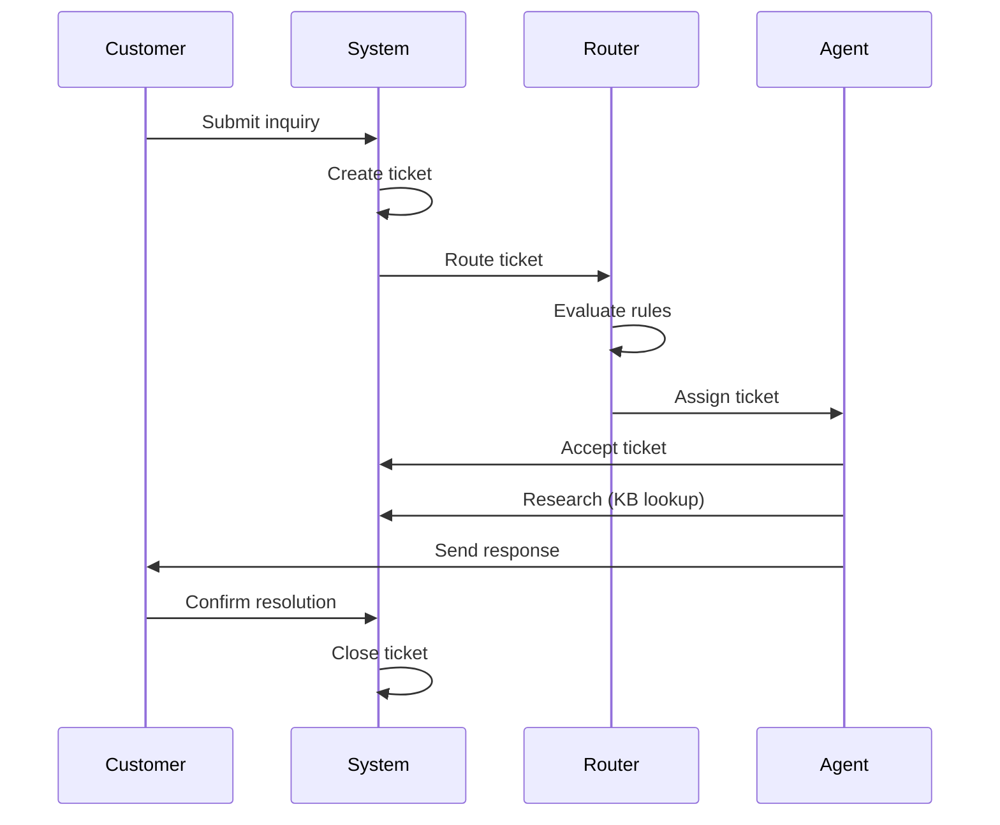

# Business Context Documentation Templates

## 1. business/background.md — Business Background Introduction

| Field | Content |
|-------|---------|
| Purpose | Business context for developers to understand the domain |
| Sections | 1) Domain Introduction (bold terms, one-sentence definitions) 2) Core Entities (table: Entity / Description / Key Attributes) 3) User Roles (permission matrix) 4) Key Metrics 5) Glossary (alphabetical, table format) |
| Content Guidelines | Domain introduction must use bold for key terms and provide one-sentence definitions. Core entities table must describe each entity and list its key attributes. User roles must be presented as a permission matrix showing which roles can perform which actions. Key metrics must list the business KPIs the system is measured against. Glossary must be alphabetical in table format. |
| Quality Checks | Domain introduction uses bold terms with definitions; Core entities table is complete; User roles permission matrix exists; Key metrics are listed; Glossary is alphabetical and in table format |

### Domain Introduction Example

The **Customer Service Platform (CSP)** is an internal platform that enables customer service agents to handle **tickets** (customer inquiries) across multiple channels. The platform integrates with a **Knowledge Base (KB)** that stores product information and troubleshooting guides. **Routing** is the process of assigning tickets to the appropriate agent based on skill, language, and availability.

### Core Entities

| Entity | Description | Key Attributes |
|--------|-------------|----------------|
| Ticket | A customer inquiry or issue | id, status, priority, channel, assignee |
| Agent | A customer service representative | id, name, skills, languages, status |
| Knowledge Base Article | A document with product or process information | id, title, category, lastUpdated |
| Routing Rule | A rule that determines ticket assignment | id, conditions, targetQueue, priority |

### User Roles

| Action | Agent | Team Lead | Admin |
|--------|-------|-----------|-------|
| View tickets | Yes | Yes | Yes |
| Assign tickets | Own only | Team-wide | All |
| Edit KB articles | No | Yes | Yes |
| Configure routing | No | No | Yes |
| View analytics | Own stats | Team stats | All stats |

### Key Metrics

- **First Response Time (FRT)**: Time from ticket creation to first agent response
- **Resolution Time**: Time from ticket creation to resolution
- **Customer Satisfaction (CSAT)**: Post-interaction survey score
- **Ticket Volume**: Number of tickets processed per time period

### Glossary

| Term | Definition |
|------|-----------|
| Agent | A customer service representative who handles tickets |
| Channel | The medium through which a customer submits an inquiry (chat, email, phone) |
| CSP | Customer Service Platform — the system for managing customer interactions |
| FRT | First Response Time — time to first agent reply |
| KB | Knowledge Base — repository of product and process information |
| Routing | The process of assigning tickets to agents based on rules |
| SLA | Service Level Agreement — contractual response and resolution time targets |
| Ticket | A customer inquiry or issue submitted through a support channel |

---

## 2. business/processes.md — Core Business Process Descriptions

| Field | Content |
|-------|---------|
| Purpose | Document main business operations and workflows |
| Sections | 1) Process Overview (Mermaid sequence diagram preferred) 2) Process Details (for each process: trigger, numbered steps with actors, system behavior, edge cases) 3) Cross-Process Interactions |
| Content Guidelines | Process overview should use a Mermaid sequence diagram for visual clarity. Each process detail must include: the trigger event, numbered steps identifying the actor, expected system behavior, and edge cases. Cross-process interactions must describe how processes relate to each other. |
| Quality Checks | Every process has a defined trigger; Steps are numbered with actors identified; Edge cases are documented; Cross-process interactions are described |

### Process Overview Example

### Process Details Example

#### Process: Ticket Routing

**Trigger**: New ticket created in the system

1. **System** receives ticket and extracts metadata (channel, language, category)
2. **Router** evaluates routing rules against ticket metadata
3. **Router** identifies matching agent queue based on skill and availability
4. **System** assigns ticket to the top available agent in the queue
5. **Agent** receives notification and accepts the ticket

**System Behavior**:
- If no agent is available, ticket enters the pending queue
- If routing rules match multiple queues, the highest priority queue is selected
- Assignment timeout after 5 minutes triggers re-routing

**Edge Cases**:
- All agents in the matched queue are offline → escalate to team lead
- Ticket matches no routing rules → assign to default queue
- Agent rejects assignment → re-route to next available agent

### Cross-Process Interactions Example

| Process | Interacts With | Interaction Point |
|---------|---------------|-------------------|
| Ticket Routing | Knowledge Base | Agent looks up KB articles during resolution |
| Ticket Routing | SLA Monitoring | SLA timer starts when ticket is assigned |
| KB Article Update | Ticket Resolution | Updated articles may change resolution workflows |
| Escalation | Ticket Routing | Escalated tickets re-enter the routing process |
| Customer Feedback | KB Update | Low CSAT scores may trigger KB article review |
