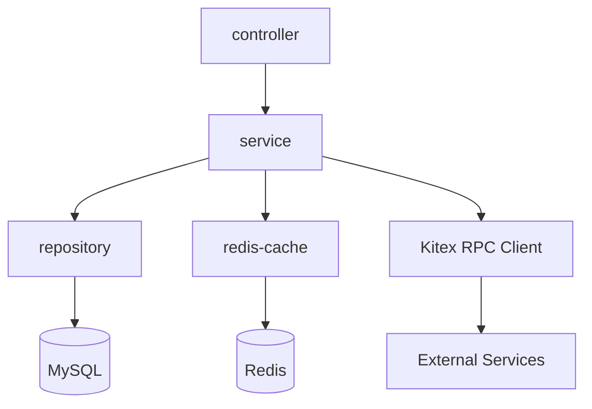

# Architecture Documentation Templates

## 1. architecture/overview.md — Repository Architecture Overview

| Field | Content |
|-------|---------|
| Purpose | Describe the repository's overall architecture, tech stack, and module dependencies |
| Sections | 1) Project Overview (≤3 sentences) 2) Tech Stack (table: Technology / Version / Purpose) 3) Repository Structure (directory tree with annotations) 4) Module Dependency Graph (Mermaid preferred) 5) Deployment Architecture (staging + production) 6) External Dependencies (service / purpose) |
| Content Guidelines | Overview must be concise — no more than 3 sentences. Tech stack table must include all major tools with accurate versions. Directory tree must have one-line annotations for every top-level directory. Module dependency graph should use Mermaid syntax for visual clarity. External dependencies must list both the service name and its purpose. |
| Quality Checks | Overview ≤ 3 sentences; Tech stack table is complete with all major tools; Every top-level directory is annotated in the repository structure; External dependencies are listed with service and purpose |

### Java Example — Tech Stack Table

```markdown
| Technology | Version | Purpose |
|-----------|---------|---------|
| Java | 17+ | Primary language |
| Spring Boot | 3.x | Application framework |
| Kitex | latest | RPC framework |
| Hertz | latest | HTTP framework |
| MySQL | 8.x | Relational database |
| Redis | 7.x | Caching and session store |
| Maven | 3.9+ / Gradle | 8+ | Build tool and dependency management |
```

### Java Example — Repository Structure

```markdown
├── src/main/java/           # Production Java source code
│   └── com/example/app/    # Base package
│       ├── controller/      # REST API controllers
│       ├── service/         # Business logic layer
│       ├── repository/     # Data access layer
│       ├── model/           # Domain models and entities
│       ├── config/          # Spring configuration classes
│       └── Application.java # Application entry point
├── src/main/resources/     # Configuration files and static assets
│   ├── application.yml     # Spring Boot configuration
│   └── db/migration/       # Database migration scripts
├── src/test/java/          # Test source code (mirrors main structure)
├── src/test/resources/     # Test configuration and fixtures
├── pom.xml                 # Maven project descriptor (or build.gradle for Gradle)
├── Dockerfile              # Container build definition
└── docs/                   # Architecture docs and conventions
```

### Java Example — Module Dependency Graph



---

## 2. architecture/module-index.md — Module Index

| Field | Content |
|-------|---------|
| Purpose | Concise index of each module with responsibility and key file locations |
| Sections | 1) Module Overview (table: Module / Path / Responsibility / Key Files) 2) Module Details (for each module: responsibility statement, key files table, core execution paths, inter-module dependencies) |
| Content Guidelines | Module Overview table must list every module/sub-project in the repository. Each Module Details subsection must include a responsibility statement (1-2 sentences), a key files table (File / Responsibility), a description of core execution paths, and explicit inter-module dependencies. |
| Quality Checks | Every module is listed in the overview table; Key files table is consistent across overview and details; Core execution paths are described for each module; Inter-module dependencies are explicit and accurate |

### Module Overview Table Format

```markdown
| Module | Path | Responsibility | Key Files |
|--------|------|---------------|-----------|
| controller | src/main/java/.../controller/ | REST API endpoints and request handling | UserController.java, OrderController.java |
| service | src/main/java/.../service/ | Business logic and orchestration | UserService.java, OrderService.java |
| repository | src/main/java/.../repository/ | Data access and persistence | UserRepository.java, OrderRepository.java |
| model | src/main/java/.../model/ | Domain entities and DTOs | User.java, Order.java |
| config | src/main/java/.../config/ | Spring and infrastructure configuration | RedisConfig.java, KitexConfig.java |
```

### Module Details Subsection Format

```markdown
### controller

**Responsibility**: REST API layer that handles HTTP requests, validates input, delegates to services, and returns responses.

**Key Files**:

| File | Responsibility |
|------|---------------|
| UserController.java | User registration, login, and profile endpoints |
| OrderController.java | Order creation, query, and status update endpoints |
| GlobalExceptionHandler.java | Unified error handling and response formatting |

**Core Execution Paths**: `Controller` → receives HTTP request → validates input via `@Valid` → delegates to `Service` → returns `ResponseEntity` with result.

**Dependencies**: service (internal), model (internal)

---

### service

**Responsibility**: Business logic layer that orchestrates workflows, enforces business rules, and coordinates between repositories and external services.

**Key Files**:

| File | Responsibility |
|------|---------------|
| UserService.java | User registration, authentication, and profile management |
| OrderService.java | Order lifecycle management and business rule enforcement |
| CacheService.java | Redis caching abstraction for frequently accessed data |

**Core Execution Paths**: `Service` → validates business rules → calls `Repository` for persistence → calls `CacheService` for cache operations → invokes Kitex RPC clients for cross-service calls.

**Dependencies**: repository (internal), model (internal), Kitex RPC clients (external), Redis (external)
```
