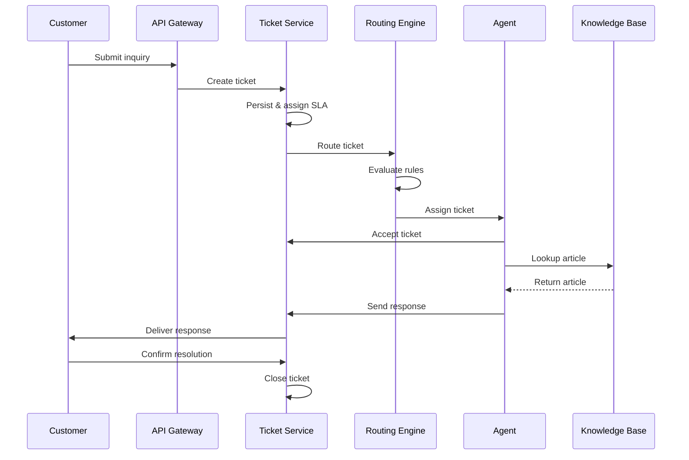

# Business Context Documentation Templates (Java)

## 1. business/background.md — Business Background Introduction

| Field | Content |
|-------|---------|
| Purpose | Business context for developers to understand the domain |
| Sections | 1) Domain Introduction (bold terms, one-sentence definitions) 2) Core Entities (table: Entity / Description / Key Attributes) 3) User Roles (permission matrix) 4) Key Metrics 5) Glossary (alphabetical, table format) |
| Content Guidelines | Domain terms in bold with one-sentence definitions. Core entities table must list key attributes. User roles must include permission levels. Key metrics must be measurable. Glossary must be alphabetical. |
| Quality Checks | Domain terms defined; Core entities table complete; User roles with permissions; Glossary alphabetical |

### Domain Introduction Example

```markdown
### Domain Introduction

The **Customer Service Platform (CSP)** is an internal platform that enables customer service agents to handle **tickets** (customer inquiries submitted through supported channels) across multiple communication channels. The platform integrates with a **Knowledge Base (KB)** that stores product information and troubleshooting guides. **Routing** is the process of assigning tickets to the appropriate agent based on skill, language, and availability. The **Service Level Agreement (SLA)** defines contractual targets for response and resolution times that the system must enforce.

### Core Entities

| Entity | Description | Key Attributes |
|--------|-------------|----------------|
| Ticket | A customer inquiry or issue | id, status, priority, channel, assignee, createdAt, slaDeadline |
| Agent | A customer service representative | id, name, skills, languages, status, currentLoad |
| Knowledge Base Article | A document with product or process information | id, title, category, lastUpdated, version |
| Routing Rule | A rule that determines ticket assignment | id, conditions, targetQueue, priority, enabled |
| SLA Policy | A policy defining response and resolution time targets | id, channel, priority, responseTimeLimit, resolutionTimeLimit |
| Queue | A group of agents sharing a ticket pool | id, name, skillSet, languageSet, maxLoad |

### User Roles

| Action | Agent | Team Lead | Admin |
|--------|-------|-----------|-------|
| View tickets | Own only | Team-wide | All |
| Assign tickets | Own only | Team-wide | All |
| Resolve tickets | Own only | Team-wide | All |
| Edit KB articles | No | Yes | Yes |
| Configure routing | No | No | Yes |
| Manage SLA policies | No | No | Yes |
| View analytics | Own stats | Team stats | All stats |
| Manage team members | No | Yes | Yes |

### Key Metrics

- **First Response Time (FRT)**: Time from ticket creation to first agent response (measured in minutes)
- **Resolution Time**: Time from ticket creation to resolution (measured in hours)
- **Customer Satisfaction (CSAT)**: Post-interaction survey score (scale 1-5)
- **Ticket Volume**: Number of tickets processed per time period (daily/weekly/monthly)
- **SLA Compliance Rate**: Percentage of tickets resolved within SLA targets
- **Agent Utilization**: Ratio of active handling time to total available time per agent

### Glossary

| Term | Definition |
|------|-----------|
| Agent | A customer service representative who handles tickets |
| Channel | The medium through which a customer submits an inquiry (chat, email, phone) |
| CSAT | Customer Satisfaction — post-interaction survey score measuring service quality |
| FRT | First Response Time — elapsed time from ticket creation to the first agent reply |
| KB | Knowledge Base — repository of product and process information for agent reference |
| Queue | A group of agents sharing a common ticket pool, organized by skill or language |
| Routing | The process of assigning tickets to agents based on configurable rules |
| SLA | Service Level Agreement — contractual response and resolution time targets |
| Ticket | A customer inquiry or issue submitted through a supported channel |
```

---

## 2. business/processes.md — Core Business Process Descriptions

| Field | Content |
|-------|---------|
| Purpose | Document main business operations and workflows |
| Sections | 1) Process Overview (Mermaid sequence diagram preferred) 2) Process Details (for each: trigger, numbered steps with actors, system behavior, edge cases) 3) Cross-Process Interactions |
| Content Guidelines | Every process must have a trigger. Steps must be numbered with actors identified. Edge cases must be documented. Mermaid syntax preferred for diagrams. |
| Quality Checks | Every process has a trigger; Steps numbered with actors; Edge cases documented; Mermaid diagram provided |

### Process Overview Example

```markdown
### Process Overview


```

### Process Details Example

```markdown
### Process: Ticket Routing

**Trigger**: New ticket created in the system

1. **Ticket Service** receives ticket and extracts metadata (channel, language, category, priority)
2. **Routing Engine** evaluates routing rules against ticket metadata
3. **Routing Engine** identifies matching agent queue based on skill set, language, and availability
4. **Ticket Service** assigns ticket to the top available agent in the queue
5. **Agent** receives notification and accepts the ticket

**System Behavior**:
- If no agent is available, ticket enters the pending queue with a timeout
- If routing rules match multiple queues, the highest priority queue is selected
- Assignment timeout after 5 minutes triggers automatic re-routing
- SLA timer starts upon agent acceptance

**Edge Cases**:
- All agents in the matched queue are offline -> escalate to team lead
- Ticket matches no routing rules -> assign to default queue
- Agent rejects assignment -> re-route to next available agent
- Ticket priority is critical -> bypass queue and assign directly to team lead

### Process: SLA Monitoring

**Trigger**: Ticket assigned to an agent

1. **Ticket Service** starts SLA timer based on the applicable SLA policy
2. **SLA Monitor** tracks elapsed time against response and resolution deadlines
3. **SLA Monitor** emits warning at 75% of deadline elapsed
4. **SLA Monitor** emits breach event when deadline is exceeded
5. **Ticket Service** escalates or reassigns on breach

**System Behavior**:
- Warning notification sent to agent and team lead at 75% threshold
- Breach triggers automatic escalation to team lead
- SLA clock paused when ticket is in a waiting-for-customer state

**Edge Cases**:
- Customer replies after SLA breach -> SLA timer does not restart
- Ticket reassigned mid-resolution -> SLA deadline remains unchanged
- SLA policy updated after ticket creation -> original policy still applies
```

### Cross-Process Interactions Example

```markdown
### Cross-Process Interactions

| Process | Interacts With | Interaction Point |
|---------|---------------|-------------------|
| Ticket Routing | Knowledge Base | Agent looks up KB articles during resolution |
| Ticket Routing | SLA Monitoring | SLA timer starts when ticket is assigned |
| SLA Monitoring | Escalation | SLA breach triggers escalation workflow |
| KB Article Update | Ticket Resolution | Updated articles may change resolution workflows |
| Escalation | Ticket Routing | Escalated tickets re-enter the routing process with higher priority |
| Customer Feedback | KB Update | Low CSAT scores may trigger KB article review |
| Ticket Routing | Agent Load Balancing | Agent utilization affects routing decisions |
```
