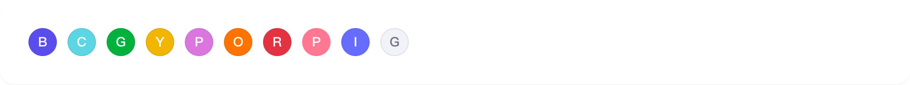
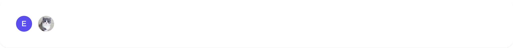
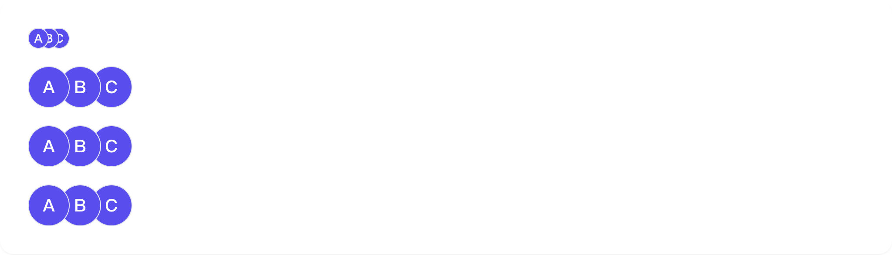

# avatar

## 1-avatar-demo

### 总结描述

- 最简单的头像使用方式。支持 `src`（图片）和 `color`（背景色）两种形态，当同时设置时，`src` 会优先生效。

### 预览效果截图

### 代码路径

- `src/components/avatar/1-avatar-demo.jsx`

## 2-avatar-demo

### 总结描述

- Avatar 提供了丰富的尺寸选项，从超大到超小，满足不同场景的需求。

### 预览效果截图

### 代码路径

- `src/components/avatar/2-avatar-demo.jsx`

## 3-avatar-demo

### 总结描述

- Avatar 支持多种预设颜色，可以用来区分不同的用户或场景。

### 预览效果截图

### 代码路径

- `src/components/avatar/3-avatar-demo.jsx`

## 4-avatar-demo

### 总结描述

- 通过设置 `hoverMask` 属性来启用编辑遮罩层，适用于需要修改头像的场景。相较于 Semi Avatar 的实现，这里的 `hoverMask` 改为了 `boolean` 类型，并预设了编辑态的图标样式，传入 `true` 即可启用。

### 预览效果截图

### 代码路径

- `src/components/avatar/4-avatar-demo.jsx`

## 5-avatar-demo

### 总结描述

- 使用 `CozAvatar.AvatarGroup` 可以将多个头像组合显示，支持不同的尺寸配置和堆叠方向。通过 `maxCount` 属性可以限制显示的头像数量，超出部分会显示为数字。

### 预览效果截图

### 代码路径

- `src/components/avatar/5-avatar-demo.jsx`

## 6-avatar-demo

### 总结描述

- Avatar 支持多种事件处理，包括点击和鼠标悬停事件。

### 预览效果截图

### 代码路径

- `src/components/avatar/6-avatar-demo.jsx`
