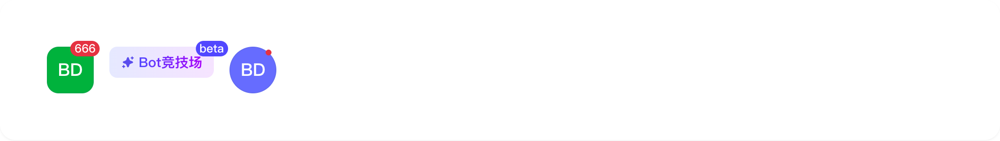
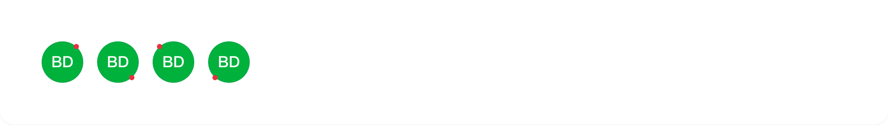
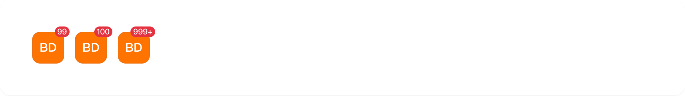
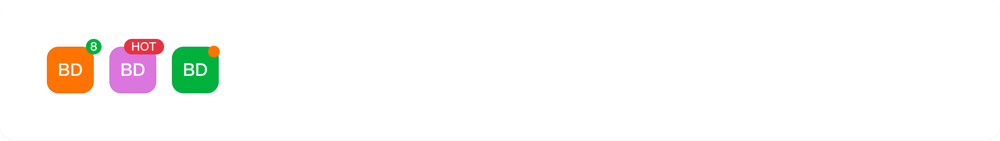

# badge

## 1-badge-demo

### 总结描述

- Badge组件可以包裹任何元素，为其添加徽标提示。徽标内容通过`count`属性设置，支持数字和文本。

### 预览效果截图

### 代码路径

- `src/components/badge/1-badge-demo.jsx`

## 2-badge-demo

### 总结描述

- Badge组件提供了三种不同的类型，适用于不同的使用场景。

### 预览效果截图

### 代码路径

- `src/components/badge/2-badge-demo.jsx`

## 3-badge-demo

### 总结描述

- 可以通过`position`属性设置徽标的显示位置，包括：`leftTop`、`leftBottom`、`rightTop`(默认)、`rightBottom`。

### 预览效果截图

### 代码路径

- `src/components/badge/3-badge-demo.jsx`

## 4-badge-demo

### 总结描述

- Badge组件支持自定义图标作为徽标内容。当传入的`count`是React节点时，将直接渲染该节点。

### 预览效果截图

### 代码路径

- `src/components/badge/4-badge-demo.jsx`

## 5-badge-demo

### 总结描述

- Badge组件支持不传入任何子节点内容，作为独立组件使用。

### 预览效果截图

### 代码路径

- `src/components/badge/5-badge-demo.jsx`

## 6-badge-demo

### 总结描述

- 当数字超过`overflowCount`设置的值时，会显示为`${overflowCount}+`的形式。默认的`overflowCount`为99。

### 预览效果截图

### 代码路径

- `src/components/badge/6-badge-demo.jsx`

## 7-badge-demo

### 总结描述

- 通过`countStyle`属性，可以自定义徽标的样式，包括颜色、位置、大小等。

### 预览效果截图

### 代码路径

- `src/components/badge/7-badge-demo.jsx`

## 8-badge-demo

### 总结描述

- Badge组件可以与导航组件结合使用，如TabBar、SegmentTab等。

### 预览效果截图

### 代码路径

- `src/components/badge/8-badge-demo.jsx`

## 9-badge-demo

### 总结描述

- Badge组件可以与按钮组件结合使用，如Button、IconButton等。

### 预览效果截图

### 代码路径

- `src/components/badge/9-badge-demo.jsx`
