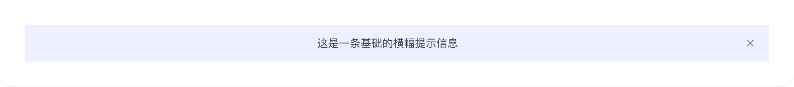
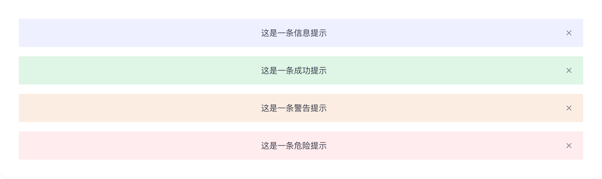
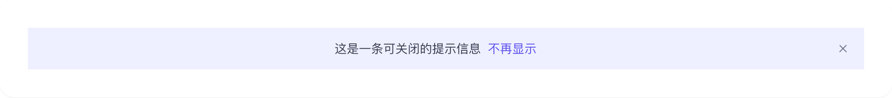

# banner

## 1-banner-demo

### 总结描述

- 展示最基本的横幅提示。默认为 info 类型，居中对齐。

### 预览效果截图

### 代码路径

- `src/components/banner/1-banner-demo.jsx`

## 2-banner-demo

### 总结描述

- 通过 `type` 属性设置不同的提示类型。每种类型都有对应的颜色和样式。

### 预览效果截图

### 代码路径

- `src/components/banner/2-banner-demo.jsx`

## 3-banner-demo

### 总结描述

- 通过 `closeIcon` 属性设置关闭按钮。支持完全自定义关闭按钮的样式。默认使用 `IconCozCross` 图标，颜色为 `coz-fg-secondary`。

### 预览效果截图

### 代码路径

- `src/components/banner/3-banner-demo.jsx`

## 4-banner-demo

### 总结描述

- 使用 `card` 属性展示卡片样式的横幅。注意需要同时设置 `fullMode={false}` 来实现卡片效果。卡片样式支持添加标题和自定义内容。卡片内的按钮会自动应用 `rounded-mini` 圆角样式。

### 预览效果截图

### 代码路径

- `src/components/banner/4-banner-demo.jsx`
