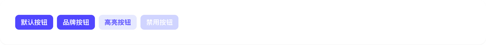
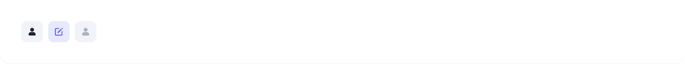
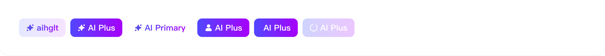
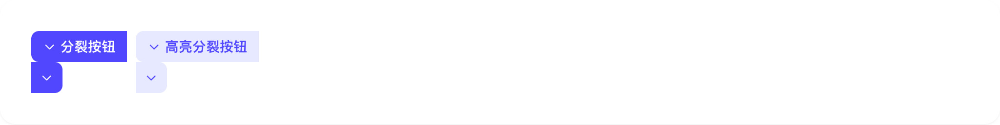
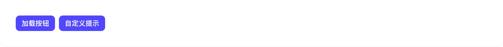
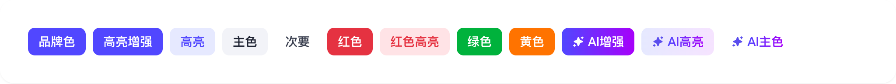
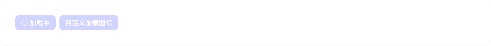
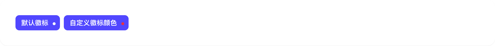

# button

## 1-button-demo

### 总结描述

- 最基础的按钮用法。

### 预览效果截图

### 代码路径

- `src/components/button/1-button-demo.jsx`

## 2-button-demo

### 总结描述

- 可以只显示图标的按钮。

### 预览效果截图

### 代码路径

- `src/components/button/2-button-demo.jsx`

## 3-button-demo

### 总结描述

- 专门为 AI 相关功能设计的按钮，具有特殊的颜色和样式。

### 预览效果截图

### 代码路径

- `src/components/button/3-button-demo.jsx`

## 4-button-demo

### 总结描述

- 带有下拉菜单的按钮。

### 预览效果截图

### 代码路径

- `src/components/button/4-button-demo.jsx`

## 5-button-demo

### 总结描述

- 带有加载提示的按钮。

### 预览效果截图

### 代码路径

- `src/components/button/5-button-demo.jsx`

## 6-button-demo

### 总结描述

- 按钮支持四种尺寸：大号、默认、小号和迷你。

### 预览效果截图

### 代码路径

- `src/components/button/6-button-demo.jsx`

## 7-button-demo

### 总结描述

- 按钮支持多种颜色变体，包括品牌色、高亮色、主色、次要色等。

### 预览效果截图

### 代码路径

- `src/components/button/7-button-demo.jsx`

## 8-button-demo

### 总结描述

- 按钮可以显示加载状态，支持自定义加载图标。

### 预览效果截图

### 代码路径

- `src/components/button/8-button-demo.jsx`

## 9-button-demo

### 总结描述

- 按钮可以配置显示徽标，这是我们在 Semi Button 基础上扩展的特性。

### 预览效果截图

### 代码路径

- `src/components/button/9-button-demo.jsx`
