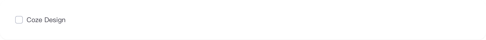
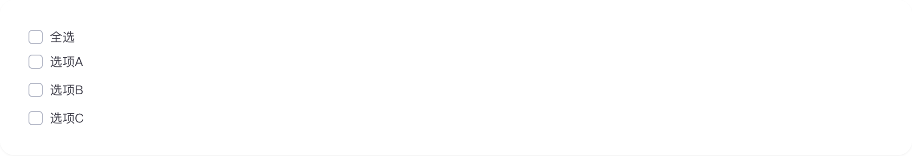
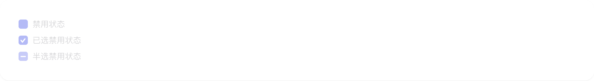
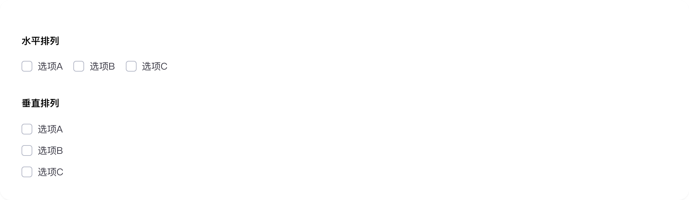

# checkbox

## 1-checkbox-demo

### 总结描述

- 最基本的复选框用法。

### 预览效果截图

### 代码路径

- `src/components/checkbox/1-checkbox-demo.jsx`

## 2-checkbox-demo

### 总结描述

- 使用 `checked` 和 `onChange` 属性实现受控组件。

### 预览效果截图

### 代码路径

- `src/components/checkbox/2-checkbox-demo.jsx`

## 3-checkbox-demo

### 总结描述

- 使用 `indeterminate` 属性可以设置复选框的半选状态。

### 预览效果截图

### 代码路径

- `src/components/checkbox/3-checkbox-demo.jsx`

## 4-checkbox-demo

### 总结描述

- 使用 `disabled` 属性可以禁用复选框。

### 预览效果截图

### 代码路径

- `src/components/checkbox/4-checkbox-demo.jsx`

## 5-checkbox-demo

### 总结描述

- 使用 `Checkbox.Group` 可以实现一组复选框。支持水平和垂直两种排列方式。

### 预览效果截图

### 代码路径

- `src/components/checkbox/5-checkbox-demo.jsx`
