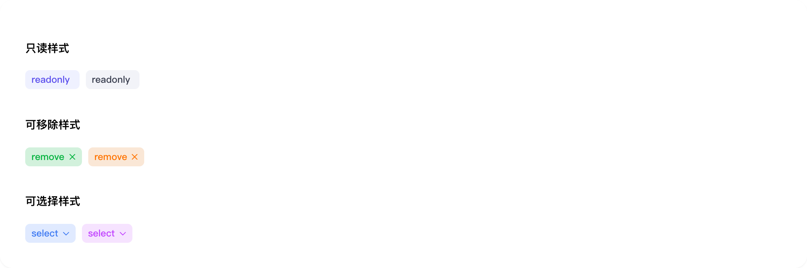

# chip

## 1-chip-demo

### 总结描述

- 最基本的标签用法。

### 预览效果截图

### 代码路径

- `src/components/chip/1-chip-demo.jsx`

## 2-chip-demo

### 总结描述

- Chip 支持 `small` 和 `mini` 两种尺寸。

### 预览效果截图

### 代码路径

- `src/components/chip/2-chip-demo.jsx`

## 3-chip-demo

### 总结描述

- Chip 提供了多种预设的颜色主题。

### 预览效果截图

### 代码路径

- `src/components/chip/3-chip-demo.jsx`

## 4-chip-demo

### 总结描述

- Chip 支持三种交互样式：readonly、remove 和 select。

### 预览效果截图

### 代码路径

- `src/components/chip/4-chip-demo.jsx`

## 5-chip-demo

### 总结描述

- 通过 `disabled` 属性设置禁用状态。

### 预览效果截图

### 代码路径

- `src/components/chip/5-chip-demo.jsx`

## 6-chip-demo

### 总结描述

- 通过 `loading` 属性设置加载状态。

### 预览效果截图

### 代码路径

- `src/components/chip/6-chip-demo.jsx`
