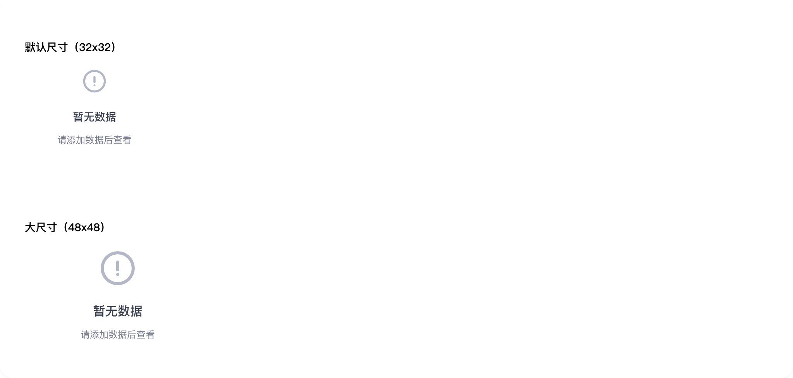

# empty-state

## 1-empty-state-demo

### 总结描述

- 展示不同尺寸的空状态。

### 预览效果截图

### 代码路径

- `src/components/empty-state/1-empty-state-demo.jsx`

## 2-empty-state-demo

### 总结描述

- 适用于需要全屏展示的空状态场景，如空页面或错误页。

### 预览效果截图

### 代码路径

- `src/components/empty-state/2-empty-state-demo.jsx`

## 3-empty-state-demo

### 总结描述

- 可以添加按钮和额外内容来引导用户操作。

### 预览效果截图

### 代码路径

- `src/components/empty-state/3-empty-state-demo.jsx`

## 4-empty-state-demo

### 总结描述

- 通过 `darkModeIcon` 属性可以设置暗色模式下显示的图标。

### 预览效果截图

### 代码路径

- `src/components/empty-state/4-empty-state-demo.jsx`
