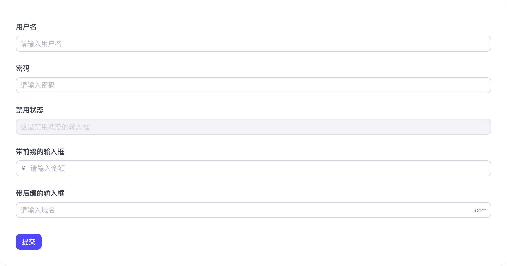

# form

## 1-form-demo

### 总结描述

- 最基础的表单用法，包含各种表单控件。

### 预览效果截图

### 代码路径

- `src/components/form/1-form-demo.jsx`

## 2-form-demo

### 总结描述

- 表单支持水平布局和垂直布局。

### 预览效果截图

### 代码路径

- `src/components/form/2-form-demo.jsx`

## 3-form-demo

### 总结描述

- 表单支持多种验证规则，包括必填、正则表达式、自定义验证等。

### 预览效果截图

### 代码路径

- `src/components/form/3-form-demo.jsx`

## 4-form-demo

### 总结描述

- 表单字段之间可以相互联动，根据某个字段的值来控制其他字段的显示、隐藏或值的变化。

### 预览效果截图

### 代码路径

- `src/components/form/4-form-demo.jsx`

## 5-form-demo

### 总结描述

- FormInput 是基于 Input 组件封装的表单控件，用于输入单行文本。

### 预览效果截图

### 代码路径

- `src/components/form/5-form-demo.jsx`

## 6-form-demo

### 总结描述

- FormSelect 是基于 Select 组件封装的表单控件，用于从多个选项中选择一个或多个值。

### 预览效果截图

### 代码路径

- `src/components/form/6-form-demo.jsx`

## 7-form-demo

### 总结描述

- FormTextArea 是基于 TextArea 组件封装的表单控件，用于输入多行文本。

### 预览效果截图

### 代码路径

- `src/components/form/7-form-demo.jsx`

## 8-form-demo

### 总结描述

- FormInputNumber 是基于 InputNumber 组件封装的表单控件，用于输入数字。

### 预览效果截图

### 代码路径

- `src/components/form/8-form-demo.jsx`

## 9-form-demo

### 总结描述

- FormUpload 是基于 Upload 组件封装的表单控件，用于上传文件。

### 预览效果截图

### 代码路径

- `src/components/form/9-form-demo.jsx`
