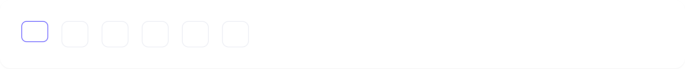
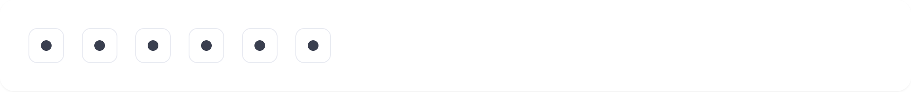
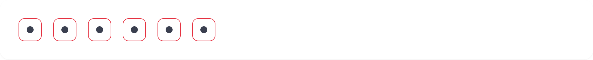
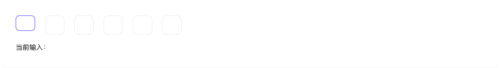

# input-code

## 1-input-code-demo

### 总结描述

- 最基本的验证码输入框用法。默认为 6 位验证码输入。

### 预览效果截图

### 代码路径

- `src/components/input-code/1-input-code-demo.jsx`

## 2-input-code-demo

### 总结描述

- 使用 `type="password"` 可以将输入框设置为密码模式，输入的字符会在短暂显示后被隐藏。

### 预览效果截图

### 代码路径

- `src/components/input-code/2-input-code-demo.jsx`

## 3-input-code-demo

### 总结描述

- 通过 `length` 属性可以自定义输入框的数量。

### 预览效果截图

### 代码路径

- `src/components/input-code/3-input-code-demo.jsx`

## 4-input-code-demo

### 总结描述

- 通过 `disabled` 属性可以禁用输入框。

### 预览效果截图

### 代码路径

- `src/components/input-code/4-input-code-demo.jsx`

## 5-input-code-demo

### 总结描述

- 通过 `error` 属性可以将输入框设置为错误状态。

### 预览效果截图

### 代码路径

- `src/components/input-code/5-input-code-demo.jsx`

## 6-input-code-demo

### 总结描述

- 通过 `value` 和 `onChange` 属性可以将输入框设置为受控组件。

### 预览效果截图

### 代码路径

- `src/components/input-code/6-input-code-demo.jsx`
