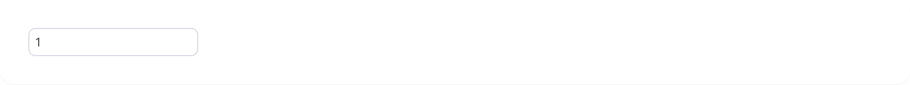
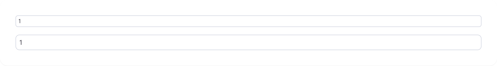
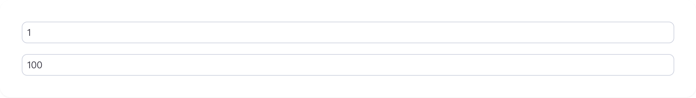
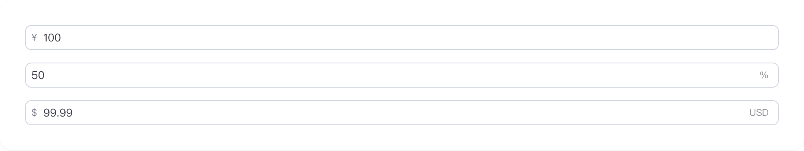
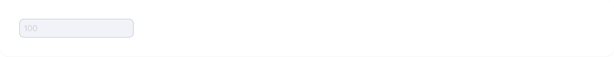
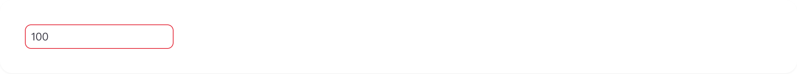
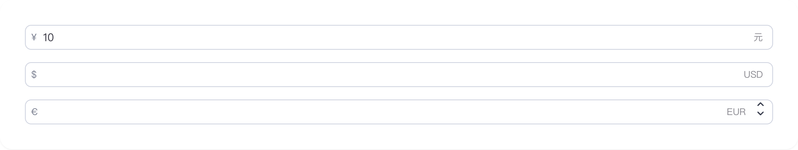

# input-number

## 1-input-number-demo

### 总结描述

- 最基本的数字输入框用法。

### 预览效果截图

### 代码路径

- `src/components/input-number/1-input-number-demo.jsx`

## 2-input-number-demo

### 总结描述

- 提供 `small`、`default` 两种尺寸。

### 预览效果截图

### 代码路径

- `src/components/input-number/2-input-number-demo.jsx`

## 3-input-number-demo

### 总结描述

- 通过 `step` 和 `shiftStep` 属性可以设置常规步进值和按住 Shift 时的步进值。

### 预览效果截图

### 代码路径

- `src/components/input-number/3-input-number-demo.jsx`

## 4-input-number-demo

### 总结描述

- 使用 `prefix` 和 `suffix` 属性可以添加前缀和后缀。

### 预览效果截图

### 代码路径

- `src/components/input-number/4-input-number-demo.jsx`

## 5-input-number-demo

### 总结描述

- 通过 `disabled` 属性禁用输入框。

### 预览效果截图

### 代码路径

- `src/components/input-number/5-input-number-demo.jsx`

## 6-input-number-demo

### 总结描述

- 通过 `error` 属性显示错误状态。

### 预览效果截图

### 代码路径

- `src/components/input-number/6-input-number-demo.jsx`

## 7-input-number-demo

### 总结描述

- 通过 `sliderControl` 属性启用滑块控制模式，可以通过滑块来调节数值。支持与按钮组合使用。

### 预览效果截图

### 代码路径

- `src/components/input-number/7-input-number-demo.jsx`
