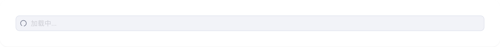
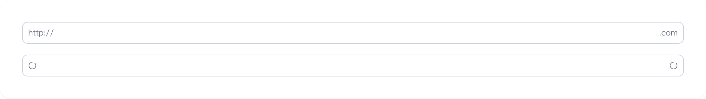
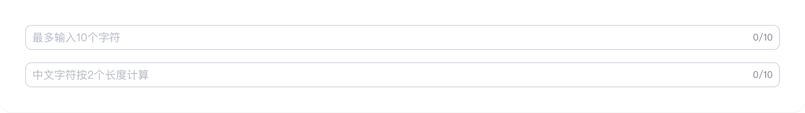
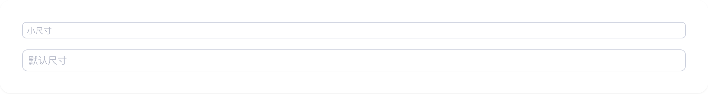

# input

## 1-input-demo

### 总结描述

- 最简单的输入框用法。

### 预览效果截图

### 代码路径

- `src/components/input/1-input-demo.jsx`

## 2-input-demo

### 总结描述

- 通过 `disabled` 属性设置输入框为禁用状态。

### 预览效果截图

### 代码路径

- `src/components/input/2-input-demo.jsx`

## 3-input-demo

### 总结描述

- 通过 `loading` 属性显示加载状态，此时输入框会被禁用。这是我们在 Semi Input 基础上扩展的特性。

### 预览效果截图

### 代码路径

- `src/components/input/3-input-demo.jsx`

## 4-input-demo

### 总结描述

- 通过 `error` 属性显示错误状态。这是我们在 Semi Input 基础上扩展的特性。

### 预览效果截图

### 代码路径

- `src/components/input/4-input-demo.jsx`

## 5-input-demo

### 总结描述

- 使用 `prefix` 和 `suffix` 属性设置前缀和后缀，可以是文本或图标。

### 预览效果截图

### 代码路径

- `src/components/input/5-input-demo.jsx`

## 6-input-demo

### 总结描述

- 使用 `maxLength` 属性限制输入字符数，会在后缀位置自动显示字符计数。支持自定义字符长度计算方法。

### 预览效果截图

### 代码路径

- `src/components/input/6-input-demo.jsx`

## 7-input-demo

### 总结描述

- 提供 `small`、`default` 两种尺寸。

### 预览效果截图

### 代码路径

- `src/components/input/7-input-demo.jsx`

## 8-input-demo

### 总结描述

- 组件内置了对中文输入法的支持，可以通过 `onCompositionStart`、`onCompositionEnd` 和 `onCompositionUpdate` 事件来处理输入法编辑过程。

### 预览效果截图

### 代码路径

- `src/components/input/8-input-demo.jsx`

## 9-input-demo

### 总结描述

- 在表单中使用时，推荐使用 `FormInput` 组件，它是 Input 组件的表单封装版本，支持表单验证等特性。

### 预览效果截图

### 代码路径

- `src/components/input/9-input-demo.jsx`
