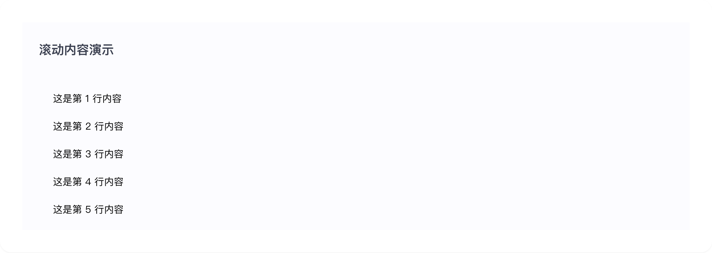

# layout

## 1-layout-demo

### 总结描述

- 最基本的布局用法。

### 预览效果截图

### 代码路径

- `src/components/layout/1-layout-demo.jsx`

## 2-layout-demo

### 总结描述

- 内容区域可以设置为滚动模式。

### 预览效果截图

### 代码路径

- `src/components/layout/2-layout-demo.jsx`
