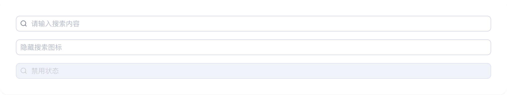

# search

## 1-search-demo

### 总结描述

- 最基本的搜索框用法。

### 预览效果截图

### 代码路径

- `src/components/search/1-search-demo.jsx`

## 2-search-demo

### 总结描述

- 搜索框支持不同的尺寸。

### 预览效果截图

### 代码路径

- `src/components/search/2-search-demo.jsx`

## 3-search-demo

### 总结描述

- 通过 `width` 属性设置搜索框宽度。

### 预览效果截图

### 代码路径

- `src/components/search/3-search-demo.jsx`

## 4-search-demo

### 总结描述

- 使用 `onSearch` 和 `onChange` 处理搜索和输入事件。

### 预览效果截图

### 代码路径

- `src/components/search/4-search-demo.jsx`
