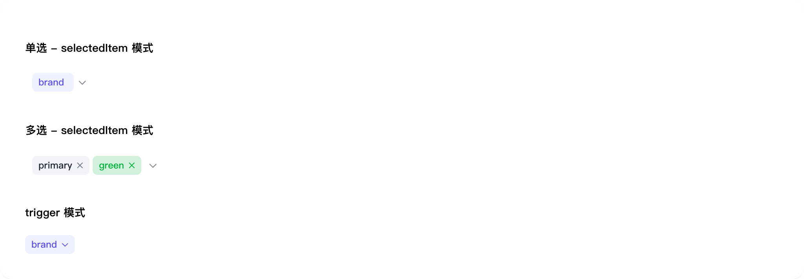

# select

## 1-select-demo

### 总结描述

- 最基本的选择器用法。

### 预览效果截图

### 代码路径

- `src/components/select/1-select-demo.jsx`

## 2-select-demo

### 总结描述

- Select 支持 `default` 和 `small` 两种尺寸。

### 预览效果截图

### 代码路径

- `src/components/select/2-select-demo.jsx`

## 3-select-demo

### 总结描述

- 使用 `OptGroup` 进行选项分组。

### 预览效果截图

### 代码路径

- `src/components/select/3-select-demo.jsx`

## 4-select-demo

### 总结描述

- 使用 `multiple` 属性启用多选模式。

### 预览效果截图

### 代码路径

- `src/components/select/4-select-demo.jsx`

## 5-select-demo

### 总结描述

- 展示选择器的不同状态。

### 预览效果截图

### 代码路径

- `src/components/select/5-select-demo.jsx`

## 6-select-demo

### 总结描述

- select 组件示例

### 预览效果截图

### 代码路径

- `src/components/select/6-select-demo.jsx`
