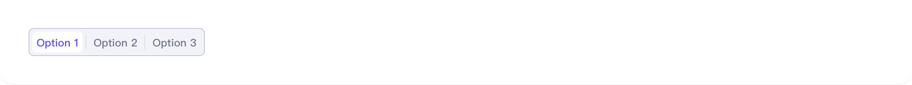
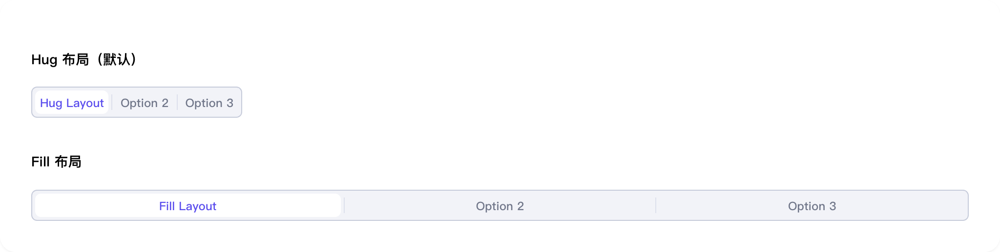
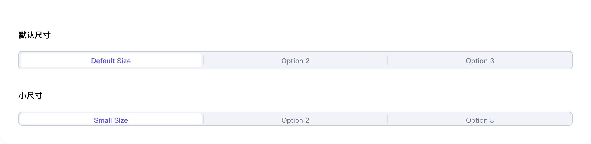

# single-select

## 1-single-select-demo

### 总结描述

- 最基本的单选框用法。

### 预览效果截图

### 代码路径

- `src/components/single-select/1-single-select-demo.jsx`

## 2-single-select-demo

### 总结描述

- 支持 `default` 和 `small` 两种尺寸。

### 预览效果截图

### 代码路径

- `src/components/single-select/2-single-select-demo.jsx`

## 3-single-select-demo

### 总结描述

- 可以禁用整个组件或单个选项。

### 预览效果截图

### 代码路径

- `src/components/single-select/3-single-select-demo.jsx`

## 4-single-select-demo

### 总结描述

- 使用 `SingleSelectLabel` 组件可以创建带有图标的选项，支持默认图标和选中状态图标。

### 预览效果截图

### 代码路径

- `src/components/single-select/4-single-select-demo.jsx`

## 5-single-select-demo

### 总结描述

- single-select 组件示例

### 预览效果截图

### 代码路径

- `src/components/single-select/5-single-select-demo.jsx`
