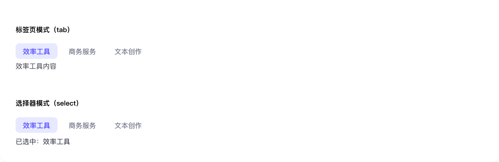
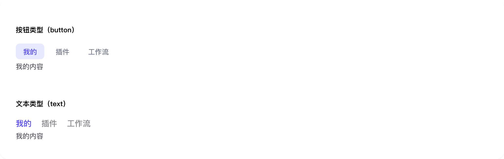

# tab-bar

## 1-tab-bar-demo

### 总结描述

- 最基本的标签栏用法。

### 预览效果截图

### 代码路径

- `src/components/tab-bar/1-tab-bar-demo.jsx`

## 2-tab-bar-demo

### 总结描述

- 支持三种对齐方式：`left`、`center`、`right`。

### 预览效果截图

### 代码路径

- `src/components/tab-bar/2-tab-bar-demo.jsx`

## 3-tab-bar-demo

### 总结描述

- 支持自定义标签内容，如添加徽标等。

### 预览效果截图

### 代码路径

- `src/components/tab-bar/3-tab-bar-demo.jsx`

## 4-tab-bar-demo

### 总结描述

- tab-bar 组件示例

### 预览效果截图

### 代码路径

- `src/components/tab-bar/4-tab-bar-demo.jsx`

## 5-tab-bar-demo

### 总结描述

- tab-bar 组件示例

### 预览效果截图

### 代码路径

- `src/components/tab-bar/5-tab-bar-demo.jsx`
