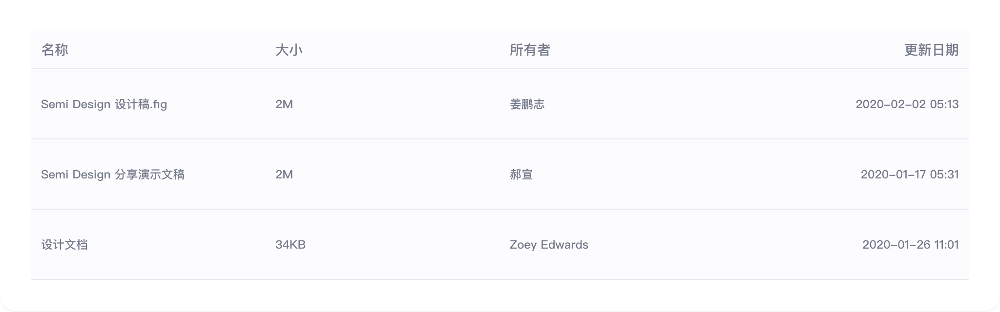
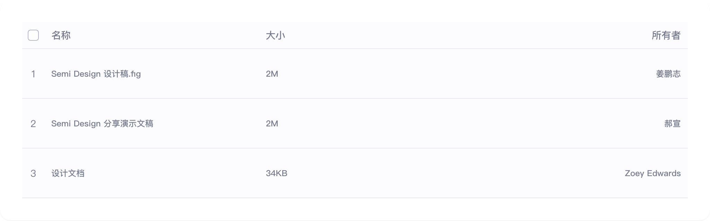

# table

## 1-table-demo

### 总结描述

- 最基础的表格用法。

### 预览效果截图

### 代码路径

- `src/components/table/1-table-demo.jsx`

## 2-table-demo

### 总结描述

- 使用 `indexRowSelection` 属性可以实现序号和复选框的切换效果。

### 预览效果截图

### 代码路径

- `src/components/table/2-table-demo.jsx`

## 3-table-demo

### 总结描述

- TableMeta 组件可以用于展示表格行的元数据，包括图标、名称、描述等信息。

### 预览效果截图

### 代码路径

- `src/components/table/3-table-demo.jsx`

## 4-table-demo

### 总结描述

- TableAction 组件可以用于展示表格行的操作按钮，包括编辑、复制、删除等操作。

### 代码路径

- `src/components/table/4-table-demo.jsx`

## 5-table-demo

### 总结描述

- 通过 `enableLoad` 和 `onLoad` 属性可以实现触底加载更多数据的功能。

### 预览效果截图

### 代码路径

- `src/components/table/5-table-demo.jsx`

## 6-table-demo

### 总结描述

- 通过 `empty` 属性可以自定义表格的空状态展示。

### 预览效果截图

### 代码路径

- `src/components/table/6-table-demo.jsx`
