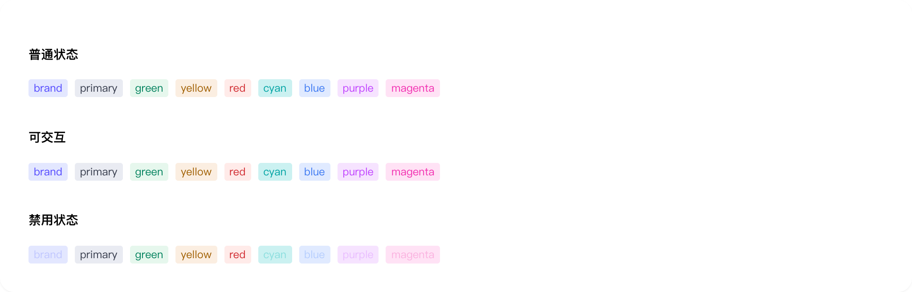

# tag

## 1-tag-demo

### 总结描述

- 最基本的标签用法，展示不同尺寸。

### 预览效果截图

### 代码路径

- `src/components/tag/1-tag-demo.jsx`

## 2-tag-demo

### 总结描述

- 支持多种预设颜色。

### 预览效果截图

### 代码路径

- `src/components/tag/2-tag-demo.jsx`

## 3-tag-demo

### 总结描述

- 支持内置图标和自定义图标。

### 预览效果截图

### 代码路径

- `src/components/tag/3-tag-demo.jsx`

## 4-tag-demo

### 总结描述

- 支持点击和关闭事件。

### 预览效果截图

### 代码路径

- `src/components/tag/4-tag-demo.jsx`

## 5-tag-demo

### 总结描述

- 支持加载和禁用状态。

### 预览效果截图

### 代码路径

- `src/components/tag/5-tag-demo.jsx`

## 6-tag-demo

### 总结描述

- 当标签内容需要额外解释或提示时，可以配合 Tooltip 使用。

### 预览效果截图

### 代码路径

- `src/components/tag/6-tag-demo.jsx`
