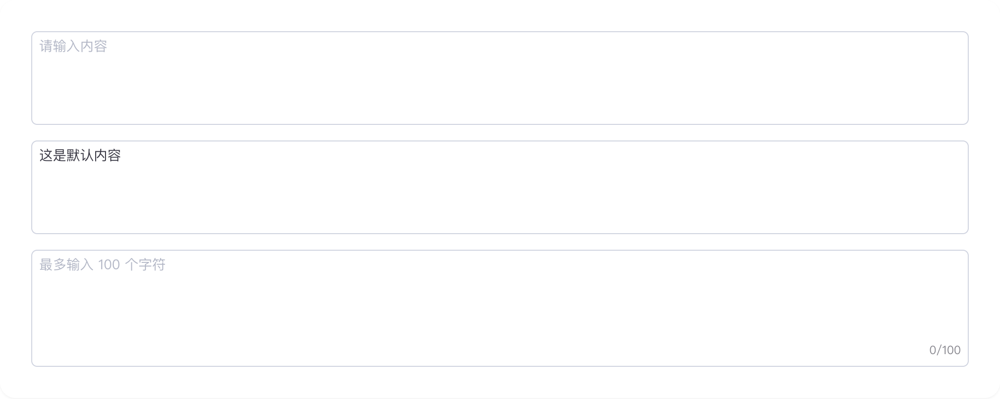
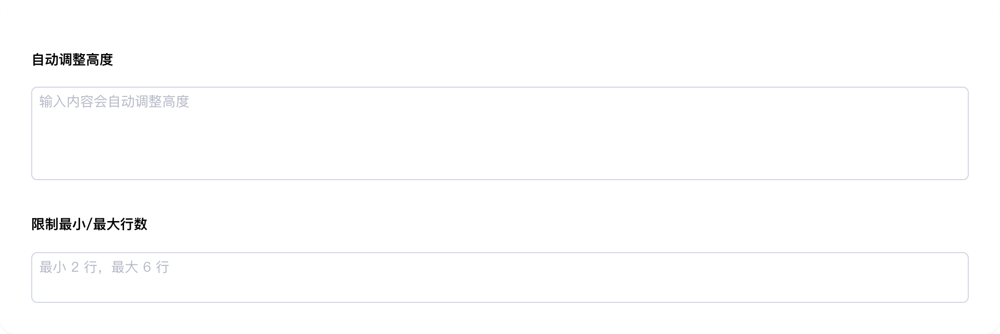
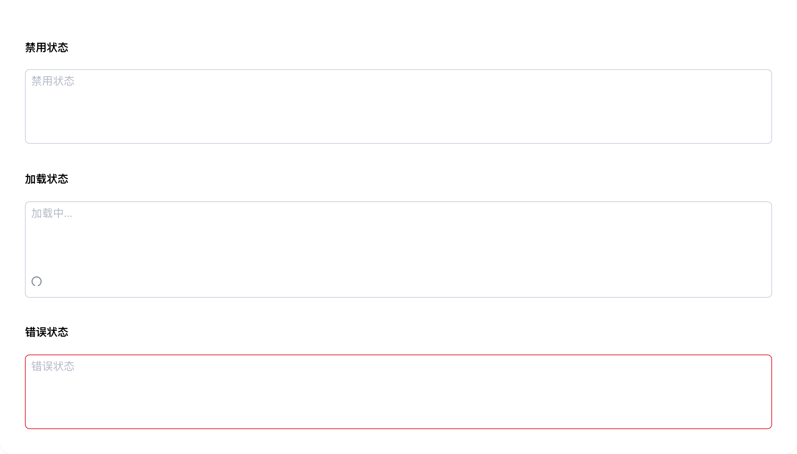
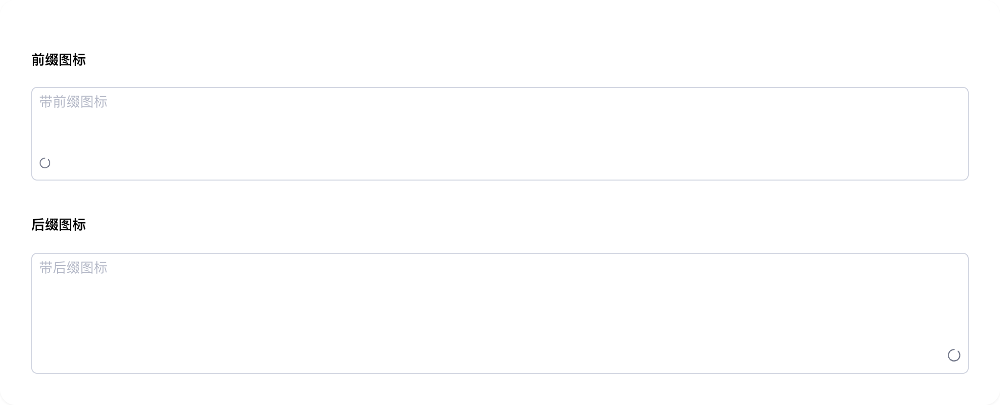

# textarea

## 1-textarea-demo

### 总结描述

- 最基本的多行文本框用法。

### 预览效果截图

### 代码路径

- `src/components/textarea/1-textarea-demo.jsx`

## 2-textarea-demo

### 总结描述

- 支持根据内容自动调整高度。

### 预览效果截图

### 代码路径

- `src/components/textarea/2-textarea-demo.jsx`

## 3-textarea-demo

### 总结描述

- 支持禁用、加载中和错误状态。

### 预览效果截图

### 代码路径

- `src/components/textarea/3-textarea-demo.jsx`

## 4-textarea-demo

### 总结描述

- 支持添加前缀和后缀图标。

### 预览效果截图

### 代码路径

- `src/components/textarea/4-textarea-demo.jsx`
