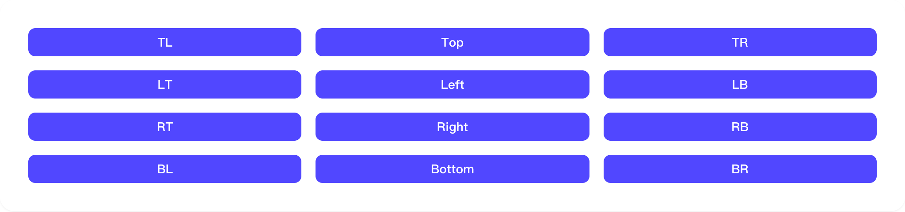
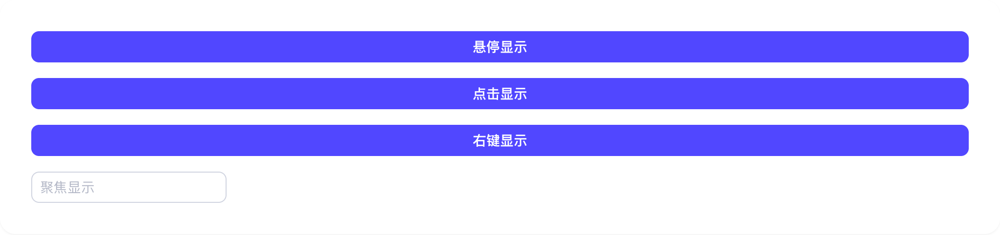

# tooltip

## 1-tooltip-demo

### 总结描述

- 最基础的用法，当鼠标悬停在元素上时显示提示。

### 预览效果截图

### 代码路径

- `src/components/tooltip/1-tooltip-demo.jsx`

## 2-tooltip-demo

### 总结描述

- Tooltip 支持亮色和暗色两种主题。

### 预览效果截图

### 代码路径

- `src/components/tooltip/2-tooltip-demo.jsx`

## 3-tooltip-demo

### 总结描述

- Tooltip 支持 12 个不同的展示位置。

### 预览效果截图

### 代码路径

- `src/components/tooltip/3-tooltip-demo.jsx`

## 4-tooltip-demo

### 总结描述

- Tooltip 支持多种触发方式：悬停、点击、右键和聚焦。

### 预览效果截图

### 代码路径

- `src/components/tooltip/4-tooltip-demo.jsx`
