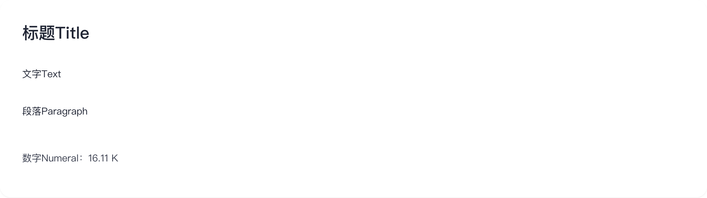
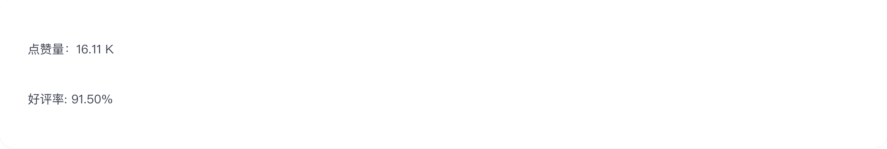
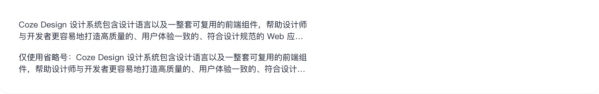

# typography

## 1-typography-demo

### 总结描述

- 展示所有子组件的基本使用方式。

### 预览效果截图

### 代码路径

- `src/components/typography/1-typography-demo.jsx`

## 2-typography-demo

### 总结描述

- Title 组件支持不同的标题级别和预设字号。

### 预览效果截图

### 代码路径

- `src/components/typography/2-typography-demo.jsx`

## 3-typography-demo

### 总结描述

- Text 组件提供了多种预设字号选择。

### 预览效果截图

### 代码路径

- `src/components/typography/3-typography-demo.jsx`

## 4-typography-demo

### 总结描述

- Paragraph 组件支持文本展开折叠和省略功能。

### 预览效果截图

### 代码路径

- `src/components/typography/4-typography-demo.jsx`

## 5-typography-demo

### 总结描述

- Numeral 组件用于处理数字的展示格式。

### 预览效果截图

### 代码路径

- `src/components/typography/5-typography-demo.jsx`

## 6-typography-demo

### 总结描述

- Typography 组件支持文字省略功能，可以配置 tooltip 或 popover 提示。

### 预览效果截图

### 代码路径

- `src/components/typography/6-typography-demo.jsx`
