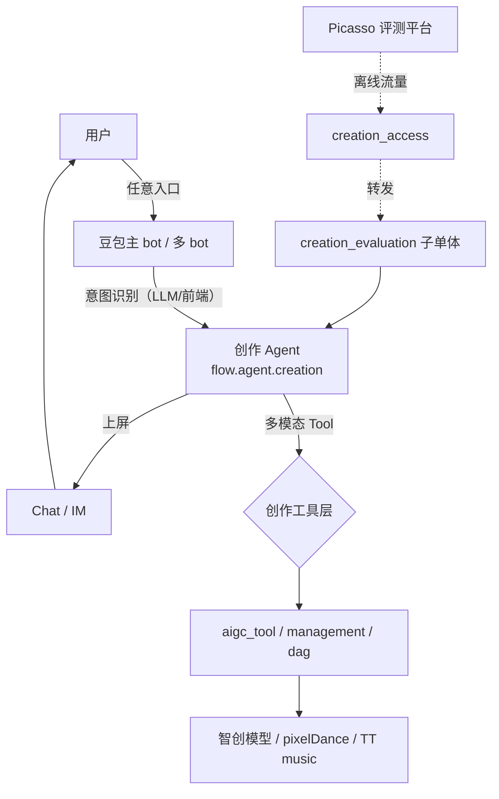

# 业务架构与场景全景

> 来源：`feat-design/background/arch/arch.md` § 业务场景表 + § 业务架构。
>
> **本文件用于**：阶段一 `skill_request_brainstorm` 判定需求落在哪条创作动线 / 哪个入口。

---

## 一、创作业务场景矩阵（8 大类 × 多入口）

豆包-创作业务包含两大方向：**创作** + **分发与消费**。本 skill scope 仅覆盖**创作**部分。

### 1.1 创作能力 × 入口矩阵（13 条动线）

| # | 创作能力 | 入口类型 | 是否本期 PRD 改造 |
|---|---|---|---|
| 1 | **文生图** | 主 bot 指令集 | ✅ |
| 2 | 文生图 | 主 bot 闲聊 | ✅ |
| 3 | 文生图 | AI 图片生成（官方多 bot） | ⚠️ 间接 |
| 4 | 文生图 | AI 漫画生成（官方多 bot） | ⚠️ 间接 |
| 5 | 文生图 | 绘画系列 bots（运营多 bot） | ⚠️ 间接 |
| 6 | **图生图** | 风格化系列 bots（运营多 bot） | ⚠️ 间接 |
| 7 | 图生图 | 主 bot 指令集 | ✅ |
| 8 | 图生图 | 主 bot 闲聊 | ✅ |
| 9 | **AI 修图** | 主 bot 指令集 | ✅ |
| 10 | **分身写真** | 主 bot 指令集 | ✅ |
| 11 | 分身写真 | 主 bot 闲聊 | ✅ |
| 12 | **图/文生视频** | 主 bot 指令集 | ✅ |
| 13 | **文生音乐** | 主 bot 指令集 | ⚠️ 与本期 ReAct 无关（语音团队） |

> **本 skill 首版** [`../C. 创作能力动线专栏/`](../C.%20创作能力动线专栏/) 完整填写 4 条命中本期改造的动线（# 2、8、11、12），其余 8 条放骨架。

---

## 二、创作能力一览（按模型来源）

### 2.1 生图（智创团队提供模型）

- 文生图、图生图、AI 修图、分身写真
- 模型接入收敛到智创工程（`flow.aigc.dag` + `flow.aigc.management` + `flow.aigc.tool`）
- 入口：除 AI 修图外，其他生图均提供"闲聊"+"Action Bar"两种入口

### 2.2 生视频（智创团队提供模型）

- 图文生视频
- 接入 pixelDance i2v 模型
- **仅支持指令集入口**

### 2.3 生音乐（语音团队 / TT music 提供）

- 文生音乐
- **仅支持指令集入口**
- **不在本 skill 重点 scope**（独立链路，与 agent 链路解耦较深）

---

## 三、入口类型解析

### 3.1 主 bot 闲聊

用户在豆包主 bot 与 AI 对话过程中，AI 通过自然语言识别意图触发创作能力。

**特点**：意图识别在 LLM 层完成（不依赖前端结构化指令）；用户体验自然但意图识别有失败率。

### 3.2 主 bot 指令集 / Action Bar

用户在主 bot 通过特定 UI 按钮 / 模板 / 指令集触发。

**特点**：意图明确（前端已结构化），无需 LLM 意图识别；体验稍欠灵活但可靠性高。

### 3.3 官方多 bot（AI 图片生成 / AI 漫画生成）

豆包平台提供的**专门的创作 bot**，用户进入即默认创作意图。

**特点**：意图先验给定（bot 即类型）；可能用 bot_engine 映射机制接入到生图 agent。

### 3.4 运营多 bot（绘画 / 风格化系列）

运营方创建的**主题 bot**（如"水彩画 bot"、"古风 bot"）。

**特点**：bot 维度可配置不同 SP / 模型 / 参数；通过 bot 映射进入生图 agent。

---

## 四、业务架构概念图（mermaid，简化）

---

## 五、与本 skill 的关联

| 阶段 | 用本文件做什么 |
|---|---|
| 阶段一 `skill_request_brainstorm` | 判定需求落在哪条动线（动线维度，定位粒度 D3） |
| 阶段二 `skill_link_explore` 子动作 `capability_match` | 链向具体动线文件（`../C. 创作能力动线专栏/<动线>.md`） |

---

## 六、参考资源

- 完整业务场景表 + 截图：`feat-design/background/arch/arch.md` § 业务场景
- 业务架构白板：`whiteboard_01_LXnUwH9zdhTSMobZZ6rcLsTinsg.json`（飞书原文档可看图）
- 工程架构白板：`whiteboard_02_WW9UwAr4ahAdTBbwyNacCNWCnBT.json`
