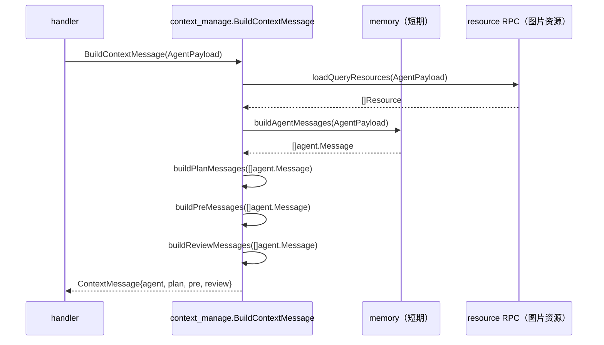

# ContextMessage 4 路扩散

> 来源：`feat-design/background/prd/prd.md` § Agent 逻辑层 § 上下文管理。
>
> **本文件用于**：理解 Agent 逻辑层"上下文管理"模块的协议和构造逻辑。改 Memory / SP / 输入构造时必读。

---

## 一、问题背景

LLM 模型调用、安全审核、前置审核、Agent 内部追踪等多个子系统都需要"上下文消息"，但**它们需要的格式不一样**：

- LLM 模型：`schema.Message`（OpenAI 风格）
- 安全审核：`agent.Message`（业务封装）
- 前置审核：`schema.Message` 但内容不同
- Agent 内部：`agent.Message` 综合形态

如果直接在 ctx 里塞所有形态 → 散乱且难维护（PRD 显式批评 ctx 传值）。

**本期改造**：把 4 路形态收敛到一个 `ContextMessage` 结构里。

---

## 二、ContextMessage 协议

```go
type ContextMessage struct {
    agentMessages  []*agent.Message   // AgentPayload.ContextMessage + Memory 综合处理后的上下文信息
    planMessages   []*schema.Message  // 给到 LLM 模型的 Message
    reviewMessages []*agent.Message   // 给安全的 Message
    preMessages    []*schema.Message  // pre 节点前置审核的 Message
}
```

四路含义：

| 字段 | 给谁用 | 类型 | 说明 |
|---|---|---|---|
| `agentMessages` | Agent 内部追踪 / 反思 | `[]*agent.Message` | "完整上下文"，由 AgentPayload + Memory 合成 |
| `planMessages` | LLM 输入 | `[]*schema.Message` | 给真实 LLM 调用的输入 |
| `reviewMessages` | 安全审核 | `[]*agent.Message` | 单独走审核 |
| `preMessages` | pre 节点前置审核 | `[]*schema.Message` | 在 LLM 之前的预审 |

---

## 三、构造流程

### 3.1 入口

`agent_phase_26/agent/context_manage/`（PRD § 上下文管理 § 具体实现）

### 3.2 函数清单

| 函数名 | 作用 | 入参 | 出参 |
|---|---|---|---|
| `BuildContextMessage` | **入口方法**，根据 AgentPayload 参数构造上下文 | `agent.AgentPayload` | `ContextMessage` |
| `loadQueryResources` | 加载用户 Query 中的图片资源 | `agent.AgentPayload` | `Resource` |
| `buildAgentMessages` | 查询 Memory 信息，构建 agentMessages 结构 | `agent.AgentPayload` | `[]*schema.Message` |
| `buildPlanMessages` | 根据 agentMessages 构建 PlanMessages（LLM 输入） | `[]*schema.Message` | `[]*schema.Message` |
| `buildPreMessages` | 根据 agentMessages 构建 PreMessages（前置审核） | `[]*schema.Message` | `[]*schema.Message` |
| `buildReviewMessages` | 根据 agentMessages 构建 ReviewMessages（安全审核） | `[]*schema.Message` | `[]*agent.Message` |

### 3.3 时序



---

## 四、与 Memory 的关系

`buildAgentMessages` 内部会查询 Memory（短期 = Abase；长期 = VikingDB / RAG）。

```go
// 伪代码
func buildAgentMessages(p *agent.AgentPayload) []*schema.Message {
    contextMsgs := p.ContextMessage  // 来自请求的上下文
    memory := loadShortTermMemory(p.UserID, p.MsgID)  // Abase
    longMemory := loadLongTermMemory(p.UserID)  // VikingDB
    return merge(contextMsgs, memory, longMemory)
}
```

详见 [`../D. 中间件_基础设施专栏/Abase.md`](../D.%20中间件_基础设施专栏/Abase.md)、[`../D. 中间件_基础设施专栏/VikingDB.md`](../D.%20中间件_基础设施专栏/VikingDB.md)。

---

## 五、改动 ContextMessage 的注意事项

### 5.1 加新路（如新增 traceMessages）

需要：
1. 在 ContextMessage 加字段
2. 写对应的 `buildXxxMessages` 构造函数
3. **不要直接修改其他路的字段**（避免污染）

### 5.2 改 Memory 合成逻辑

需要：
1. 在 `buildAgentMessages` 内修改
2. **同步评估存量 Memory 数据兼容**（PRD § Memory 也提到"短期记忆结构过于冗杂，已出现部分大 key 倾向"，是已知 tech-debt）

### 5.3 改 LLM 输入

需要：
1. 在 `buildPlanMessages` 内修改
2. 注意 `parsers` 字段（doubao_think_v1 / doubao_fc_xml_v2）；改格式时同步看 [`./3. ReAct 五层架构介绍.md`](./3.%20ReAct%20五层架构介绍.md) § 5

### 5.4 改安全 / 前置审核

需要：
1. 在 `buildReviewMessages` / `buildPreMessages` 修改
2. 调用下游 `ocean.cloud.review`，注意接口契约

---

## 六、与本 skill 的关联

| 阶段 | 用本文件做什么 |
|---|---|
| 阶段二 `skill_link_explore` 子动作 `tool_chain_trace` | 当工具调用涉及上下文构造时，定位到这里 |
| 阶段二 `sp_inventory` | SP 内容最终被 `buildPlanMessages` 注入 LLM 输入；改 SP 必须看这里 |
