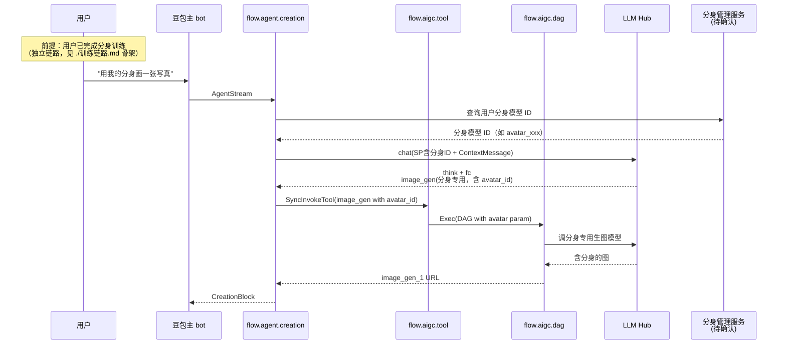

# 分身写真 — 推理链路 主 bot 闲聊

> **命中本期 PRD 改造**：✅ 完整命中
>
> **业务 PM**：陈思颖 (Siying Chen)
> **入口特点**：用户已完成分身训练（独立链路）后，在闲聊中触发推理；强依赖训练产物（分身模型）

---

## 1. 用户动线



---

## 2. 涉及 PSM 链路

| 跳数 | 关键 |
|---|---|
| 0 | （前置）用户分身训练在独立链路完成（见 [训练链路骨架](./训练链路.md)） |
| 1 | 端上 → `flow.agent.creation::AgentStream` |
| 2 | `creation_agent` → 分身管理服务（具体 PSM 待确认，可能是 `flow.alice.creativity_asset` 或专用） |
| 3 | `flow.agent.creation` → `flow.aigc.tool::SyncInvokeTool`（带 avatar_id） |
| 4 | `flow.aigc.tool` → `flow.aigc.dag::Exec` |
| 5 | `flow.aigc.dag` → 调智创**分身专用模型**（IDIP 系列） |
| 6 | 同文生图后续 |

> **特殊**：分身写真链路相比纯文生图，**多一跳分身模型查询**。

---

## 3. 命中的 Tool

| Tool | 角色 | 备注 |
|---|---|---|
| `host` | 陪伴文本 | — |
| `image_gen` | 生图（带分身参数） | 与文生图共享 image_gen Tool，但 DAG 内部参数 `avatar_id` 区分 |

工具参数（分身写真特有）：

```json
{
    "prompts": ["在海边的写真"],
    "ratio": "3:4",
    "output_image_ids": ["image_gen_1"],
    "avatar_id": "avatar_xxx"  // 关键参数，触发分身专用模型
}
```

> **争议**：是否应该独立成 `image_gen_avatar` Tool？目前看是**复用 image_gen + 参数区分**（schema 中 avatar_id 是 optional）。

---

## 4. 命中的 SP

| SP key（推断） | 用途 |
|---|---|
| 分身写真专用发散 SP | 控制写真场景生成 prompt |
| 主 ReAct SP | 控制 think + fc |

> **特别注意**：分身写真链路涉及**用户隐私**（人脸数据），SP 中可能有特殊安全约束。改 SP 务必同步 [`../../A. 组织职责与找人地图/团队组织.md`](../../A.%20组织职责与找人地图/团队组织.md) 的安全 PM。

---

## 5. 关键 Libra / 切流点

- `SupportAgent26`：决定走新老链路
- 分身专用 AB 维度：可能在 `creation_evaluation/constant/ab_params.go` 或独立 constant
- IDIP 模型版本切流：智创内部维护（不在本仓库）

---

## 6. 历史架构演进备注

- 2024.4-7 分身写真 MVP（业务萌芽期）
- 2024.7 分身能力建设
- ⑤ 本期 ReAct 复用 image_gen Tool 接入

---

## 7. 本期改造影响点

| 改了什么 | 在哪 | 影响 |
|---|---|---|
| image_gen schema 含 avatar_id 字段 | `aigc_management/.../schema/doubao/doubao_text2image.json` | 共享 schema，参数兼容 |
| 分身链路在 ReAct 下的 think/fc 流程 | agent_phase_26 | 与普通文生图一致流程，仅 SP / 参数差异 |

---

## 8. brainstorm 时常见问题

### Q1：用户没训练分身就触发分身写真怎么处理？

→ Tool 内部应校验 avatar_id 存在；不存在则走 ButtonBlock 引导用户先训练（指向训练链路入口）。

### Q2：分身模型可能下线（用户自删 / 安全下架），怎么处理？

→ 加查询步骤；若不存在则降级到普通生图 + 提示。

### Q3：为什么"训练链路"是独立动线？

→ 训练链路涉及**任务化长链路**（数据采集 → 训练 → 验收 → 上线），与"用 chat 触发"模式不同。详见 [训练链路骨架](./训练链路.md)。

### Q4：用户体验区分"普通生图 vs 分身写真"？

→ 在 ContentForModel / SP 中区分；UI 层也可能展示不同 LoadingBlock。

### Q5：分身写真改动**安全侧**（人脸 / 隐私）必须 review 的清单？

→ 安全 PM 曹东欧 + 安全工程蒋星；画风机审 PM；任何与人脸数据流转的改动都不能跳过。
