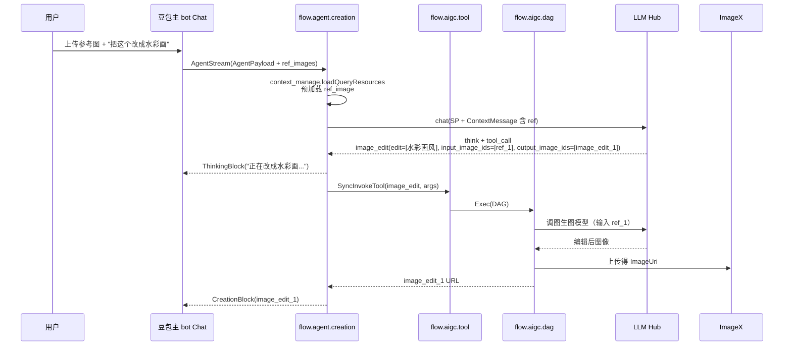

# 图生图 — 主 bot 闲聊入口

> **命中本期 PRD 改造**：✅ 完整命中
>
> **业务 PM**：陈思颖 (Siying Chen)
> **入口特点**：用户上传 / 选择参考图后自然语言对话；引入 ReferenceImage 资源；意图识别 + 参考图绑定

---

## 1. 用户动线



---

## 2. 涉及 PSM 链路

与文生图基本相同，但**新增"参考图加载"步骤**：

| 跳数 | 关键 |
|---|---|
| 0a | `creation_agent/agent_phase_26/agent/context_manage/loadQueryResources` 预加载 ref_image 到 PreLoadResource |
| 1 | `flow.agent.creation::AgentStream`（输入含 ref_images） |
| 2-7 | 同 [文生图主bot闲聊](../文生图/主bot%20闲聊入口.md) §2 |

---

## 3. 命中的 Tool

| Tool | 角色 | schema | 网关 | DAG handler |
|---|---|---|---|---|
| `host` | 陪伴文本 | — | — | — |
| `image_edit` | 图编辑主工具 | `aigc_management/.../schema/doubao/doubao_image2image.json` ★本期新增 | `aigc_tool/method/sync_invoke_tool.go` | `aigc_dag/biz/handler_sync/doubao/image2image.go` ★本期新增 |

工具调用参数：

```json
{
    "edit": ["改成水彩画"],
    "input_image_ids": ["ref_1"],
    "output_image_ids": ["image_edit_1"],
    "ratio": "unchange"
}
```

> **关键差异**：图生图工具 `input_image_ids` 接收用户**已存在的 ResourceID**（可能是用户上传的 ref，也可能是上一步 image_gen 产出的 ID）；`ratio="unchange"` 表示保持原图比例。

---

## 4. 命中的 SP

| SP key（推断） | 用途 | 4 层加载 |
|---|---|---|
| 图生图发散 SP | 控制 image_edit 工具调用决策 | ④ Fornax 默认 |
| 主 ReAct SP（同文生图） | 全链路控制 think + fc | ④ Fornax 默认 |

---

## 5. 关键 Libra / 切流点

与 [文生图主bot闲聊](../文生图/主bot%20闲聊入口.md) §5 类似。**额外注意**：

- 图生图特有的图片格式 / 分辨率 AB 在 `aigc_dag/biz/common/ab.go`
- 风格化 bot 入口（运营多 bot）有独立切流策略

---

## 6. 历史架构演进备注

- ② Hook 时代起源（2024.9）
- ③ 豆包新架构（2024.12）做了"闲聊图生图迁移 agent"——这是关键节点
- ⑤ 本期 ReAct 把 image_edit 升级为标准 Tool

> 详见 [`../../B. Agent 架构专栏/2. 工程架构演进史.md`](../../B.%20Agent%20架构专栏/2.%20工程架构演进史.md)。

---

## 7. 本期改造影响点

| 改了什么 | 在哪 | 影响 |
|---|---|---|
| image_edit schema 化 | `doubao_image2image.json` ★新增 | 配置化，不影响代码 |
| handler_sync/doubao/image2image.go | aigc_dag ★新增 | 标准化图编辑链路 |
| ResourceID 跨层引用 | image_gen_X / image_edit_X 一致 | **关键**：保持 ID 一致是协议核心 |
| 参考图预加载 | context_manage/loadQueryResources | PreLoadResource 含 binary / URL / Base64 多种形态 |

---

## 8. brainstorm 时常见问题

### Q1：要支持新的图编辑风格（如"赛博朋克"）

→ 不需要改代码，改 SP 中的可选风格列表 + Fornax 配置；如果需要专门 Tool 接入新模型，则按"新增工具"流程。

### Q2：参考图过大怎么办（性能问题）

→ 看 PreLoadResource 的 `ImageUrl500P` / `ImageUrl720P` 缩略图字段；DAG 内部应优先用缩略图发模型。

### Q3：用户上传的图被识别成 ref_X 还是 image_gen_X？

→ 上传图统一是 `ref_X`（用户提供）；模型生成的是 `image_gen_X`；编辑产物是 `image_edit_X`。区分清楚不要混。

### Q4：与 AI 修图（[../AI修图/](../AI修图/)）的区别？

→ 图生图是**风格 / 内容级修改**（往往整图重绘）；AI 修图是**局部编辑**（消除 / 扩图 / 变清晰）。两者命中不同的智创工具能力（IDIP1.4 / IDIP2.0 等）。
