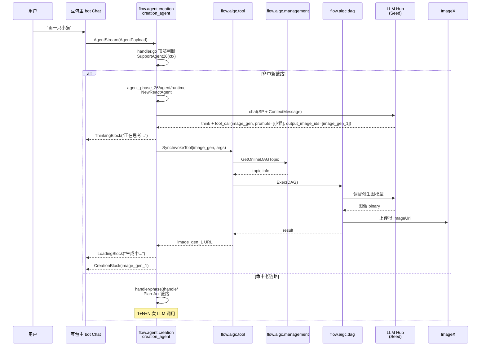

# 文生图 — 主 bot 闲聊入口

> **命中本期 PRD 改造**：✅ 完整命中（agent_phase_26 灰度内重点动线）
>
> **业务 PM**：欧桐桐 (Tongtong Ou)
> **入口特点**：用户在主 bot 自然语言对话中触发，依赖 LLM 意图识别

---

## 1. 用户动线



---

## 2. 涉及 PSM 链路

| 跳数 | 上 | 下 | 接口 / 协议 |
|---|---|---|---|
| 1 | 端上 (Chat) | `flow.agent.creation` | `AgentStream` (kitex stream) |
| 2 | `flow.agent.creation` | `flow.aigc.tool` | `SyncInvokeTool` ★（本期推 sync）/ `AsyncInvokeTool`（兼容 async） |
| 3 | `flow.aigc.tool` | `flow.aigc.management` | `GetOnlineDAGTopic` |
| 4 | `flow.aigc.tool` | `flow.aigc.dag` | `Exec` |
| 5 | `flow.aigc.dag` | `stone.llm.gateway` / `ic.cv.hamlet` | 模型调用 |
| 6 | `flow.aigc.dag` | `bytedance.videoarch.imagex_url` | 上传 / 拉链接 |
| 7 | `flow.agent.creation` | Chat | StreamPacket 上屏（Block 协议） |

**LLM 模型调用次数**：
- 老 Plan-Act：1（Plan）+ 1+（FC）+ 1（多模态）= **≥ 3 次 LLM 交互**
- 新 ReAct：1（think + fc）+ 1（多模态）= **2 次** ⬇️

---

## 3. 命中的 Tool

| Tool | 角色 | schema | 网关 | DAG handler |
|---|---|---|---|---|
| `host` | 发陪伴文本（"正在为您生成小猫的图片..."） | — | — | （内嵌于 ReAct 协议） |
| `image_gen` | 生图主工具 | `aigc_management/service/domain/ability/schema/doubao/doubao_text2image.json` ★本期新增 | `aigc_tool/method/sync_invoke_tool.go` ★本期新增 | `aigc_dag/biz/handler_sync/doubao/text2image.go` ★本期新增 |

工具调用参数（来自 PRD § Tool 配置协议）：

```json
{
    "prompts": ["小猫"],
    "ratio": "1:1",
    "output_image_ids": ["image_gen_1"]
}
```

> **关键**：`output_image_ids` 是模型在 think 时**预先分配**的逻辑 ID，工具执行后填充真实 URL 到 Memory.Resource[image_gen_1]。

---

## 4. 命中的 SP

| SP key（推断 / 待验证） | 用途 | 4 层加载状态 |
|---|---|---|
| `T2IDivergent` 或同类发散 SP | 文生图发散描述 | ④ Fornax 默认线上 |
| 主 ReAct SP（agent_phase_26 用） | 控制 think + fc 行为 | ★ 待补：新链路如何映射 SP key 需查 `agent_phase_26/agent/sp/` |

> **改 SP 必看**：当前 SP 加载在 3 处分散（详见 [`../../../../locators/sp_locator.md`](../../../../locators/sp_locator.md)），改文生图相关 SP **三处都要验证**。

---

## 5. 关键 Libra / 切流点

参考 [`../../../../locators/libra_locator.md`](../../../../locators/libra_locator.md)。本动线相关：

| # | 切流点 | 影响 |
|---|---|---|
| 1 | `creation_agent/handler/handler.go::SupportAgent26` ★ | 决定走新 ReAct or 老 Plan-Act |
| 2 | `SupportAgent26Ark` | 决定 ArkModel vs ModelAPI（影响速度 / 成本） |
| 6 | `aigc_dag/biz/common/ab.go` | DAG 节点级 AB（缩略图 / 图片格式 / 分辨率等） |
| 7 | `aigc_tool/dal/dag_switch.go` | DAG topic 切流（决定走哪个 DAG 版本） |

---

## 6. 历史架构演进备注

参考 [`../../B. Agent 架构专栏/2. 工程架构演进史.md`](../../B.%20Agent%20架构专栏/2.%20工程架构演进史.md)：

- 本动线起源于 ② **基于 Hook 的生图 agent**（2024.9）
- ③ 豆包新架构创作 agent（2024.12）正式独立成 `flow.agent.creation`
- ④ 多模态 Plan-Act 探索（phase3）扩展为可调度 N Tool
- ⑤ ReAct + 五层（**本期 agent_phase_26**）大幅简化交互链

---

## 7. 本期改造影响点

| 改了什么 | 在哪 | 影响 |
|---|---|---|
| 文生图工具 schema JSON 化 | `aigc_management/service/domain/ability/schema/doubao/doubao_text2image.json` ★新增 | 工具能力配置化，不需重新生成 IDL |
| 新增 `SyncInvokeTool` 接口 | `aigc_tool/method/sync_invoke_tool.go` + IDL | 文生图可走 sync（短链路场景） |
| 新增 doubao_image_upload | `aigc_dag/biz/handler_sync/doubao/doubao_image_upload.go` | 图片上传链路标准化 |
| ReAct 协议 think + fc 解析 | `agent_phase_26/agent/runtime/think_stream_parser.go` 等 | 与 SP / Tool 配合产出最终 Block |
| writer/block_build 流式块级管理 | `agent_phase_26/writer/block_build.go` | LoadingBlock + CreationBlock 流式输出 |

---

## 8. brainstorm 时常见问题

### Q1：要新增"水印"开关怎么做？

→ 推荐在 `aigc_dag` 的 doubao text2image handler 加 close_watermark 参数（IDL 已有 `InvokeToolExtraAipReqParam.close_watermark`）；走 Libra 灰度。详见对应 brainstorm 报告示例。

### Q2：要改文生图的 SP 怎么做？

→ 优先 Fornax 改配置（不动代码）。如果是结构性变化，3 处都改。

### Q3：要新增一种 ratio（如 16:9）怎么做？

→ 改 schema JSON `properties.ratio.enum`；agent_phase_26/agent/runtime/tool/dag_image.go 也要识别新 enum。

### Q4：现在文生图能力命中新链路了吗？

→ 看当前 `option.SupportAgent26` 的灰度比例（去 Libra / TCC 平台查）。
