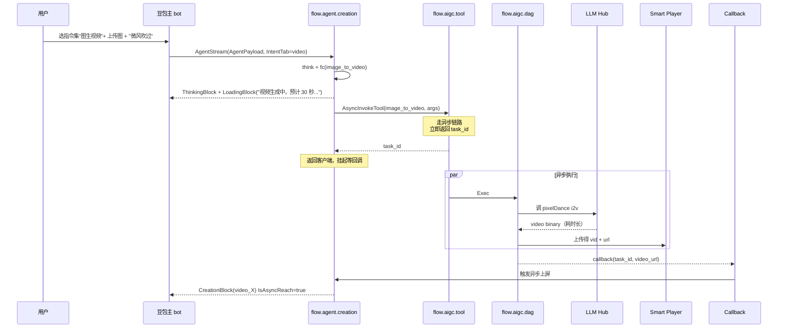

# 文生视频 / 图生视频 — 主 bot 指令集入口

> **命中本期 PRD 改造**：✅ 完整命中
>
> **业务 PM**：智创团队（徐鑫）+ 创作业务工程
> **入口特点**：**仅指令集**（无闲聊入口）；耗时长（异步上屏）；接 pixelDance i2v 模型

---

## 1. 用户动线



---

## 2. 涉及 PSM 链路

| 跳数 | 关键 |
|---|---|
| 1 | 端上 → `flow.agent.creation::AgentStream`（同步阶段） |
| 2 | `flow.agent.creation` → `flow.aigc.tool::AsyncInvokeTool` ★ 用 async |
| 3 | `flow.aigc.tool` → `flow.aigc.dag::Exec` |
| 4 | `flow.aigc.dag` → 调 `pixelDance` 模型（pixelDance 接入 `stone.llm.gateway` 或专用 PSM，待确认） |
| 5 | `flow.aigc.dag` → `toutiao.videoarch.smart_player` 上传得 vid |
| 6 | callback → `flow.agent.creation` → 异步上屏（独立链路） |

> **关键**：与文生图 / 图生图相比，视频走 **AsyncInvokeTool**（不要用 sync 等）。

---

## 3. 命中的 Tool

| Tool | 角色 | schema | 网关 | DAG handler |
|---|---|---|---|---|
| `host` | 陪伴文本 | — | — | — |
| `image_to_video` | 图生视频主工具 | `aigc_management/.../schema/doubao/...` | `aigc_tool/method/async_invoke_tool.go` | `aigc_dag/biz/handler_async/...` |
| `text_to_video` | 文生视频（无参考图） | 同上 | 同上 | 同上 |

工具调用参数（图生视频示例）：

```json
{
    "input_image_ids": ["image_edit_1"],
    "duration": 5,
    "output_video_id": "video_1",
    "prompt": "微风吹过，树叶轻轻摆动",
    "ratio": "unchange"
}
```

---

## 4. 命中的 SP

| SP key（推断） | 用途 | 4 层加载 |
|---|---|---|
| 视频生成专用 SP | 控制视频意图分发 + 提示词增强 | ④ Fornax 默认 |
| 主 ReAct SP | 控制 think + fc | ④ Fornax 默认 |

---

## 5. 关键 Libra / 切流点

| # | 切流点 | 视频特有的影响 |
|---|---|---|
| 1 | `SupportAgent26` | 决定走新老链路 |
| 6 | `aigc_dag/biz/common/ab.go` | 视频时长 / 分辨率 AB |
| 7 | `aigc_tool/dal/dag_switch.go` | DAG topic 切流（决定走 pixelDance v1 / v2） |

---

## 6. 历史架构演进备注

- 2024.11 接入图文生视频能力，搭建新架构 agent 原型
- 2024.12 在新架构 agent 下做"图文生视频"
- ⑤ 本期 ReAct 把 image_to_video / text_to_video 升级为标准 Tool

---

## 7. 本期改造影响点

| 改了什么 | 在哪 | 影响 |
|---|---|---|
| image_to_video schema | aigc_management/.../schema/ | 配置化 |
| 异步链路 callback 上屏 | agent_phase_26/writer/ | IsAsyncReach 标记的精细化 |
| ButtonBlock 接入（视频降级用） | block_build/button_block.go | 当模型降级时给用户跳转入口 |

---

## 8. brainstorm 时常见问题

### Q1：视频生成失败怎么处理？

→ 回 ButtonBlock（10103）让用户手动跳转 / 重试；不要在 agent 内部硬重试（耗时已经长，再 retry 用户更等不动）。

### Q2：如何控制视频时长 / 分辨率？

→ 走 `aigc_dag/biz/common/ab.go` 的 AB 参数；不要硬编码到代码。

### Q3：视频上传后 URL 怎么拉？

→ 通过 `toutiao.videoarch.smart_player` 的 `Vid + GetVideoInfo`；详见 [`../../D. 中间件_基础设施专栏/ImageX_SmartPlayer.md`](../../D.%20中间件_基础设施专栏/ImageX_SmartPlayer.md)。

### Q4：视频用 sync 还是 async？

→ **必须 async**。视频生成耗时常超过 RPC 超时；用 sync 会 timeout 等不到。

### Q5：异步上屏怎么保证不丢？

→ Memory.AsyncInfo 标记 IsAsyncMemory；callback 失败有重试机制（实现细节看 `agent_phase_26/agent/memory/runtime_memory/`）。
