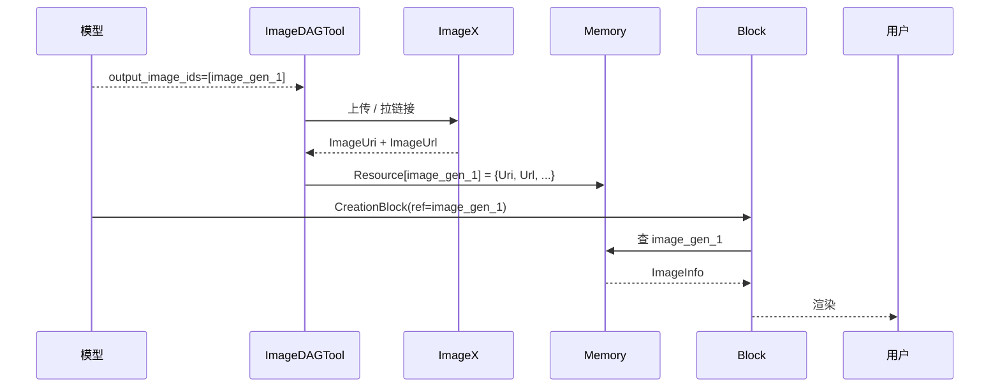

# ImageX / Smart Player

> 字节多媒体基础设施。

---

## 一、用途（豆包-创作链路）

| 中间件 | 用途 |
|---|---|
| **ImageX** | 图片资源管理（生成图、参考图、上传图、缩略图等都通过 ImageX 提供 URL / URI） |
| **Smart Player** | 视频资源管理（生成视频、上传视频的播放链接） |

---

## 二、IDL 引用

| 服务 | PSM |
|---|---|
| ImageX | `bytedance.videoarch.imagex_url` |
| Smart Player | `toutiao.videoarch.smart_player` |

> 这两个是 butterfly 系列的**公共 IDL**，不在 alice_idl / butterfly idl（aigc 三件套）范畴。

---

## 三、ImageInfo / VideoInfo 结构（PRD § 上下文管理）

```go
type ImageInfo struct {
    ImageUri              string
    ImageUrl              string
    TaskId                int64
    Ratio                 string
    PreLoadImgResource    *PreLoadResource
}

type PreLoadResource struct {
    ImageUrlRow      string
    ImageUrl500P     string
    ImageUrl720P     string
    ImageRowData     []byte
    ImageContentType string
    ImageRowBase64   string
    RatioStr         string
    ImageRowWidth    int64
    ImageRowHeight   int64
}

type VideoInfo struct {
    VideoUrl  string
    Vid       string
    TaskId    int64
    Duration  string
}
```

---

## 四、ResourceID 与 ImageX 的关系

参考 [`../../../locators/tool_locator.md`](../../../locators/tool_locator.md) §六 ResourceID 跨层引用：

- 模型层用 `image_gen_X` 这种**逻辑 ID**
- ImageDAGTool.Exec() 拿到结果后**调 ImageX 拉真实 URL**
- 写入 Memory.Resource[image_gen_X] = ImageInfo 结构
- 上屏 CreationBlock 通过 ResourceID 引用真实 URL



---

## 五、写需求时的检查

- [ ] 触达图片 / 视频 / 多模态资源 → 必须考虑 ImageX / Smart Player
- [ ] 改 Resource 结构 → 评估 PreLoadResource 的存量数据兼容
- [ ] 用 binary 模式 vs URL 模式（看带宽 / 安全约束）
- [ ] 视频 vs 图片走不同 PSM
