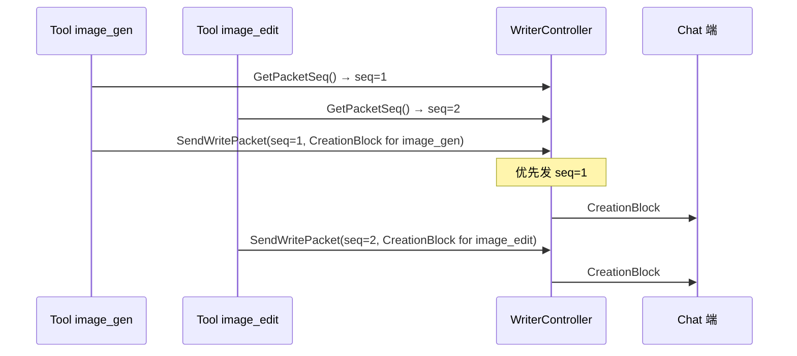

# Block Locator — 上屏 / Chat 交互协议

> 用法：分析涉及"上屏 / Chat 交互 / 端上展示 / 流式渲染"的需求时必读。

---

## 一、Block 类型清单

来源：`feat-design/background/prd/prd.md` § 上屏模块 § 协议定义 § 下行协议（对Chat）

| Block 名称 | content_type | 用途 | 本期改造范围 |
|---|---|---|---|
| `CreationBlock` | 2074 | 创作 Block，用于图片 / 视频等多模态消息展示 | ✅ 本期内 |
| `LoadingBlock` | 10101 | 创作 LoadingBlock，多模态产物规划 / 生成过程中提示信息 | ✅ 本期内 |
| `TextBlock` | — | 文字 Block | ✅ 本期内 |
| `ThinkingBlock` | 10040 | 深入思考 Block，用于思考态过程的标题展示 | ✅ 本期内（**ReAct 配套新增**） |
| `ButtonBlock` | 10103 | 通用跳转 Button Block，用于视频模型降级等场景 | ✅ 本期内 |
| `CreditBlock` | 10057 | 积分 Block | ⚠️ **暂不在本期接入范围** |
| `LoginBlock` | — | 强制要求用户登录的 Block（未登录态） | ⚠️ **暂不在本期接入范围** |

---

## 二、Block 在代码里的位置

### 2.1 旧链路 / Plan-Act 时代

`creation_agent/handler/phase3handle/*` 下的 writer / output 模块。

### 2.2 新链路 / agent_phase_26（本期）

```
creation_agent/agent_phase_26/writer/
├── writer_controller.go           # 上屏控制总入口
└── block_build/                   # 各种 Block 的构造
    ├── creation_block.go         # CreationBlock
    ├── loading_block.go          # LoadingBlock
    ├── text_block.go             # TextBlock
    ├── thinking_block.go         # ThinkingBlock（本期重点）
    └── button_block.go           # ButtonBlock
```

> **关键**：本期 PRD 把上屏抽出为**独立层**（"上屏交互层"），与 Agent 逻辑层解耦。这是五层架构里改动最干净的一层。

---

## 三、WriterPacket 内部协议

来源：`prd.md` § 上屏模块 § 协议定义 § 内部协议

```go
type WriterPacket struct {
    PacketMeta *PacketMeta
    BlockInfo  *PacketBlockInfo
    
    SaveIgnore             bool       // 是否不落 IM 消息
    PacketType             PacketType // packet_type_incr / packet_type_full
    NeedRefreshFullMessage bool       // 是否重置整条消息内容
}

type PacketType string

var (
    PacketTypeIncr PacketType = "packet_type_incr"  // 增量更新
    PacketTypeFull PacketType = "packet_type_full"  // 全量替换
)

type PacketBlockInfo struct {
    BlockType          agent.PacketContentType  // 上面 Block 类型表的 content_type
    BlockContent       *im.Block
    BlockContentForTTS string                   // TTS 专用文本
    BlockMeta          *agent.BlockMeta
}
```

**关键映射**：**N 个 packet 对应 1 个 PacketBlockInfo**（流式渲染时一个 Block 由多个 packet 累积构成）。

---

## 四、上屏顺序锁（关键）

来源：`prd.md` § 上屏模块 § 具体实现

| 函数 | 作用 |
|---|---|
| `GetPacketSeq()` | 获取一个上屏顺序锁，用于后续控制上屏顺序 |
| `(release seq)` | 释放上屏顺序锁，便于后续消息上屏 |
| `SendWritePacket(WriterPacket)` | 发送上屏消息包 |
| `InitXXXBlock()` | 提供各类 Block 结构体的初始化方法 |
| `CopyBlock(XXXBlock)` | 提供对 Block 的深拷贝 |

**为什么需要顺序锁**：流式产出时，多个 Tool 并发执行，但端上展示要保持时序（如 image_gen 1/2/3/4 必须按顺序到达）。`GetPacketSeq()` 确保严格递增。



---

## 五、ThinkingBlock 父子关系（ReAct 新增）

来源：`prd.md` § ThinkingBlock 接入；`prd.md` 接入飞书原文档 token MVD4dawweoNz2gx71sOc5Eq0nYc

**核心思路**：父子 Block 设计：
- **ThinkingBlock**：思考态**标题**（如"开始思考" / "完成思考"）
- **TextBlock**：思考态**内容**（具体思考文本，挂在 ThinkingBlock 下）

示例 packet 序列：

```
packet1: ThinkingBlock_id1: { "title": "开始思考", "is_finish": false }
packet2: TextBlock_id2: { "text": "思考内容1", "parent_id": ThinkingBlock_id1, "is_finish": false }
packet3: TextBlock_id2: { "text": "思考内容2", "parent_id": ThinkingBlock_id1, "is_finish": true }  // 第一段思考完
packet4: TextBlock_id3: { "text": "思考内容2", "parent_id": ThinkingBlock_id1, "is_finish": false } // 第二段思考开始
packet5: TextBlock_id3: { "text": "思考内容2结束", "parent_id": ThinkingBlock_id1, "is_finish": true }
packet6: ThinkingBlock_id1: { "title": "完成思考", "is_finish": true }  // 整个思考态结束
```

**关系**：`parent_id` 关联到 ThinkingBlock；多个 TextBlock 可以挂在同一个 ThinkingBlock 下。

---

## 六、同步 vs 异步上屏链路差异

PRD § 上屏模块 § 内部协议提及"同步 & 异步链路上屏逻辑"。

| 维度 | 同步上屏 | 异步上屏 |
|---|---|---|
| 触发 | LLM 流式输出实时 → 实时上屏 | DAG 异步执行 → 完成后通过 callback / push 上屏 |
| Memory 标记 | `IsAsyncReach = false` | `IsAsyncReach = true`（一次性上屏） |
| 典型场景 | 文字、ThinkingBlock | 长耗时生图 / 生视频 |
| 涉及链路 | LLM → writer → Chat | DAG → 完成 → callback 触发 writer |

> **brainstorm 提醒 RD**：如果你的需求是"耗时长的多模态生成"，**默认走异步上屏**，否则用户体验差。

---

## 七、与 Memory（RuntimeMemory）的关系

```
RuntimeMemory
├── AgentMemory（持久化部分 → Abase: MsgCreationAgentMemoryInfo）
├── TracerInfo（埋点部分 → Tracer logs+metrics）
└── RuntimePlanInfo（生命周期内部，不持久化）
    ├── Planner.Steps / RawSteps / IsAsyncReach
    └── ToolCalls[]
```

**Block 的元数据**通过 `BlockMeta`、`PacketMeta` 等结构与 RuntimeMemory 关联，**最终持久化到 Abase**（按 `MsgID` 索引）。

> **关键约束**：如果改 Block 协议，**必须考虑存量 Memory 数据的兼容**（PRD § Memory 也提到"短期记忆结构过于冗杂，已出现部分大 key 倾向"，是已知 tech-debt）。

---

## 八、ResourceID 在 Block 中的角色

参考 [`tool_locator.md`](./tool_locator.md) §6 ResourceID 跨层引用：

`image_gen_X` 等 ID 是模型 ↔ 工具 ↔ Memory ↔ **Block** 跨层游标。Block 渲染时通过 ResourceID 拉真实图片 / 视频 URL 从 `flow.alice.resource*` 服务。

---

## 九、Block 改动 brainstorm 建议

### 9.1 决策树

```
你想做什么？
├── 加新 Block 类型
│   → ① 在 alice_idl 加 content_type 编号
│   → ② agent_phase_26/writer/block_build/ 加 builder
│   → ③ writer_controller.go 加路由
│   → ★ 注意 Chat 端是否同步支持新 content_type
├── 改 Block 字段（结构变化）
│   → ★ 注意存量 Memory 数据的反序列化兼容
│   → 走 optional 新字段（向后兼容）
├── 调整上屏顺序 / 时机
│   → 改 GetPacketSeq / SendWritePacket 调用时机
│   → 注意同步 vs 异步选择
└── 接入 ThinkingBlock 类似的"父子关系"
    → 用 parent_id 关联
```

### 9.2 检查清单

- [ ] Block content_type 编号是否与 Chat 端约定一致？
- [ ] 同步 vs 异步上屏选对了？
- [ ] 上屏顺序锁是否被破坏？
- [ ] 改动是否影响 Memory 持久化结构？（看 `MsgCreationAgentMemoryInfo` 的反序列化）
- [ ] 改动是否影响 ResourceID 引用链？
- [ ] 新链路 agent_phase_26 + 老链路两边都同步了？
- [ ] CreditBlock / LoginBlock 不在本期 → 不要假设可用
