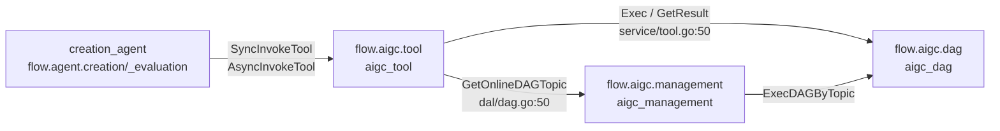

# PSM Locator — 豆包-创作 Agent 链路

> 用法：分析任何需求**第一步**先来这里定位 PSM 入口。**禁止跳过 PSM 定位直接 grep 代码**。

---

## 一、6 PSM 全景

| # | 仓库 worktree | PSM | RUN_NAME 出处 | 角色 |
|---|---|---|---|---|
| 1 | `creation_access` | `flow.alice.creation_access` | `build.sh::RUN_NAME` + `kitex_info.yaml::ServiceName` | 接入层（**主要 for Picasso**） |
| 2 | `creation_agent` | `flow.agent.creation` | `build.sh::RUN_NAME`（无 kitex_info.yaml） | C 端 Agent 主服务 |
| 3 | `creation_agent/creation_evaluation/` | `flow.agent.creation_evaluation` | `main.go::isPSMCreationEvaluation()` 切分 | Picasso 评测专用单体（**与 #2 共仓库**） |
| 4 | `aigc_management` | `flow.aigc.management` | `build.sh::RUN_NAME` + `kitex_info.yaml` | 创作能力配置中心 |
| 5 | `aigc_dag` | `flow.aigc.dag` | `build.sh::RUN_NAME` + `kitex_info.yaml` | DAG 执行引擎 |
| 6 | `aigc_tool` | `flow.aigc.tool` | `build.sh::RUN_NAME` + `kitex_info.yaml` | 工具调用网关 |

> #2 和 #3 共享 `creation_agent` 仓库，但是是两个**独立 PSM**。`main.go` 第 42-45 行根据进程的 PSM 标识判断走 `creation_evaluation.Main()` 还是主服务流程。这是**最容易踩坑的归类误区**（详见 `knowledge_repository/.../A. 组织职责与找人地图/误区纠正.md`）。

---

## 二、C 端入口（`flow.agent.creation`）

**业务方原话**：「agent 有两个流量来源，一个是端上的 c 端用户」 → C 端用户**不经过** `creation_access`，直接打 `flow.agent.creation`。

### 2.1 IDL 接口清单

来源：`alice_idl/thrift/alice_creativity/agent_creation.thrift::service AgentService`

| 接口 | 类型 | 用途 |
|---|---|---|
| `AgentStream(AgentPayload)` | server stream | **主流式接口**（生图 / 生视频 / 编辑等所有创作能力都从这里入） |
| `AgentDuplex(DuplexRequest)` | bidirectional stream | 双向流（用于多轮对话） |
| `AgentStream4Search(AgentPayload)` | server stream | 搜索专用 |
| `CanvasStream(CanvasRequest)` | server stream | 画布交互 |
| `CreationCache(AgentPayload)` | unary | 创作缓存 |
| `GetCrowdTestTask(CrowdTestReq)` | unary | 众测任务 AB 参数 |

### 2.2 第一落点

`creation_agent/handler.go::AgentServiceImpl`：

```
AgentStream → handler.NewAgentStreamHandler().Do(req, stream)   // line 29
CanvasStream → canvas.NewCanvasStreamHandler(req, stream).Do()  // line 48
CreationCache → handler.NewKitsAgentHandler().Text2Image()      // line 55
```

### 2.3 新老架构灰度（在 handler 顶部）

```go
if strings.Contains(req.Query.ContentForModel, "2026_bh") || option.SupportAgent26(ctx) {
    reactAgent := runtime.NewReactAgent(...)  // 新 ReAct（agent_phase_26）
    return reactAgent.Run(ctx, req)
}
// 否则：老 Plan-Act 链路
err = dispatchResult.AgentHandlerInter.Execute(agentCtx, eventProducer)
```

---

## 三、Picasso 入口（`flow.alice.creation_access`）

**业务方原话**：「access 主要 for picasso 的适配」 → IDL 6 个接口里 5 个**显式标 `picasso 调用`**，证实之。

### 3.1 IDL 接口清单

来源：`alice_idl/thrift/alice_creativity/creation_access.thrift::service CreationAccessService`

| 接口 | 类型 | 备注 |
|---|---|---|
| `EvaluateImageTask(EvaluateImageTaskRequest)` | unary | 评测专用（注释未标 picasso，但与 picasso 一组） |
| `ExecuteAgent(ExecuteAgentRequest)` | server stream | **picasso 调用** ★ 主转发接口 |
| `GetDoubaoAgentConfig(req)` | unary | picasso 调用 |
| `ConvertToDoubaoImages(req)` | unary | picasso 调用 |
| `GetDoubaoAgentConfigV2(req)` | unary | **★ 本期新增**（v2 版本，支持 ReAct Agent 架构调试） |
| `GetDoubaoAgentToolVersion(req)` | unary | **★ 本期新增** |

### 3.2 落点 → 转发到 creation_evaluation

`creation_access/handler/picasso/execute_agent.go`（关键 line 18）：

```go
client := evaluationagentservice.MustNewStreamClient("flow.agent.creation_evaluation")
// 拿到下游 client 后，直接转发 stream
```

→ 进入 `creation_agent/creation_evaluation/handler/execute_agent.go`，最终走 `creation_agent/agent_phase_26/agent/runtime/` 或老 Plan-Act 链路（与 C 端共享 runtime 模块）。

### 3.3 c 端唯一接口

c 端在 `creation_access` 里只有 `EvaluateImageTask`：`creation_access/handler/evaluate_image_task/`。注意它**也是评测相关**（不是真正的"业务 c 端流量"），所以可以理解为 `creation_access` 几乎全为评测服务。

---

## 四、`creation_evaluation` 共仓库特殊性

**关键事实**：

- `flow.agent.creation_evaluation` 是**独立 PSM**，但**与 `flow.agent.creation` 共仓库** `creation_agent/`
- 入口在 `creation_agent/creation_evaluation/main.go`（独立 init）
- 主仓 `main.go` 第 42-45 行：

```go
if isPSMCreationEvaluation() {
    creation_evaluation.Main()
    return
}
// 否则走主服务流程
```

- 编译产物：同一个 build.sh 产出**两个二进制**，部署时按 PSM 选启动入口
- 子目录有自己的 handler / service / constant / util，**不与主服务共享 runtime**

> **设计技术方案时**：如果需求只影响 picasso 评测，改 `creation_evaluation/`；如果只影响 c 端，改 `handler/` 主链路 / `agent_phase_26/`；如果两边都要影响，**两边都要改**。

---

## 五、aigc 三件套调用关系

### 5.1 拓扑图



### 5.2 三者职责一句话

| PSM | 一句话 |
|---|---|
| `flow.aigc.management` | **配置中心**：管 Tool 元数据、Ability、DAG 草稿、租户工具配置 |
| `flow.aigc.tool` | **网关**：接收 Sync/Async InvokeTool；查询 management 拿 DAG topic；调 dag 真执行 |
| `flow.aigc.dag` | **执行引擎**：DAG 解析 / 编排 / 调度，最终调用模型完成多模态任务 |

### 5.3 接口入口

| 服务 | handler.go 暴露 |
|---|---|
| aigc_management | `CreateTool` / `UpdateTool` / `ListTool` / `ListToolVersions` ★ / `QueryAgentToolList` ★ / `CreateDAGDraft` / `PublishDAGDraft` / `QueryDAGMeta` / `GetDAGConfig` / `ExecDAGTopic` / `GetAbilityConfig`/ `GetTenantToolConf` 等 |
| aigc_tool | `AsyncInvokeTool` / `SyncInvokeTool` ★（新增） / `InvokeTool` / `GetTaskResult_` |
| aigc_dag | `Exec` / `GetResult_` |

★ 标记本期 IDL 新增。

### 5.4 跨服务调用代码证据

| 调用 | 代码位置 |
|---|---|
| aigc_tool → aigc_dag | `aigc_tool/service/tool.go:50` `flow_aigc_dag.RawCall.Exec()` |
| aigc_tool → aigc_management | `aigc_tool/dal/dag.go:50` `flow_aigc_management.RawCall.GetOnlineDAGTopic()` |
| aigc_management → aigc_dag | `aigc_management/handler/dag/exec_dag_topic.go::ExecDAGByTopic` |
| creation_agent → aigc_tool | `creation_agent/agent_phase_26/agent/runtime/tool/dag_image.go` 等 |

---

## 六、其他关联下游 PSM（`creation_agent` 出口侧）

**核心生成类**：
- `flow.aigc.tool` / `flow.aigc.management`
- `stone.llm.gateway`（butterfly 大模型网关）
- `flow.alice.resource` / `flow.alice.resource_center` / `flow.alice.resource_item`

**数据 / 配置 / 模型**：
- `flow.alice.config_center` / `flow.alice.model` / `flow.alice.creativity`
- `flow.commerce.credit_rpc`（积分）
- `ic.cv.hamlet`（CV 模型网关）

**审核 / 用户 / 媒体**：
- `ocean.cloud.review`（内容审核）
- `ocean.cloud.profile`（用户档案）
- `bytedance.videoarch.imagex_url` / `toutiao.videoarch.smart_player`（图片 / 视频资源）

**消息 / 推送**：
- `flow.alice.message`
- `flow.notify.push`

---

## 七、IDL 双源依赖（参考 [`tool_locator`](./tool_locator.md) §"IDL 引用"）

| IDL 仓库 | 角色 | 包路径 |
|---|---|---|
| `alice_idl` | 创作业务**自有 IDL** | `flow_alice_creativity` / `flow_alice_config_center` / `flow_alice_resource(_center / _item)` / `flow_alice_model` / `flow_alice_message` / `flow_agent_creation` / `flow_agent_creation_evaluation` |
| `idl` (butterfly/idl) | aigc 三件套**公共 IDL** | `flow/service/{dag,management,tool}/`；通过 `code.byted.org/butterfly/common`、`code.byted.org/overpass/butterfly_aigc_creation` 引入 |

**业务方告知**：`aigc_dag` / `aigc_management` 依赖 butterfly/idl —— 已在依赖矩阵证实。

---

## 八、定位流程（用本 locator 的标准动作）

```
1. 读用户 PRD → 抽出关键词
2. 关键词命中 → 决定流量入口（C 端 or Picasso）
3. 流量入口决定 → 决定第一落点
   - C 端 → creation_agent/handler.go
   - Picasso → creation_access/handler/picasso/* → creation_evaluation
4. 落点处理后 → 决定是否走 agent_phase_26（看 SupportAgent26 / 2026_bh）
5. 如果触达 Tool → 转去 tool_locator
6. 如果触达 SP → 转去 sp_locator
7. 如果触达 灰度 / Libra → 转去 libra_locator（**任何需求都要查**）
8. 如果触达 上屏 / Block → 转去 block_locator
```
