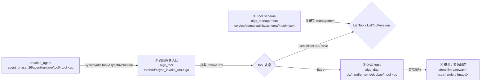

# Tool Locator — 创作工具链路

> 用法：分析"新增 / 改动 / 下线 Tool"类需求时**必读**。Tool 链路横跨 4 个仓库，任何一段都可能成为隐藏点。

---

## 一、Tool 清单（PRD 白板 + 代码）

来源：`feat-design/background/prd/resources/whiteboard_04_model.json`（含 host / Quota / Image2Video / Text2Video / Hold / Safety / Image DAG Tool）

| Tool | 类型 | 一句话 |
|---|---|---|
| `host` | 协调工具 | ReAct 的"宿主"工具，发 `display_text`（"正在为您生成..."）伴随消息 |
| `image_gen` | 创作工具 | 文生图（输入 prompts、ratio、output_image_ids） |
| `image_edit` | 创作工具 | 图编辑（输入 edit、input_image_ids、output_image_ids） |
| `image_to_video` | 创作工具 | 图生视频（输入 input_image_ids、duration、output_video_id、prompt） |
| `text_to_video` | 创作工具 | 文生视频 |
| `Hold` | 控制工具 | 等待 / 持续状态控制（用于多步任务的中间态） |
| `Safety` | 安全工具 | 内容安全审核（contentType: review） |
| `Quota` | 账户工具 | 额度 / 积分 / 会员校验 |
| `saliency_segmentation` | 创作工具（diff 新增） | 显著性分割 |
| `doubao_image_upload` | 工具内逻辑（diff 新增） | 图片上传 |

---

## 二、Tool 四级链路（横跨 4 仓库）



四级链路在以下文件中可以"展开"：

| 级 | 仓库 | 入口位置 | 你能在这里改什么 |
|---|---|---|---|
| ① schema | aigc_management | `service/domain/ability/schema/<tool>.json` | 工具的 input/output 结构、参数描述 |
| ② 网关 | aigc_tool | `handler.go` + `method/<x>.go` | sync vs async 选择、租户超时、参数校验 |
| ③ DAG | aigc_dag | `biz/handler_sync/doubao/<tool>.go` 或 `biz/handler_async/<tool>.go` | DAG 节点编排、模型调用、上传逻辑、错误处理 |
| ④ 模型 | 下游 | 调用 `stone.llm.gateway` 等 | 不在本期 scope |

**`creation_agent` 侧的 Tool 入口**：

| 旧（Plan-Act） | 新（agent_phase_26） |
|---|---|
| `internal/rpc/tool.go`（基础定义） | `agent_phase_26/agent/runtime/tool/dag_image.go`、`t2v.go`、`i2v.go` 等（共 7 个工具） |
| `internal/rpc/phase3/tool/`（t2i、i2i、gen_video、ai_replica 等） | — |

> Tool 注册函数：`NewText2ImageAgentTools` / `NewImage2ImageAgentTools` 等（旧），新链路在 agent_phase_26 包内独立注册。

---

## 三、本期 Tool 协议变迁（必读）

### 3.1 ToolInfo 简化（alice_idl）

**diff 来自** `alice_idl/thrift/alice_creativity/creation_tool.thrift`：

```thrift
// 旧
struct ToolInfo {
    1: string name
    2: string description
    3: map<string, ToolParamInfo> properties  // 复杂：无结构 K-V map
    4: optional list<string> required_
}

// 新
struct ToolInfo {
    1: string name
    2: string description
    3: ToolParamInfo properties               // 结构化对象
}
```

**影响**：旧 `properties` 是任意 K-V，新强制结构化。**对历史依赖 properties map 的代码可能是 silent breaking change**（详见 `Z.2 PRD vs 实现 Gap 表.md`）。

### 3.2 idl (butterfly) Tool 结构扩展

**diff 来自** `idl/flow/service/management/tool.thrift` 等：

```thrift
struct Tool {
    // 原有字段...
    9:  optional i64 version        // ★ 新增：工具版本号
    10: optional bool is_sync       // ★ 新增：是否同步工具
    30: optional ToolInfo tool_info // ★ 新增：工具参数定义
}

struct Ability {
    // 原有字段...
    6: bool is_sync                 // ★ 新增
}
```

### 3.3 新增 Sync 调用接口（idl/flow/service/tool/）

```thrift
service AIGCToolService {
    InvokeToolResponse InvokeToolAsync(1: AsyncInvokeToolRequest req)  // 旧
    GetTaskResultResponse GetTaskResult(1: GetTaskResultRequest req)
    
    SyncInvokeToolResponse SyncInvokeTool(1: SyncInvokeToolRequest req) // ★ 新增
}

struct SyncInvokeToolRequest {
    1: required string source
    2: required i64 tenant_id
    3: required string tool_name
    4: required string input
    5: optional string req_id
    6: optional string extra
    7: optional i64 version
}

struct SyncInvokeToolResponse {
    1: string output
    2: string task_id
    3: optional i32 biz_err_status_code      // 业务错误码
    4: optional string biz_err_status_msg
}

struct InvokeToolExtraAipReqParam {
    1: optional string request_key
    2: optional string model_version
    3: optional string pre_vlm_version
    4: optional bool close_search
    5: optional i64 seed
    6: optional string cot_mode
    7: optional bool force_single
    8: optional bool close_watermark
}
```

### 3.4 新增 management 接口

```thrift
service AIGCManagementService {
    // 原有 API...
    tool.ListToolVersionsResp ListToolVersions(1: tool.ListToolVersionsReq req)      // ★
    tool.QueryAgentToolListResp QueryAgentToolList(1: tool.QueryAgentToolListReq req) // ★
}
```

---

## 四、Sync vs Async 调用决策

| 维度 | Sync (`SyncInvokeTool`) | Async (`AsyncInvokeToolAsync`) |
|---|---|---|
| 入口 | aigc_tool/method/sync_invoke_tool.go | aigc_tool/method/async_invoke_tool.go |
| 等待 | 同步等结果 | 立即返回 task_id，后续 `GetTaskResult` 拉取 |
| 适用 | 短链路工具（如 Quota / Hold / 部分图片处理） | 多模态生成（生图 / 生视频，耗时长） |
| 内部 | IDL 注释提示有 "DAG 异步转同步" 内部逻辑 | 标准异步 |
| 租户超时 | aigc_tool/infra/tcc.go 新增租户级超时配置（diff 新增） | 沿用 |

> **隐藏复杂度**：`SyncInvokeTool` 内部是 "DAG 异步转同步"。如果你新增工具想用 Sync，要确认 DAG 执行可控时长。

---

## 五、Tool schema 在哪、怎么改

### 5.1 schema 文件位置

```
aigc_management/service/domain/ability/schema/
├── doubao/
│   ├── doubao_text2image.json          ★ 本期新增
│   ├── doubao_image2image.json         ★ 本期新增
│   ├── doubao_saliency_segmentation.json ★ 本期新增
│   └── ... 其他 doubao 工具
├── butterfly/
│   └── ... butterfly 平台工具
└── （无文件直接在 schema/ 下）
```

### 5.2 schema 注册流程

1. 加 / 改 JSON schema 文件
2. 通过 `aigc_management::CreateTool` / `UpdateTool` API 注册到数据库
3. 通过 `PublishDAGDraft` 发布 DAG 草稿
4. `creation_agent` 通过 `aigc_tool::SyncInvokeTool / AsyncInvokeTool` 调用

> ✅ 改 schema **不需要** 重新生成 IDL 代码（schema 是 JSON 配置，不是 thrift）。
> ⚠️ 但改 schema 字段后，aigc_dag 的 handler 必须同步消费新字段。

### 5.3 ReAct 协议下 Tool 配置示例

来自 PRD §4.1430 协议：

```json
{
    "type": "function",
    "function": {
        "name": "image_gen",
        "description": "文生图工具，根据输入 prompt 从零创建图像。此工具不接受参考图片 ID...",
        "parameters": {
            "type": "object",
            "properties": {
                "prompts":   { "type": "array", "items": {"type": "string"} },
                "ratio":     { "type": "string", "enum": [...] },
                "output_image_ids": { "type": "array", "items": {"type": "string"} }
            },
            "required": ["prompts", "ratio", "output_image_ids"]
        }
    }
}
```

XML tool call 示例（模型输出，被 `agent_phase_26/agent/runtime/think_stream_parser.go` 解析）：

```xml
<seed:tool_call_never_used_51bce0c785ca2f68081bfa7d91973934>
<function_never_used_51bce0c785ca2f68081bfa7d91973934=image_gen>
<parameter_never_used_51bce0c785ca2f68081bfa7d91973934=prompts>
<list><item>一只猫</item></list>
</parameter_never_used_51bce0c785ca2f68081bfa7d91973934>
<parameter_never_used_51bce0c785ca2f68081bfa7d91973934=ratio>1:1</parameter_never_used_51bce0c785ca2f68081bfa7d91973934>
<parameter_never_used_51bce0c785ca2f68081bfa7d91973934=output_image_ids>
<list><item>image_gen_1</item></list>
</parameter_never_used_51bce0c785ca2f68081bfa7d91973934>
</function_never_used_51bce0c785ca2f68081bfa7d91973934>
</seed:tool_call_never_used_51bce0c785ca2f68081bfa7d91973934>
```

> `_never_used_51bce0c785ca2f68081bfa7d91973934` 是模型独享 token 围栏，并非乱码。**不要尝试简化它**。

---

## 六、ResourceID 跨层引用（重要）

工具间通过 `image_gen_X` / `image_edit_X` / `video_X` 等 ID 串联：

```
模型输出 image_gen_1 (ImageDAGTool.Exec)
   ↓
1. 根据 output_image_ids 数量下发对应数量 LoadingBlock
2. 调用 aigc_tool.SyncInvokeTool(image_gen)
3. 拿到 image_url 后 → 写入 Memory.Resource[image_gen_1]
4. 后续 image_edit 调用以 input_image_ids = ["image_gen_1"] 引用
```

> ResourceID 是**模型 ↔ 工具 ↔ Memory ↔ 上屏**的"游标"。**任何跨层改动必须保持 ID 一致**。

---

## 七、Tool 改动 brainstorm 建议

### 7.1 决策树

```
你要改什么？
├── 改工具描述 / 参数说明（schema 文字）
│   → 只改 schema JSON，不改代码
├── 新增字段（不破坏 schema 兼容）
│   → ① 改 schema  ② 改 aigc_dag handler  ③ creation_agent 侧调用补字段
├── 新增工具
│   → ① 加 schema  ② 加 aigc_dag handler_sync 或 handler_async
│   → ③ aigc_tool method/ 通常不需新增（沿用 sync/async 通用 method）
│   → ④ creation_agent agent_phase_26/agent/runtime/tool/ 注册新工具
│   → ⑤ ToolInfo 协议（决定走 sync 还是 async）
├── 改工具入参类型（破坏兼容）
│   → ★高风险：必须做 silent breaking change 评估
│   → 走 Tool version + agent 侧按 version 分支调度
└── 下线工具
    → schema 标 deprecated → 老调用兼容 → 等 90 天 → 真正删除
```

### 7.2 检查清单

- [ ] 你的改动是否跨 4 仓库都做了一致变更？
- [ ] schema 是否破坏了现有 ToolInfo 结构？（注意 § 3.1 简化）
- [ ] sync vs async 选对了？
- [ ] ResourceID 跨层一致性是否保持？
- [ ] 新链路 agent_phase_26 + 老 phase3/tool 都改了？
- [ ] 多租户开关是否需要？（看 `infra/tcc.go` 的租户级超时模式可借鉴）
- [ ] AB 切流是否走 `aigc_tool/dal/dag_switch.go`？
