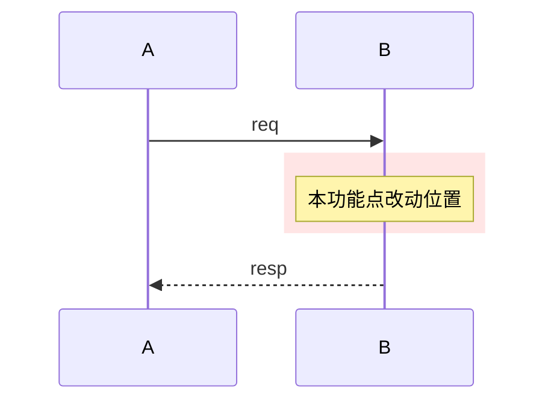

# Brainstorm 核心发现写作指导（**重要**）

> 对标 ecom-buy `写作指导（重要）.md`，但严格**反向**——本 skill 严禁代写技术方案。

---

## 目标读者

**RD 自己**。他们要拿这份报告**写技术方案**，**不是直接交付**。

> 如果读者拿走能直接当方案用，**说明你写偏了**——把 RD 的工作给做了。

---

## ❌ 必须避免

| 项 | 反例 |
|---|---|
| ❌ diff 代码片段 | `+ if option.NewWatermark(ctx) { ... }` |
| ❌ 伪代码 | `func handleWatermark(...) { /* 检查 watermark, 调用 X */ }` |
| ❌ 文件路径 + 行号 | `aigc_dag/biz/handler_sync/doubao/text2image.go:L122-L150 处加 close_watermark 字段判断` |
| ❌ 我建议这样写 | "我建议把 foo.go::bar() 改成..." |
| ❌ 字母编号改动点 | "改动点 A、B、C" |
| ❌ 调研笔记结构 | "已证实 / 待确认 / 调研索引" |
| ❌ 完整 SQL / 协议字段定义 | （这些是技术方案的内容，不是 brainstorm） |

## ✅ 必须包含

| 项 | 例 |
|---|---|
| ✅ 流程图（mermaid）展示链路穿越点 | （时序图，标红本功能点改动位置） |
| ✅ 表格化清单（关键定位） | 关键文件 / 模块 / 配置 / 依赖 4 张表 |
| ✅ 命中的 Gap（来自 Z.2） | "本需求触达 G3 SP regression，请 3 处都验证" |
| ✅ 散落点盘点（SP/Libra/Tool） | 完整 7 行 Libra 表（含不触达的也明示） |
| ✅ 方向建议 | "建议走 Libra 而非 TCC，因为短期 A/B" |
| ✅ 必须验证清单 | "[ ] 灰度回滚兼容性 / [ ] 多租户语义 / ..." |
| ✅ 待用户决策问题 | "Q1: 水印应用在 binary 模式还是 URL 模式?" |

---

## ✅ 正确示例

### 示例 1：链路穿越点（流程图 + 清单）

✅ **正确**：

```markdown
## 三、命中动线

本需求命中 [文生图/主bot 闲聊入口](../../../knowledge_repository/doubao_creation/C.%20创作能力动线专栏/文生图/主bot%20闲聊入口.md)。

时序图（标红本功能点穿越点）：

\`\`\`mermaid
sequenceDiagram
    participant CA as creation_agent
    participant ATOOL as aigc_tool
    participant ADAG as aigc_dag
    
    CA->>ATOOL: SyncInvokeTool(image_gen)
    ATOOL->>ADAG: Exec(DAG)
    rect rgba(255,0,0,0.1)
        Note over ADAG: 本功能点穿越点：<br/>消费 close_watermark 参数
    end
    ADAG-->>CA: image_gen_1 URL
\`\`\`

关键文件清单：
| 角色 | 仓库 | 模块 | 改动 |
|---|---|---|---|
| schema | aigc_management | doubao_text2image schema | 加 close_watermark 字段 |
| handler | aigc_dag | text2image.go | 消费 close_watermark |
```

❌ **错误**：

```markdown
本需求命中文生图链路。在 aigc_management/service/domain/ability/schema/doubao/doubao_text2image.json (L1-L120) 加 close_watermark 字段。然后在 aigc_dag/biz/handler_sync/doubao/text2image.go::Run() 第 145 行的参数解析处加 if extra.CloseWatermark { ... } 判断...
```

> 错在堆砌路径 + 行号 + 写出 diff 代码。

---

### 示例 2：方案方向建议

✅ **正确**：

```markdown
## 七、方案方向建议

### 7.1 改动定位建议

**建议**：本次水印开关应主要落在 **aigc_dag** 的 doubao text2image handler，**不要**在 creation_agent 主链路加 if 分支。

**理由**：
- 水印是图片生成层的能力，与 agent 决策无关
- IDL `InvokeToolExtraAipReqParam.close_watermark` 字段已为此设计（详见 [tool_locator §三.3](../../../locators/tool_locator.md)）
- 改 creation_agent 会扩大影响面，命中 SP regression（Z.2 G3）

### 7.2 扩展机制建议

| 改动 | 建议 |
|---|---|
| 灰度策略 | Libra 实验（短期 A/B），实验 key = `creation_watermark_picasso_v1` |
| 配置承载 | TCC 默认值 + Libra 覆盖（不要硬编码） |

### 7.3 必须验证的事项

- [ ] 灰度切回老链路时水印开关失效，是否符合需求预期？
- [ ] 现有 close_watermark 字段在端到端是否真的透传到模型？需端到端验证
- [ ] 实验下线计划：实验结束后清理 if 分支
```

❌ **错误**：

```markdown
## 方案

在 aigc_dag/biz/handler_sync/doubao/text2image.go 的 Run() 函数添加：
\`\`\`go
+ if extra := req.GetExtra(); extra != nil && extra.CloseWatermark {
+     return generateWithoutWatermark(req)
+ }
\`\`\`

在 IDL 加字段...
```

> 错在直接给代码 + 文件路径，做了 RD 的工作。

---

## 三种合适的"代码替代物"

当你想表达"这里需要改"时，用这三种之一**代替**写代码：

### 1. 流程图 + 高亮



### 2. 改动定位表（不写代码内容，只写定位）

| 角色 | 路径 / 模块 | 改动语义 |
|---|---|---|
| schema 字段 | doubao_text2image | 新增 close_watermark optional |
| handler 消费点 | text2image handler | 消费 close_watermark |

### 3. 方向描述（自然语言）

> "在 DAG handler 的参数解析阶段消费 close_watermark；不需要改 IDL（字段已有）；不需要改 SP（不影响意图识别）"

---

## 章节编号规则

- 中文一二三四（一、二、三、四）
- 二级 1.1, 1.2
- 三级 1.1.1, 1.1.2
- **不要**字母 A/B/C
- **不要**特殊编号（0、附录等）

---

## 内容精简规则

- **现状分析**：流程图 / 架构图，不堆路径
- **方向建议**：聚焦"为什么"，不罗列所有方案
- **风险**：列关键风险 + 应对，不穷举所有可能
- **待确认**：只列阻塞开发的，不列细节问题

---

## 强制图表

| 图表类型 | 何时必出 |
|---|---|
| 时序图 / 流程图 | 任何 brainstorm 报告都要至少 1 张 |
| 调用拓扑图 | 涉及跨服务时必出 |
| 4 层 SP 树状图 | 涉及 SP 时必出 |
| Block 序列图 | 涉及上屏时必出 |

---

## 禁止假设

- 不要假设"flow/ocerr 已集成"（gap）
- 不要假设"多租户已支持"（gap）
- 不要假设"SP 已收敛"（regression）
- 不要假设"agent_phase_26 已下线老链路"（双轨在）
- 不要假设"用户能改 Libra 平台"（自检：用户的角色 / 权限）

---

## 自检：你写的是技术方案还是 brainstorm？

| 问题 | 如果回答"是"，你可能写偏了 |
|---|---|
| 我的报告里有 diff 代码片段吗？ | ✗ |
| 我的报告里有"请把 foo 改成 bar"吗？ | ✗ |
| 我的报告里有 file:line 引用吗？ | ✗ |
| RD 拿走我的报告能直接当方案交付吗？ | ✗ |

| 问题 | 如果回答"是"，你写得对 |
|---|---|
| 我的报告让 RD 知道**哪些坑要避开**了吗？ | ✓ |
| 我的报告让 RD 知道**改动主要在哪个模块**了吗（方向）？ | ✓ |
| 我的报告让 RD 知道**Gap 表里哪些项要绕过**了吗？ | ✓ |
| 我的报告让 RD **少花时间找散落点**了吗？ | ✓ |
