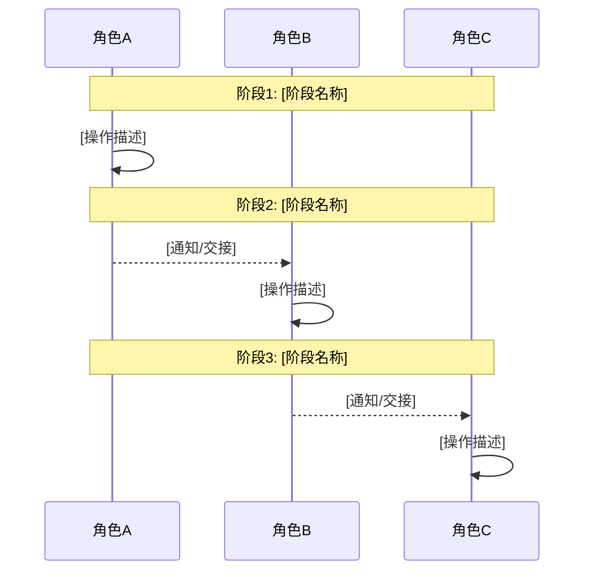
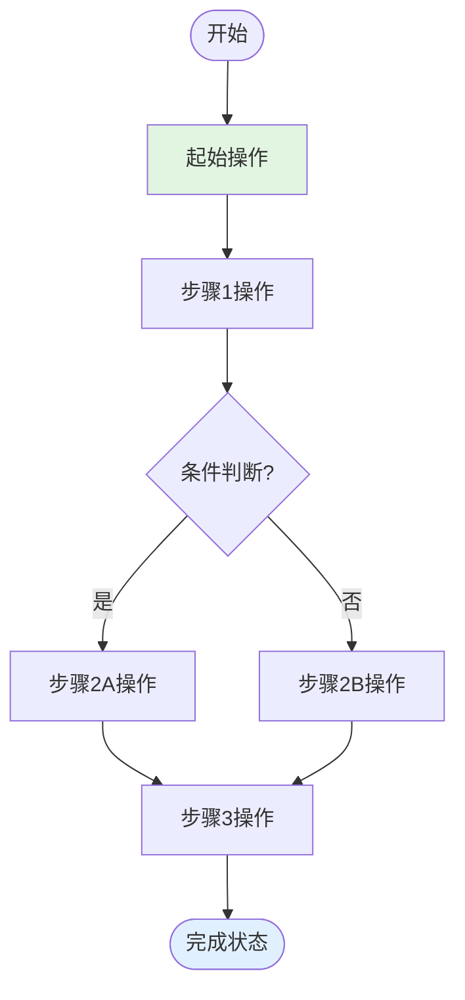
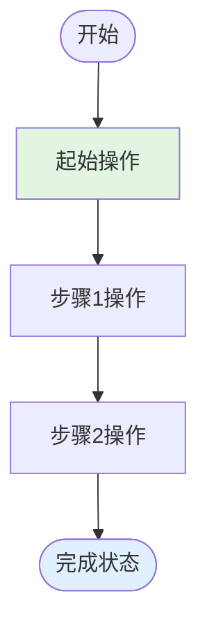
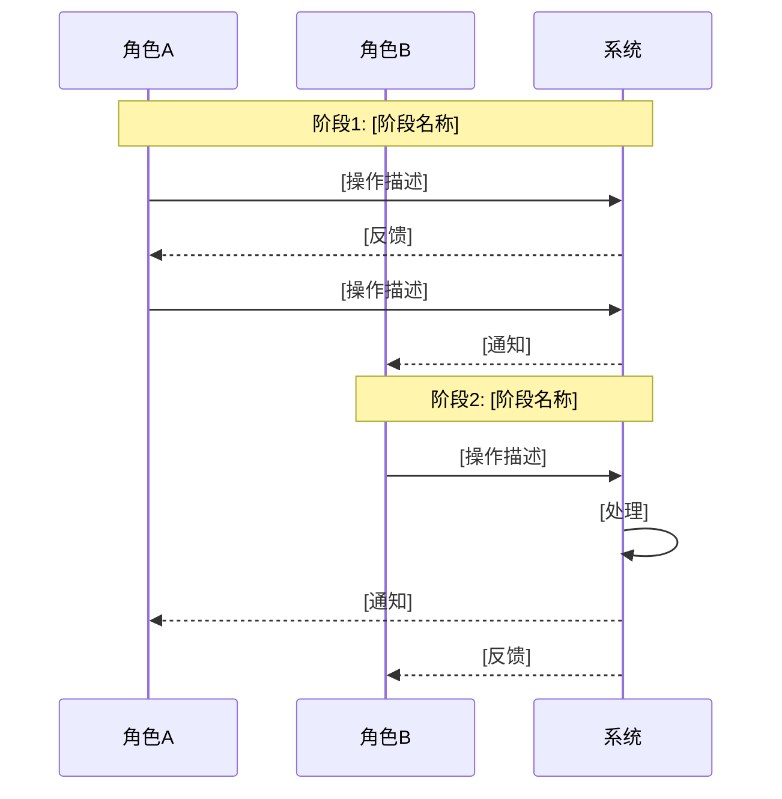
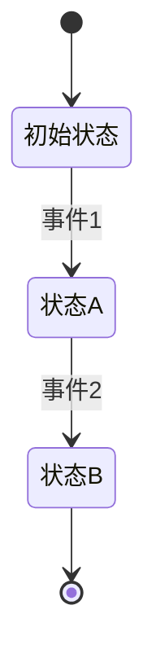
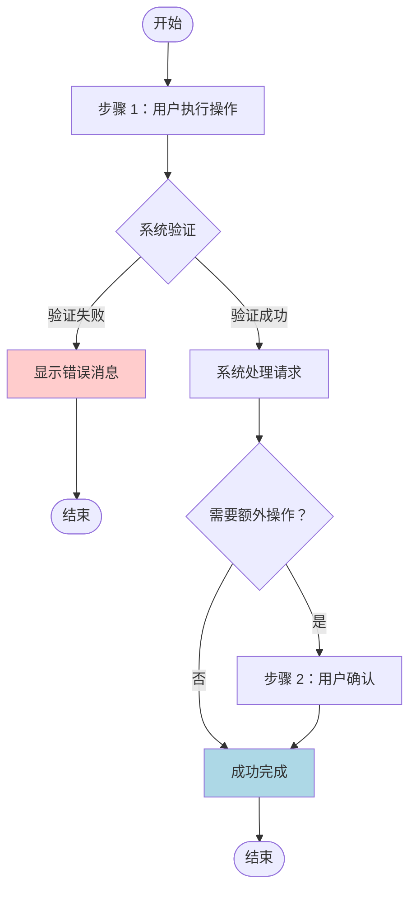
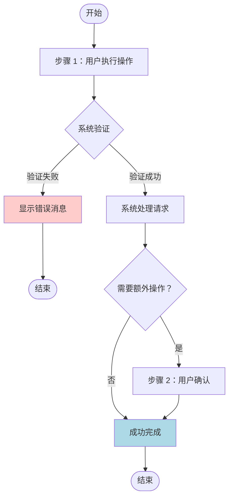

# 功能规格说明书：[功能名称]

**功能分支**：`[###-功能名称]`
**创建时间**：[日期]
**状态**：草稿
**输入**：用户描述："$ARGUMENTS"

## 功能概述

<!--
  ========================================
  章节目的
  ========================================
  
  概述本次需求的核心目标、涉及的角色和整体范围。
  
  ========================================
  编写要点
  ========================================
  
  - 用 1-3 段简短描述功能的业务目标
  - 如有用户角色画像描述，明确列出涉及的用户角色
  - 说明本次需求的范围和边界
  - 如有分期，说明当前期次的目标
  
  ========================================
  示例
  ========================================
  
  CoStudio 是一个 AI 驱动的软件研发协作平台，旨在打通"需求对齐 → 方案设计 → 代码开发 → MR 生成"的完整流程。本规格说明书聚焦于 M1 第一期的核心单线流程，实现服务端开发从需求到代码交付的最小闭环。

  **第一期目标**：一个需求能跑通 步骤2（需求对齐）→ 步骤4（服务端方案设计）→ 步骤7（测试用例设计）→ 步骤10（服务端开发），MR 合入后完成。

  **核心参与角色**（第一期）：
  - 产品经理（PM）：负责需求对齐
  - 服务端开发（Backend）：负责技术方案设计和代码开发
  - 测试（QA）：负责测试用例设计

  > 注：第一期不包含前端开发角色，前端流程将在第二期实现。
-->

[在此描述功能的核心目标和范围]

**目标**：[本次需求要达成的目标]

**核心参与角色**：
- [角色1]：[职责描述]
- [角色2]：[职责描述]

> 注：[如有特殊说明或范围限制]

---

## 用户动线地图 _（可选章节）_

<!--
  ========================================
  使用条件
  ========================================
  
  当满足以下条件时，应包含此章节：
  - 需求涉及复杂的多步骤工作流
  - 需要展示用户在整个需求中的使用路径
  - 存在跨角色的协作流程（多角色场景）
  
  如果需求仅涉及简单的单页面功能，请删除此章节。
  
  ========================================
  单角色 vs 多角色场景
  ========================================
  
  【单角色场景】仅保留一个动线图即可：
  - 删除「用户动线总览」（时序图对单角色无意义）
  - 删除「完整流程时序图」
  - 仅保留一个「[角色名称]动线」章节，包含：
    - 用户画像
    - Mermaid 流程图
    - 关键触点表格
  
  【多角色场景】保留完整结构：
  - 用户动线总览（展示角色间协作关系）
  - 每个角色的独立动线
  - 完整流程时序图（可选，复杂协作时使用）
  
  ========================================
  章节目的
  ========================================
  
  描述用户在需求中的典型使用路径，帮助开发团队理解：
  - 用户的完整操作流程
  - 关键的交互触点和页面
  - 各角色之间如何协作（多角色场景）
  
  ========================================
  编写要点
  ========================================
  
  1. **角色动线总览**（多角色场景）：使用时序图展示角色间的协作关系
  2. **单个角色动线**：为每个角色提供：
     - 用户画像（简短描述）
     - Mermaid 流程图（展示该角色的操作流程）
     - 关键触点表格（详细列出步骤、页面、操作、产出）
  3. **完整流程时序图**（可选，多角色复杂协作场景）：展示所有角色的详细交互
-->

本节描述不同角色用户在需求中的典型使用路径。

### 用户动线总览 _（多角色场景，单角色请删除此节）_

<!--
  【多角色场景使用】使用 Mermaid 时序图展示角色间的高层协作关系
  【单角色场景】请删除此节，直接使用下方的角色动线即可
-->



---

### [角色名称1]动线

**用户画像**：[简短描述该角色的职责和特点]

<!--
  使用 Mermaid 流程图展示该角色的完整操作流程
  包括：操作步骤、决策点、状态变化
  使用颜色标记重要节点：
  - #e1f5e1: 起始/关键输入
  - #e1f0ff: 成功完成/关键输出
-->



**关键触点**：

<!--
  使用表格详细列出该角色的每个操作步骤
  包括：触达的页面、执行的操作、产生的结果
-->

| 步骤 | 页面/组件 | 关键操作 | 产出 |
|------|----------|---------|------|
| 1. [步骤描述] | [页面名称] | [具体操作] | [产生的结果] |
| 2. [步骤描述] | [页面名称] | [具体操作] | [产生的结果] |
| 3. [步骤描述] | [页面名称] | [具体操作] | [产生的结果] |

---

### [角色名称2]动线

**用户画像**：[简短描述该角色的职责和特点]



**关键触点**：

| 步骤 | 页面/组件 | 关键操作 | 产出 |
|------|----------|---------|------|
| 1. [步骤描述] | [页面名称] | [具体操作] | [产生的结果] |
| 2. [步骤描述] | [页面名称] | [具体操作] | [产生的结果] |

---

### 完整流程时序图 _（可选 - 多角色复杂协作场景使用，单角色请删除）_

<!--
  【多角色复杂场景使用】当需要展示更详细的角色间交互时包含此部分
  【单角色场景】请删除此节
-->



---

## 用户场景与测试 _（必填）_

<!--
  重要：用户故事应该按重要性排序作为用户旅程的优先级。
  每个用户故事/旅程必须是独立可测试的——意味着即使你只实现其中一个，
  你仍然应该拥有一个可交付价值的可行 MVP（最小可行产品）。

  为每个故事分配优先级（P1、P2、P3 等），其中 P1 是最关键的。
  将每个故事视为可以独立：
  - 开发
  - 测试
  - 部署
  - 向用户演示
  的功能切片
-->

### 用户故事 1 - [简要标题]（优先级：P1）

[用简单语言描述此用户旅程]

**为何此优先级**：[解释价值以及为何具有此优先级]

**独立测试**：[描述如何独立测试 - 例如，"可以通过 [具体操作] 完全测试并交付 [具体价值]"]

#### 交互流程

<!--
  操作要求：使用 Mermaid 流程图描述完整的用户交互路径
  包括：用户操作、系统响应、决策点、错误处理、成功/失败路径
-->


#### 验收场景

<!--
  ========================================
  验收场景编写原则
  ========================================
  
  聚焦于：端到端的用户可观察行为
  - ✅ 功能可见性（什么元素在什么条件下可见/不可见）
  - ✅ 状态变化（用户可见的状态，如"待开始"→"进行中"）
  - ✅ 权限控制（谁可以执行什么操作）
  - ✅ 数据展示（显示什么信息的内容）
  - ✅ 交互反馈（成功/失败消息的文字内容）
  - ✅ 功能状态（禁用、加载中、可用、只读）
  
  严格禁止：
  - ❌ UI样式（颜色、字体、大小、间距）
  - ❌ 精确尺寸（48px、120px、宽度100%）
  - ❌ 布局细节（两列布局、flex排列、居中对齐）
  - ❌ 组件实现（用Table组件、用Modal弹窗）
  - ❌ 实现细节（数据库字段名、表名、API路径）
  
  ========================================
  表格格式说明
  ========================================
  | 场景 | 前置条件 | 操作步骤 | 预期结果 |
  
  - 场景：测试用例名称
  - 前置条件 (Precondition)：执行操作前必须满足的条件
  - 操作步骤 (Test Steps)：用户需要执行的操作序列
  - 预期结果：使用 ✅ 标记应该发生的行为，❌ 标记不应该发生的行为
  
  ========================================
  正确示例（端到端行为）
  ========================================
  | PM 开始执行步骤 | 用户「张三」是 PM，步骤状态为"待开始" | 1. 点击 [开始执行] | ✅ 步骤状态从"待开始"变为"进行中"<br/>✅ 开始时间已记录并显示<br/>✅ [完成] 操作出现但处于禁用状态 |
  
  ❌ 错误示例（包含实现细节）
  | 更新数据库 | - | 1. 执行 SQL | ✅ step_execution.status = 'in_progress'<br/>✅ step_execution.started_at = NOW() |
  
  → 不要描述数据库操作，应描述用户可观察到的行为
-->

| 场景 | 前置条件 | 操作步骤 | 预期结果 |
|------|----------|----------|----------|
| 场景1名称 | 前置条件1 | 1. 操作步骤A<br/>2. 操作步骤B | ✅ 预期结果1<br/>✅ 预期结果2 |
| 场景2名称 | 前置条件2 | 1. 操作步骤C<br/>2. 操作步骤D | ✅ 预期结果3<br/>❌ 不应发生的行为 |
| 场景3名称（复杂示例） | 1. 前置条件A<br/>2. 前置条件B | 1. 执行操作1<br/>2. 执行操作2<br/>3. 执行操作3 | ✅ 结果1：状态变化符合预期<br/>✅ 结果2：UI展示正确<br/>❌ 不应出现错误提示 |

> **表格列说明**：
> - **场景**：测试用例名称，描述验收场景
> - **前置条件**：执行操作前必须满足的条件
> - **操作步骤**：用户需要执行的操作序列
> - **预期结果**：使用 ✅ 标记应该发生的行为，❌ 标记不应该发生的行为


#### 功能需求

<!--
  ========================================
  FR 编写原则
  ========================================
  
  聚焦于：业务能力和规则
  - ✅ 业务规则和计算逻辑
  - ✅ 数据字段及其约束条件（使用业务语言）
  - ✅ 状态转换条件
  - ✅ 权限和访问控制
  - ✅ 数据验证规则
  - ✅ 业务流程顺序
  
  严格禁止：
  - ❌ UI样式（颜色、字体、大小、间距）
  - ❌ 布局信息（位置、对齐、排列方式）
  - ❌ 组件类型（Button、Input、Modal等）
  - ❌ 动画效果（淡入、滑出、过渡）
  - ❌ 实现技术（API路径、数据库表名、字段名）
  
  ========================================
  FR 表格格式
  ========================================
  
  使用表格统一展示所有功能需求，包含以下列：
  - 编号：FR 唯一标识符（FR-001, FR-002, ...）
  - 业务能力描述：简短描述该功能的核心能力（20字以内）
  - 业务规则：该功能必须遵循的业务约束和逻辑（多条用<br>分隔）
  - 数据要求：涉及的数据字段及其约束条件（使用业务语言）
  - 触发条件：什么情况下该功能被触发
  - 成功标准：功能完成后的业务状态
  
  ========================================
  正确示例（聚焦业务）
  ========================================
  
  | 编号 | 业务能力描述 | 业务规则 | 数据要求 | 触发条件 | 成功标准 |
  |------|-------------|----------|----------|----------|----------|
  | FR-001 | 用户可以查看评估器列表 | 1) 默认按创建时间倒序排列<br>2) 仅显示用户有权限查看的评估器<br>3) draft 状态的评估器仅创建者可见 | 显示字段：名称、状态、版本号、创建时间；支持按名称搜索、按状态筛选 | 用户访问评估器管理页面 | 用户能看到符合权限的评估器列表，且排序正确 |
  | FR-002 | PM 可以开始执行需求对齐步骤 | 1) 仅步骤负责人（PM）可以开始执行<br>2) 步骤状态必须为"待开始"<br>3) 开始执行后状态变更为"进行中"<br>4) 记录开始时间 | 步骤状态：从"待开始"变为"进行中"；开始时间：记录操作时的时间戳；操作权限：仅步骤负责人可执行 | 步骤负责人点击"开始执行"操作 | 步骤状态显示为"进行中"，开始时间已记录并显示，界面反映最新状态 |
  
  ❌ 错误示例（包含实现细节）
  
  | 编号 | 业务能力描述 | 业务规则 |
  |------|-------------|----------|
  | FR-003 | 查询 evaluator 表并返回 JSON | SQL: SELECT * FROM evaluator WHERE user_id = ?；API: GET /api/evaluators；字段：evaluator.id, evaluator.name |
  
  → 不要使用数据库表名、字段名、API路径，应使用业务语言描述
  
  ========================================
  待澄清标记
  ========================================
  
  当需求不明确时，在对应列中使用 [待澄清: 具体问题] 标记：
  
  | 编号 | 业务能力描述 | 业务规则 |
  |------|-------------|----------|
  | FR-004 | 用户认证 | 系统必须通过 [待澄清：未指定认证方式 - 邮箱/密码、SSO、OAuth？] 认证用户 |
  | FR-005 | 用户数据保留 | [待澄清：未指定保留期限] |
-->

| 编号 | 业务能力描述 | 业务规则 | 数据要求 | 触发条件 | 成功标准 |
|------|-------------|----------|----------|----------|----------|
| FR-001 | [业务能力描述] | [该功能必须遵循的业务约束和逻辑] | [涉及的数据字段及其约束条件] | [什么情况下该功能被触发] | [功能完成后的业务状态] |

#### 业务逻辑规则 _（可选章节 - 仅包含复杂业务规则时使用）_

<!--
  ========================================
  使用条件
  ========================================
  
  当满足以下任一条件时，应包含此章节：
  - 某个 FR 的业务规则超过 3 条
  - 存在多个条件判断（if-then-else）
  - 包含复杂计算公式或业务规则
  - 触发关键词：计算、算法、评分、匹配、推荐、排序、过滤、聚合、统计、规则、判断、条件
  
  如果用户故事的业务逻辑简单（仅CRUD），请删除此章节。
  
  ========================================
  格式
  ========================================
  
  **规则 #1: [规则名称]**
  - **触发条件**: [何时应用此规则]
  - **具体逻辑**: [规则的详细描述，可使用伪代码]
  - **优先级**: [与其他规则的关系，如"优先于规则 #2"]
  - **示例**: [具体场景示例]
  
  ========================================
  示例
  ========================================
  
  **规则 #1: 评估分数计算**
  - **触发条件**: 所有测试用例执行完成后
  - **具体逻辑**:
    1. 统计通过的测试用例数量 passedCount
    2. 统计失败的测试用例数量 failedCount
    3. 计算总数 totalCount = passedCount + failedCount
    4. 计算通过率 passRate = passedCount / totalCount
    5. 根据通过率映射分数：
       - passRate >= 0.9 → score = 1.0
       - passRate >= 0.7 → score = 0.7
       - passRate >= 0.5 → score = 0.5
       - passRate < 0.5 → score = 0.0
  - **优先级**: 核心规则，无依赖
  - **示例**:
    - 输入：10 个测试用例，9 个通过，1 个失败
    - 输出：score = 1.0, reason = "9/10 测试用例通过"
-->

**规则 #1: [规则名称]**
- **触发条件**: [何时应用此规则]
- **具体逻辑**: [规则的详细描述]
- **优先级**: [与其他规则的关系]
- **示例**: [具体场景示例]

---

#### 状态流转定义 _（可选章节 - 仅实体有状态机时使用）_

<!--
  ========================================
  使用条件
  ========================================
  
  当满足以下任一条件时，应包含此章节：
  - 实体有 2 个及以上明确的状态
  - 描述了状态之间的转换条件
  - 涉及审批流、工作流等概念
  - 触发关键词：状态、状态机、工作流、审批、流程、draft、pending、active、archived、enabled、disabled
  
  如果用户故事不涉及状态管理，请删除此章节。
  
  ========================================
  格式
  ========================================
  
  使用 Mermaid stateDiagram-v2 绘制状态图，并提供状态转换规则表。
  
  ========================================
  示例
  ========================================
  
  ```mermaid
  stateDiagram-v2
      [*] --> Draft: 创建评估器
      Draft --> Active: 发布
      Active --> Archived: 归档
      Draft --> Archived: 删除草稿
      Archived --> Active: 恢复
      Active --> [*]: 硬删除
  ```
  
  状态定义：
  | 状态名 | 说明 | 可进入该状态的前置状态 |
  |--------|------|---------------------|
  | Draft | 草稿状态，评估器正在编辑中 | - |
  | Active | 激活状态，评估器可被使用 | Draft, Archived |
  | Archived | 归档状态，评估器不可用但保留 | Draft, Active |
  
  状态转换规则：
  | 当前状态 | 触发事件 | 前置条件 | 目标状态 | 副作用/后处理 |
  |---------|---------|---------|---------|-------------|
  | Draft | 用户点击"发布" | 评估器配置完整 | Active | 发送发布通知、记录发布时间 |
  | Active | 用户点击"归档" | - | Archived | 不接受新任务 |
-->

**状态图**：



**状态定义**：

| 状态名 | 说明 | 可进入该状态的前置状态 |
|--------|------|---------------------|
| 初始状态 | [说明] | - |
| 状态A | [说明] | 初始状态 |

**状态转换规则**：

| 当前状态 | 触发事件 | 前置条件 | 目标状态 | 副作用/后处理 |
|---------|---------|---------|---------|-------------|
| 初始状态 | 事件1 | [条件] | 状态A | [副作用] |

---


#### 表单规格：[表单名称] _（可选章节 - 仅涉及表单时使用）_

<!--
  仅当此用户故事涉及表单提交时包含此部分。
  使用综合表格格式描述所有字段的完整信息。

  触发条件：用户故事包含创建、编辑、配置、提交、填写、注册等操作。
  如果此用户故事不涉及表单，请删除整个"表单规格"部分。
-->

**表单目的**：[表单业务目的的简要描述，例如"用于创建新用户账户"]

**提交行为**：[创建/编辑/配置等] → [对应的业务操作]

**字段定义**：

| 字段名 | 标签/占位符 | 输入类型 | 必填 | 默认值 | 可选项/取值范围 | 验证规则 | 帮助文本/说明 |
|--------|------------|----------|------|--------|----------------|----------|---------------|
| [fieldName] | [字段标签]<br>_[占位符文本]_ | [见下方类型] | ✓/✗ | [值]/- | [选项或范围] | [验证规则列表] | [字段说明] |

**输入类型参考**（使用业务语义，不指定组件）：
- **文本输入**：用户自由输入文本
- **多行文本**：用户输入长文本内容
- **数字输入**：用户输入数字
- **是/否选择**：二元布尔选择
- **单选**：从多个选项中选择一个
- **多选**：从选项中选择多个
- **日期选择**：选择日期
- **时间选择**：选择时间
- **日期时间选择**：选择日期和时间
- **文件上传**：上传一个或多个文件
- **树形选择**：从树形结构中选择
- **级联选择**：多级联动选择

**填写说明**：

- **字段名**：字段的唯一标识符（驼峰命名）
- **标签/占位符**：第一行为字段标签，第二行（斜体）为占位符文本（可选）
- **输入类型**：使用上述业务语义描述
- **必填**：✓（必填）/ ✗（可选）
- **默认值**：具体值 / -（无默认值）/ []（空数组）
- **可选项/取值范围**：
  - 对于选择类：列出选项，格式 `- option1（显示文本1）`
  - 对于文本/数字：说明范围，如 `1-100字符`
  - 对于API数据：说明来源，如 `来自用户API`
- **验证规则**：列出所有验证规则，格式 `1) 规则1 2) 规则2`
- **帮助文本/说明**：字段的用途说明或辅助提示

**字段依赖规则**（如有）：

| 触发字段 | 触发条件 | 影响字段 | 影响结果 |
|---------|---------|---------|---------|
| [字段A] | = [值] | [字段B] | [变为必填/显示/隐藏/只读] |

**表单提交**：

- **成功时**：[后续操作，例如"关闭弹窗，刷新列表，显示成功提示"]
- **失败时**：[错误处理，例如"验证失败：标记错误字段；服务器错误：显示错误提示"]

#### 边界情况

<!--
  操作要求：此部分的内容为占位符。
  用正确的边界情况填写它们。
-->

- 当 [边界条件] 时会发生什么？
- 系统如何处理 [错误场景]？

---

### 用户故事 2 - [简要标题]（优先级：P2）

[用简单语言描述此用户旅程]

**为何此优先级**：[解释价值以及为何具有此优先级]

**独立测试**：[描述如何独立测试]

#### 交互流程

<!--
  操作要求：使用 Mermaid 流程图描述完整的用户交互路径
  包括：用户操作、系统响应、决策点、错误处理、成功/失败路径
-->



#### 验收场景

<!--
  格式说明参考用户故事1中的详细注释
  遵循相同的编写原则：聚焦端到端行为，禁止实现细节
-->

| 场景 | 前置条件 | 操作步骤 | 预期结果 |
|------|----------|----------|----------|
| 场景名称 | 前置条件 | 操作步骤 | ✅ 预期结果 |

#### 功能需求

<!--
  格式说明参考用户故事1中的详细注释和示例
  使用表格格式：编号、业务能力描述、业务规则、数据要求、触发条件、成功标准
-->

| 编号 | 业务能力描述 | 业务规则 | 数据要求 | 触发条件 | 成功标准 |
|------|-------------|----------|----------|----------|----------|
| FR-001 | [业务能力描述] | [该功能必须遵循的业务约束和逻辑] | [涉及的数据字段及其约束条件] | [什么情况下该功能被触发] | [功能完成后的业务状态] |

#### 业务逻辑规则 _（可选章节）_

<!-- 使用条件和格式参考用户故事1，如不需要请删除此章节 -->

#### 状态流转定义 _（可选章节）_

<!-- 使用条件和格式参考用户故事1，如不需要请删除此章节 -->

#### 表单规格：[表单名称] _（可选章节）_

<!-- 使用条件和综合表格格式参考用户故事1，如不需要请删除此章节 -->

#### 边界情况

<!--
  操作要求：此部分的内容为占位符。
  用正确的边界情况填写它们。
-->

- 当 [边界条件] 时会发生什么？
- 系统如何处理 [错误场景]？

---

### 用户故事 3 - [简要标题]（优先级：P3）

[用简单语言描述此用户旅程]

**为何此优先级**：[解释价值以及为何具有此优先级]

**独立测试**：[描述如何独立测试]

#### 交互流程

<!--
  操作要求：使用 Mermaid 流程图描述完整的用户交互路径
  包括：用户操作、系统响应、决策点、错误处理、成功/失败路径
-->



#### 验收场景

<!--
  格式说明参考用户故事1中的详细注释
  遵循相同的编写原则：聚焦端到端行为，禁止实现细节
-->

| 场景 | 前置条件 | 操作步骤 | 预期结果 |
|------|----------|----------|----------|
| 场景名称 | 前置条件 | 操作步骤 | ✅ 预期结果 |

#### 功能需求

<!--
  格式说明参考用户故事1中的详细注释和示例
  使用表格格式：编号、业务能力描述、业务规则、数据要求、触发条件、成功标准
-->

| 编号 | 业务能力描述 | 业务规则 | 数据要求 | 触发条件 | 成功标准 |
|------|-------------|----------|----------|----------|----------|
| FR-001 | [业务能力描述] | [该功能必须遵循的业务约束和逻辑] | [涉及的数据字段及其约束条件] | [什么情况下该功能被触发] | [功能完成后的业务状态] |

#### 业务逻辑规则 _（可选章节）_

<!-- 使用条件和格式参考用户故事1，如不需要请删除此章节 -->

#### 状态流转定义 _（可选章节）_

<!-- 使用条件和格式参考用户故事1，如不需要请删除此章节 -->

#### 表单规格：[表单名称] _（可选章节）_

<!-- 使用条件和综合表格格式参考用户故事1，如不需要请删除此章节 -->

#### 边界情况

<!--
  操作要求：此部分的内容为占位符。
  用正确的边界情况填写它们。
-->

- 当 [边界条件] 时会发生什么？
- 系统如何处理 [错误场景]？

---

[根据需要添加更多用户故事，每个都分配优先级]
