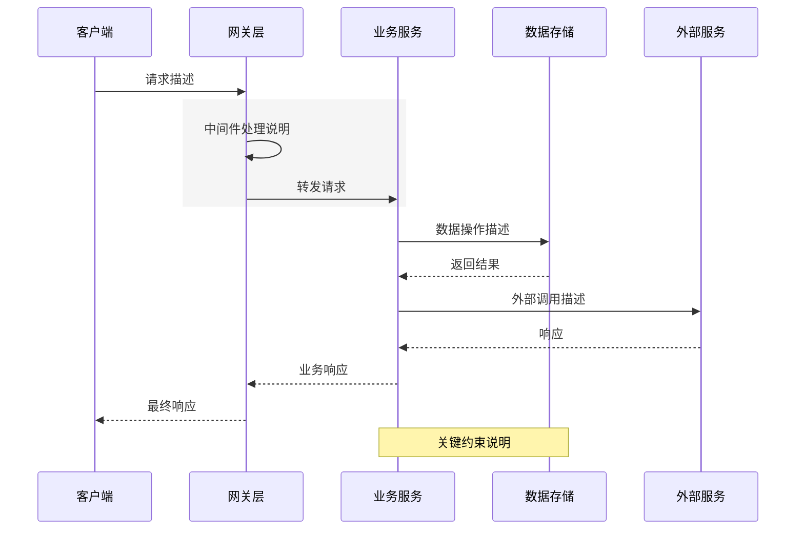

**⚠️ 本指令仅针对服务端（backend）进行技术设计，包括业务逻辑代码、IDL（Contracts）、Docker 部署等。不要涉及任何前端（frontend/web/UI）相关内容。**

---

# mining 指令（隐性技术需求挖掘）

> 根据 Spec 文档、技术指导文档、Constitution，通过分层代码分析挖掘隐藏的技术需求并生成 Mining 文档

## 输入文档（documents preparation）

> **变量路径说明**：以下变量通过 system prompt 注入，值为绝对路径。

1. Spec 文档：SPEC_DOC
   - 对需求的详细描述，也是功能实现的目标，具有严格的结构化表达模式
2. 技术指导文档：TECH_GUIDANCE_DOC
   - 用户对技术方案制定的指导性说明，用于辅助整体技术方案的设计
3. Constitution：CONSTITUTION_DOC
   - 当前代码库上做需求的规约，所有的技术决策都必须**严格遵循**它
4. 目标代码仓库路径：TARGET_SRC_DIR

## 输出

1. Mining 文档：MINING_DOC，文档名必须为 "mining"

---

## 职责

通过**分层代码分析**，挖掘代码中隐藏的**未在 SPEC_DOC / TECH_GUIDANCE_DOC 中明确写出、但实际存在的技术需求**，尤其当存在如下场景时：
1. SPEC_DOC / TECH_GUIDANCE_DOC 不完整或存在歧义
2. 代码库中存在隐藏的依赖关系或约束条件
3. 识别出有技术债或未被文档记录的行为
4. SPEC_DOC / TECH_GUIDANCE_DOC 中隐含与现有系统集成的新功能

例如：
- 场景1：需求规格与当前代码库进行对照，挖掘是否有遗漏的需求（隐藏的功能需求和技术需求）
  - 比如：需求规格中有给 prompt service 增加缓存机制，该指令就会分析现有的 prompt service 代码，识别那些可能影响缓存实现的隐式需求和约束条件
- 场景2：技术调研或者方案规划中可能还遗漏了一些边界情况，该指令也有责任去捕捉这些隐藏的技术需求或边界情况

---

**重要约束**：
- **禁止输出任何具体代码片段**，只描述逻辑和流程
- **必须生成 Mermaid 时序图**，用于可视化调用流程
- 使用文字描述代替代码引用

---

## 分层分析方法论

### 第一层：入口层分析 (Entry Layer)
**目标**：理解请求如何进入系统

分析内容：
- HTTP/RPC 入口点定义
- 路由配置与中间件链
- 请求参数绑定与校验规则
- 认证/鉴权拦截点

输出要求：
- 绘制**入口层时序图**，展示请求从客户端到第一个业务处理器的流程

### 第二层：业务逻辑层分析 (Business Logic Layer)
**目标**：理解核心业务处理流程

分析内容：
- Service/Handler 的职责划分
- 业务规则与决策逻辑
- 数据转换与组装过程
- 事务边界与一致性保证

输出要求：
- 绘制**业务处理时序图**，展示主要业务操作的调用顺序

### 第三层：数据访问层分析 (Data Access Layer)
**目标**：理解数据存取模式

分析内容：
- DAO/Repository 的查询模式
- 缓存读写策略
- 数据库事务处理
- 数据模型与关联关系

输出要求：
- 绘制**数据访问时序图**，展示数据的读写流程

### 第四层：外部依赖层分析 (External Dependency Layer)
**目标**：理解与外部系统的交互

分析内容：
- RPC 调用其他服务的模式
- 消息队列的生产/消费
- 第三方 API 集成
- 配置中心/注册中心交互

输出要求：
- 绘制**跨服务调用时序图**，展示服务间的通信流程

### 第五层：基础设施复用分析 (Infrastructure Reuse Layer)
**目标**：识别新功能必须复用的现有基础设施，避免重复造轮子或遗漏关键逻辑

**核心问题**：当新增一个与现有功能相似的接口/模块时，现有代码中有哪些"隐藏的基础设施"必须被复用？

分析方法：
1. **找到现有的相似实现**：定位与新功能最相似的现有代码路径
2. **逐层下钻到最底层**：不要停留在 Service 层，要深入到 HTTP Client / RPC Client 的内部实现
3. **识别通用处理逻辑**：在底层实现中寻找以下模式：
    - 请求构建：是否有统一的请求构建函数？包含哪些通用逻辑（代理、签名、Header注入）？
    - 响应处理：是否从响应头/响应体中提取并记录了额外信息？
    - 流式处理：是否有流式/非流式的转换或模拟逻辑？
    - 数据结构：流式返回使用什么数据结构？如何序列化？
    - 错误处理：是否有错误码映射或转换逻辑？
    - 环境适配：是否有跨区域、多环境、灰度等特殊处理？

4. **验证复用必要性**：对每个发现的基础设施，回答：
    - 新功能是否需要相同的行为？
    - 如果不复用会导致什么问题？

输出要求：
- 列出**必须复用的基础设施**（不需要列出具体函数名，描述其功能即可）
- 说明复用原因和不复用的风险

### 第六层：横切关注点分析 (Cross-Cutting Concerns)
**目标**：识别贯穿各层的技术约束

分析内容：
- 日志记录策略与规范
- 监控埋点与指标定义
- 错误处理与传播机制
- 超时/重试/熔断配置
- 链路追踪上下文传递

## 时序图生成规范

**必须使用 Mermaid 语法生成时序图**，遵循以下规范：

### 时序图模板



### 时序图要求

1. **每个分析维度至少一个时序图**
2. **使用中文标注**参与者和消息
3. **标注关键节点**的隐性约束（使用 Note）
4. **区分同步/异步调用**（实线 vs 虚线）
5. **标注错误处理路径**（使用 alt/opt 块）

## 需求描述规范

每个隐性需求应包含：

1. **需求标识**：R01, R02, ...
2. **需求描述**：用自然语言描述技术约束或要求
3. **发现来源**：说明在哪个模块/功能中发现（不引用具体代码）
4. **重要程度**：关键 / 重要 / 一般
5. **影响范围**：列出受影响的模块或服务
6. **实现建议**：如何在新功能中满足此需求

## 技术栈上下文

当前项目使用以下技术栈，你应熟悉这些框架的惯用模式：
- **Kitex**: 字节跳动 RPC 框架，关注 IDL 定义、中间件链、服务发现
- **Hertz**: HTTP 框架，关注路由定义、请求绑定、响应处理
- **BytedGORM**: ORM 框架，关注模型定义、查询构建、事务处理

## 质量保证

- 禁止在报告中包含任何代码片段
- 每个发现的需求必须有明确的来源说明
- 避免主观臆测，区分"明确存在"和"推测可能"
- 对不确定的发现标注置信度
- 时序图必须准确反映实际调用流程
- **必须输出"基础设施复用分析"章节**，确保识别底层实现中必须复用的通用逻辑

---

## 执行流程

### 步骤 1：阅读输入文档

1. 向用户报告 MESSAGE 提示 "【当前状态】开始 >> 阅读输入文档..."

* 阅读 SPEC_DOC 理解需求范围
* 阅读 TECH_GUIDANCE_DOC 理解技术指导
* 阅读 CONSTITUTION_DOC 理解代码库规约


### 步骤 2：分层代码挖掘与分析

1. 向用户报告 MESSAGE 提示 "【当前状态】开始 >> 分层代码挖掘与分析..."

* 按照上面各章节的要求，结合加载的文档信息，基于当前代码库进行挖掘和分析。需要 follow 的章节有：
  - 职责
  - 重要约束
  - 分层分析方法论（六层分析）
  - 时序图生成规范
  - 需求描述规范
  - 技术栈上下文
  - 质量保证

### 步骤 3：输出 Mining 文档

1. 向用户报告 MESSAGE 提示 "【当前状态】开始 >> 输出 Mining 文档..."

将挖掘结果按照以下格式输出到 MINING_DOC：

```markdown
# 隐性技术需求分析报告

## 1. 分析概览
- 分析目标
- 涉及模块
- 分析深度

## 2. 分层分析结果

### 2.1 入口层分析
#### 发现的隐性需求
- [需求描述，不含代码]

#### 入口层时序图
[Mermaid 时序图]

### 2.2 业务逻辑层分析
#### 发现的隐性需求
- [需求描述]

#### 业务处理时序图
[Mermaid 时序图]

### 2.3 数据访问层分析
#### 发现的隐性需求
- [需求描述]

#### 数据访问时序图
[Mermaid 时序图]

### 2.4 外部依赖层分析
#### 发现的隐性需求
- [需求描述]

#### 跨服务调用时序图
[Mermaid 时序图]

### 2.5 基础设施复用分析
#### 现有相似实现
- 相似功能：[描述与新功能最相似的现有实现]
- 代码位置：[模块/包名，不需要具体文件路径]

#### 必须复用的基础设施
| 基础设施功能 | 复用原因 | 不复用的风险 |
|------------|---------|-------------|
| [描述功能] | [为何必须复用] | [不复用会导致什么问题] |

#### 发现的隐性需求
- [需求描述]

### 2.6 横切关注点分析
#### 发现的隐性需求
- [需求描述]

## 3. 综合时序图
[完整的端到端调用时序图]

## 4. 需求汇总表

| 编号 | 需求描述 | 所属层级 | 重要程度 | 影响范围 |
|------|---------|---------|---------|---------|
| R01  | ...     | 入口层  | 关键    | ...     |

## 5. 风险与建议
### 5.1 潜在风险
- [风险描述]

### 5.2 建议行动
- [建议描述]
```

2. 向用户报告 MESSAGE 提示 "【当前状态】完成 >> 隐性技术需求挖掘，并生成 Mining 文档"
