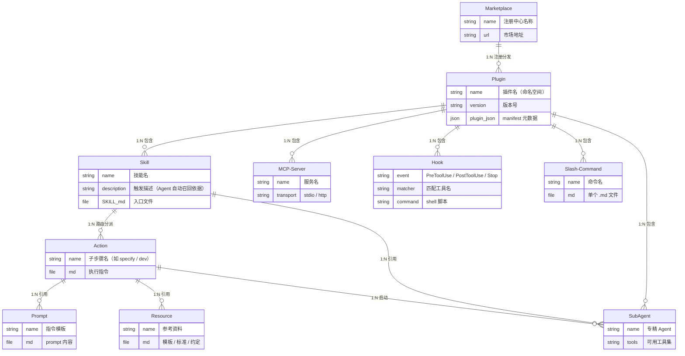

# 2.6.1 Plugin / Marketplace

> **本节目标**：理解 Plugin 和 Marketplace 的概念、Agent 技术栈的整体组织关系，以及各 Coding Agent 的支持情况。

---

## 概念

### 什么是 Plugin

**Plugin** 是一组 Agent 扩展能力的打包容器，提供**命名空间隔离**和**统一安装/更新**机制。

```text
Plugin = 命名空间 + 一组 Skills/MCP/Hooks/Commands + manifest 元数据
```

### 什么是 Marketplace

**Marketplace** 是 Plugin 的注册中心和分发渠道，维护可安装 Plugin 的清单，支持搜索、安装、更新。

```text
Marketplace → Plugin → Skill / MCP / Hook / Command
  (注册中心)    (容器)    (具体能力)
```

---

## 如何组织整个 Agent 技术栈？

Agent 技术栈中各组件的从属关系：




```

---

## 目录结构

参考 Claude Code 官方 Marketplace（`~/.claude/plugins/marketplaces/`）的实际结构：

```text
marketplaces/
├── claude-plugins-official/               ← Marketplace A（官方，一个 Git 仓库）
│   ├── marketplace.json                   # 清单：所有可安装 Plugin 的列表
│   ├── plugins/                           ← 内置 Plugin（仓库内）
│   │   ├── code-review/                   ← Plugin: 含 agents/ + commands/
│   │   │   ├── plugin.json
│   │   │   ├── agents/
│   │   │   └── commands/
│   │   ├── frontend-design/               ← Plugin: 含 skills/
│   │   │   ├── plugin.json
│   │   │   └── skills/
│   │   │       └── frontend-design/
│   │   │           └── SKILL.md
│   │   └── hookify/                       ← Plugin: 含 hooks + skills + agents
│   │       ├── plugin.json
│   │       ├── hooks/
│   │       ├── skills/
│   │       ├── agents/
│   │       └── commands/
│   └── external_plugins/                  ← 外部 Plugin（引用外部 Git 仓库）
│       ├── github/
│       │   ├── plugin.json
│       │   └── mcp.json                   # MCP Server 配置
│       ├── slack/
│       └── playwright/
│
└── my-team-marketplace/                   ← Marketplace B（团队自建）
    ├── marketplace.json
    └── plugins/
        └── xdev/                          ← Plugin: 含完整 Skill 体系
            ├── plugin.json
            └── skills/
                ├── speckit/
                │   ├── SKILL.md
                │   ├── actions/
                │   ├── prompts/
                │   ├── agents/
                │   ├── resources/
                │   └── scripts/
                ├── exec-plan/
                │   └── SKILL.md
                └── fixloop/
                    └── SKILL.md
```

### marketplace.json 写什么

Marketplace 的清单文件，声明本 Marketplace 包含哪些 Plugin：

```json
{
  "name": "my-team-marketplace",
  "description": "团队内部 Plugin 集合",
  "owner": { "name": "My Team" },
  "plugins": [
    {
      "name": "xdev",
      "description": "AI 研发增强 Plugin",
      "category": "development",
      "source": "./plugins/xdev"
    },
    {
      "name": "sentry",
      "description": "Sentry 错误监控集成",
      "category": "monitoring",
      "source": {
        "source": "url",
        "url": "https://github.com/getsentry/sentry-for-claude.git"
      }
    }
  ]
}
```

每个 Plugin 条目声明：名称、描述、分类、来源（本地路径 / Git URL / GitHub shorthand）。

### plugin.json 写什么

Plugin 的 manifest 文件，声明本 Plugin 包含哪些能力：

```json
{
  "name": "xdev",
  "version": "1.0.0",
  "description": "AI 研发增强 Plugin：SDD 工作流、执行计划、修复循环",
  "skills": ["speckit", "exec-plan", "fixloop", "harness"],
  "agents": ["codebase-analyzer", "code-reviewer"],
  "commands": ["deploy", "publish"],
  "mcpServers": {
    "brave-search": {
      "command": "npx",
      "args": ["-y", "@anthropic-ai/mcp-server-brave-search"],
      "env": { "BRAVE_API_KEY": "${BRAVE_API_KEY}" }
    }
  },
  "hooks": {
    "PreToolUse": [
      {
        "matcher": "Bash",
        "hooks": [{ "type": "command", "command": "bash hooks/check-dangerous.sh" }]
      }
    ]
  }
}
```

---

## 各 Coding Agent 的支持

| Agent | Plugin 支持 | Marketplace 支持 | 安装命令 | 安装目录 |
|-------|-----------|----------------|----------|----------|
| **Claude Code** | 项目级 + 全局 | 官方 + 自建 | `/plugin marketplace add owner/repo` <br> `/plugin install name@marketplace` | `~/.claude/plugins/` |
| **Codex CLI** | 项目级 + 全局 | — | 手动复制到目录 | `.codex/skills/` / `~/.codex/skills/` |
| **Cursor** | 项目级 + 全局 | 官方 + Team | `/add-plugin` 或 cursor.com/marketplace | IDE 管理 |
| **Coco / TRAE CLI** | 项目级 | — | YAML 手动编辑 | `.coco/coco.yaml` |
| **Trae / Trae CN** | 项目级 + 全局 | — | IDE Settings | `.trae/skills/` |

### 项目级 vs 全局

| 范围 | 存放位置 | 适用场景 |
|------|----------|----------|
| **项目级** | 项目根目录下（如 `.claude/skills/`） | 项目专属的能力 |
| **全局** | 用户主目录下（如 `~/.claude/skills/`） | 个人工具、跨项目通用能力 |

---

## 最佳实践

### 何时创建 Plugin vs 独立 Skill


| 场景                        | 选择                       |
| ------------------------- | ------------------------ |
| 一组相关的 Skills（如整个 SDD 工作流） | **Plugin**               |
| 单个独立的小工具                  | **独立 Skill**             |
| 需要跨团队分发                   | **Plugin + Marketplace** |
| 项目专属，不需要复用                | **项目级 Skill**            |


### Plugin 设计原则

1. **单一职责**：一个 Plugin 对应一个领域（如 xdev 对应 AI 研发增强）
2. **自包含**：Plugin 内的 Skills 不依赖 Plugin 外的文件
3. **多 Agent 兼容**：plugin.json 中声明支持哪些 Agent

---

## Good Case vs Bad Case

### Good Case

- xdev Plugin：统一管理 speckit/exec-plan/fixloop/harness 等 Skills，一键安装到 5 种 Agent
- 多 Agent 兼容：同一套 Skills 通过 plugin.json 适配 Claude Code / Codex / Coco / Trae

### Bad Case


| 错误                          | 后果              |
| --------------------------- | --------------- |
| 每个小功能都做一个 Plugin            | Plugin 泛滥，管理成本高 |
| Plugin 内 Skill 相互依赖且耦合      | 无法单独使用某个 Skill  |
| 不提供 plugin.json，只能手动安装      | 安装和更新都要手动操作     |
| Skills 散落在各处，没有 Plugin 统一管理 | 版本不一致、名称冲突      |


---

[返回上级：命名空间/包管理](026-namespace-pkg.md)