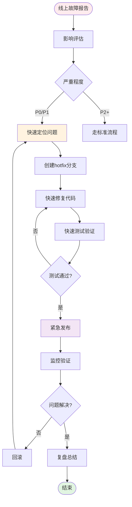

# Hotfix 紧急修复流程

## 流程概览



---

## 一、故障响应阶段

### 1.1 影响评估

**目的：** 快速评估故障影响范围和严重程度

**执行操作：**
1. 确认故障现象和影响范围
2. 评估业务影响（用户数、功能范围）
3. 确定严重等级（P0/P1/P2/P3）

**门禁条件：**
- [ ] 故障现象已确认
- [ ] 影响范围已评估
- [ ] 严重等级已确定

### 1.2 问题定位

**目的：** 快速定位问题根因

**执行操作：**
1. 查看监控告警
2. 分析错误日志（使用 bytedance-log）
3. 定位问题代码位置

**门禁条件：**
- [ ] 问题根因已定位
- [ ] 问题代码位置已确认

---

## 二、快速修复阶段

### 2.1 创建 hotfix 分支

**目的：** 隔离修复代码

**执行操作：**
```bash
git checkout -b hotfix/TASK-YYYYMMDD-fix-name
```

**门禁条件：**
- [ ] hotfix 分支已创建

### 2.2 快速修复代码

**目的：** 最小化修改，快速修复问题

**执行操作：**
1. 编写修复代码（最小化修改原则）
2. 本地验证修复效果

**门禁条件：**
- [ ] 修复代码已编写
- [ ] 本地验证通过

### 2.3 快速测试验证

**目的：** 验证修复效果，确保不引入新问题

**执行操作：**
1. 部署到测试环境
2. 执行关键路径测试
3. 回归测试（核心功能）

**门禁条件：**
- [ ] 测试环境验证通过
- [ ] 核心功能回归测试通过

---

## 三、紧急发布阶段

### 3.1 紧急发布

**目的：** 快速发布修复到生产环境

**执行操作：**
1. 代码审查（简化流程）
2. 合并到 release 分支
3. 发布到生产环境

**门禁条件：**
- [ ] 代码审查通过
- [ ] 发布成功

### 3.2 监控验证

**目的：** 确认问题已解决

**执行操作：**
1. 监控关键指标
2. 验证故障现象消失
3. 确认无新问题引入

**门禁条件：**
- [ ] 故障现象已消失
- [ ] 监控指标正常

**失败处理：**
- 立即回滚到上一版本
- 重新进入修复流程

---

## 四、复盘总结阶段

### 4.1 复盘总结

**目的：** 沉淀经验，防止问题再次发生

**执行操作：**
1. 编写故障报告
2. 分析根本原因
3. 制定预防措施

**门禁条件：**
- [ ] 故障报告已完成
- [ ] 预防措施已制定

---

## 最佳实践

### 修复原则
- **最小化修改**：只修改必要的代码
- **快速优先**：优先快速修复，后续优化
- **回滚准备**：确保可以快速回滚

### 时间要求
- P0 故障：30分钟内修复
- P1 故障：2小时内修复
- P2+ 故障：走标准流程

### 沟通机制
- 及时同步修复进度
- 发布前后通知相关方
- 复盘结果共享团队
