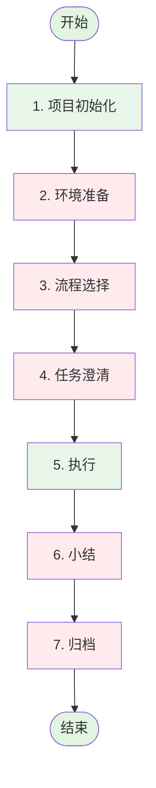

***
name: Flou 工作流程
description: Flou 交互工作流程完整闭环
version: 1.2.1
tags: [工作流程, 交互, 闭环]
---

# Flou 工作流程

> **约束**：项目初始化允许读写记忆/配置文件，环境准备/流程选择/任务澄清/小结阶段严禁操作代码；归档阶段默认严禁操作代码，但在多仓 worktree 模式下允许对用户确认的仓库执行归档动作；执行阶段按研发流程操作代码

## 流程概览

> 🟩 绿色：可操作代码 | 🟥 红色：禁止操作代码

---

## 1. 项目初始化（✅ 可读写记忆/配置）

**目标**：检索或初始化项目记忆和配置

**执行步骤**：

1. **检查项目初始化状态** `flou-cli project init --check --agent <agent>`
   - `<agent>` 建议填写当前正在使用的 AI IDE / Agent 客户端，支持 `trae`、`claude`、`coco`、`cursor`、`codex`、`gemini`、`openclaw`、`opencode`、`ttadk`
   - 空目录 → 输出"空目录，无需初始化"，跳过后续步骤
   - 已初始化 → 输出历史任务表格和对话记录提示（通过 terminaloutput）
   - 未初始化 → 执行初始化

**门禁**：记忆和配置就绪，会话记录就绪（如启用）

---

## 2. 环境准备（🚫 禁止操作代码）

**目标**：确认开发环境配置，创建任务目录

**执行步骤**：

1. **环境澄清**
   - 开发模式：single（单仓库）/ multi（多仓库）
   - 分支策略：当前分支或新建 feature 分支，自动根据任务描述生成分支名称， 如 `feature/manage-user-auth`
   - 测试环境：BOE / PPE, 按照需求含义自动生成相关的环境名称， 如 `boe_user_info` / `ppe_user_info`
   - 仓库配置：
     - 支持本地仓库路径：`/path/to/local/repo`
     - 支持仓库名称：`ies-cs/trace_go`，自动补全为 `git@code.byte.org:ies-cs/trace_go.git`, 向用户确认
     - 多个仓库用逗号分隔
   - BITS 开发任务(用于流水线自动部署)：是否创建
   - 工作目录：
     - 单仓模式：当前路径是 git 仓库时，询问用户是否创建新的 worktree。`--work-dir` 可以为空（使用默认路径），也可以是一个不存在路径或空目录
     - 多仓模式：运行 `flou-cli task recomend-dir <task-id>` 获取推荐工作目录，展示给用户确认
> **注意**：
   > - `--dev-mode=multi` 时必须指定 `--repos`，`--work-dir` 可选
   > - 多仓模式下，先用 `flou-cli task recomend-dir <task-id>` 获取推荐目录，并将结果作为 `task init --work-dir` 传入；工作区空目录判定会忽略 `.ai/`、除 `.git` 外所有以 `.` 开头的文件/目录，以及普通空子目录
   > - 多仓 worktree 模式不支持同一路径二次 `task init` 复用；已有 worktree 内容时必须换新目录
   > - 单仓模式下，当前路径是 git 仓库时，可使用 `--create-worktree` 创建新的 worktree；worktree 目录支持不存在路径或真实空目录
   > - 仓库名称格式如 `ies-cs/trace_go` 需要补全为 `git@code.byte.org:ies-cs/trace_go.git`
   > - 未找到仓库时，提示用户询问更准确的仓库路径

2. **用户确认（必须）**
   > ⚠️ **重要**：必须向用户展示完整的配置信息，等待用户明确确认后才可执行 task init 命令
   - 展示配置摘要需包含所有澄清选项
   - 用户确认后方可继续

3. **创建任务**
   - 生成任务ID：`TASK-YYYYMMDD-<需求名>`
   - 执行 `flou-cli task init <TASK-ID> [flags]`
   - `--agent` 建议填写当前正在使用的 AI IDE / Agent 客户端；该值会作为任务首次客户端写入 `todo-flow.md` 并随上报保留，未传时不阻断任务初始化

   **参数说明（*为必填）：**
   | 参数 | 必填 | 说明 | 示例 |
   |------|:--:|------|------|
   | `task-id` | * | 任务ID | `TASK-20260319-login` |
   | `-u, --user-input` | * | 用户原始输入/任务描述 | `"实现用户登录功能"` |
   | `--dev-mode` | * | 开发模式 | `single` / `multi` |
   | `--branch` | * | 开发分支名称 | `feature/login` |
   | `--test-env` | * | 测试环境 | `boe_xxx` / `ppe_xxx` / `local` |
   | `--repos` | | 仓库列表（多仓模式），支持 JSON 格式或逗号分隔 | `'[{"url":"git@...","branch":"main"}]'` 或 `git@...,git@...` |
   | `--work-dir` | | 工作目录 | `/path/to/workspace`；多仓模式先通过 `flou-cli task recomend-dir <task-id>` 获取推荐值 |
   | `--create-bits` | | 创建 BITS 任务 | 标志位 |
   | `--create-worktree` | | 创建新的 git worktree | 标志位 |
   | `--agent` | | Agent 类型 / AI IDE 客户端，建议使用当前实际客户端 | `trae` / `claude` / `coco` / `cursor` / `codex` / `gemini` / `openclaw` / `opencode` / `ttadk` |

4. **剪切会话日志**：执行 `flou-cli log copy -s <session_id> -t <task_id>` 将会话剪切到任务日志

**门禁**：任务目录创建完成

---

## 3. 流程选择（🚫 禁止操作代码）

**目标**：分析场景并选择合适的研发流程

**执行步骤**：

1. 分析任务场景
2. 先调用 `flou-cli memory recall "流程" --stage flow` 从插件流程记忆中选择候选流程；再检索项目记忆 `flou-cli memory recall 流程` 获取历史流程偏好，加载 `$FLOU_SKILL_DIR/statics/` 路径获取默认流程定义
3. **场景路由检测**: 推荐合适流程（含路由依据），用户可根据推荐流程进行确认或调整。
5. 用户确认或调整（路由仅作推荐，用户可手动覆盖）
6. 加载研发流程定义文件

**门禁**：流程确认、定义文件加载完成

---

## 4. 任务澄清（🚫 禁止操作代码）

**目标**：澄清研发流程所需必要信息

**执行步骤**：

1. 识别流程各节点所需信息输入
2. 逐项澄清：需求详情、技术选型、测试策略等
3. 更新 todo-flow 文件
4. 用户确认继续

**门禁**：必要信息已澄清、用户确认进入执行阶段

---

## 5. 执行（✅ 按研发流程操作代码）

**目标**：按研发流程节点执行任务

**执行步骤**：

1. 加载研发流程定义
2. 按节点顺序执行：
   - 进入节点前，先根据当前阶段、任务关键词、中间件/业务对象调用 `flou-cli memory recall <关键词> --stage <stage>` 召回插件知识
   - 命中插件 `flow/memory/prompt` 后，先生成 Spark Prompt；若运行环境提供 `spawn_agent` / `spawnAgent` 子 agent 能力，必须调用子 agent 执行 Spark Prompt 并返回合法 JSON 计划，再按 JSON 中的 `tasks[].layer` 分别启动子 agent 执行不同分层，等待全部必需子 agent 完成后汇总
   - 若没有子 agent 能力，则主 agent 使用同一份 JSON 计划按 `tasks[]` 顺序串行执行，作为显式兜底；不得跳过 `layers` 拆分或忽略已召回的插件条目
   - 检索项目记忆获取上下文前，先读取 `.flou/tasks/{TASK-ID}/memory_fetch.json` 去重，仅对新增关键词执行 `flou-cli memory recall <关键词>`（由 Agent 更新关键词文件，CLI 不内置记录逻辑）
   - 记忆检索关键词至少包含研发流程中涉及到的节点名称、用户任务关键词
   - 执行节点任务（可搜索/读写代码）
   - 验证门禁条件
   - 记录执行结果
   - 如开发执行、测试反馈或 Troubleshooting 导致方案变更，同步更新 `docs/design.md`、`docs/requirement.md` 相关段落，并维护 `todo-flow.md` 关键决策列表
   - 更新 todo-flow
   - 用户确认继续下一节点
3. 遇到阻塞时记录并请求用户介入

**门禁**：当前节点完成、用户确认继续；如本轮存在方案变更，必须确认 `docs/design.md`、`docs/requirement.md` 与 `todo-flow.md` 关键决策列表三同步已完成

---

## 6. 小结（🚫 禁止操作代码）

**目标**：总结任务成果

**执行步骤**：

1. 汇总任务执行过程
2. 提取关键决策和变更，确认 `todo-flow.md` 关键决策列表已覆盖方案变更
3. 生成小结文档
4. 用户确认小结内容

**门禁**：用户确认小结

---

## 7. 归档（🚫 默认禁止操作代码；多仓 worktree 模式允许归档已确认仓库）

**目标**：沉淀知识到项目记忆

**执行步骤**：

1. **加载归档素材**
   - 加载任务日志文件 `.flou/logs/{TASK-ID}.jsonl`
   - 加载暂存记忆文件 `.flou/tasks/stashed_archive.json`
   - 若 `DEV_MODE=multi` 或存在 `.flou/memory/repos.yaml`，加载工作区仓库清单并检查 `WORKSPACE_DIR/repos/*` 的 git 变更状态

2. **用户选择归档条目**
   - 展示日志和暂存记忆内容
   - 多仓 worktree 模式下，优先展示存在未归档产物的仓库列表（如 git status 非空的仓库）
   - 引导用户确认需要归档到仓库中的仓库有哪些
   - 用户选择需要归档的条目
   - 收集用户修改意见

3. **执行归档**
   - 多仓 worktree 模式下，仅对用户确认的仓库执行工作区产物归档动作；禁止继续开发新内容
   - 根据用户选择执行 `flou-cli memory add` 写入记忆
   - 归档任务文件

**门禁**：记忆更新完成、任务文件归档

---

## 研发流程列表

| 流程 | 文件 | 适用场景 |
|------|------|----------|
| SDD | sdd_flow_spec.md | 标准开发流程 |
| TDD | tdd_flow.md | 测试驱动开发 |
| SDD-Plus | sdd-plus-flow.md | 复杂需求开发 |
| Hotfix | hotfix_flow.md | 线上紧急修复 |
| Spike | spike_flow.md | 技术预研 |
| Oncall | oncall_flow.md | Oncall 问题处理 |
| Onboarding | onboarding_flow.md | 新人项目上手 |
| TCC-Config | tcc_config_flow.md | TCC配置类任务自助接入 |

**优先级**：项目自定义流程（`$FLOU_DIR/memory/flows/`）> 内置流程（`statics/`）

---

## 对话记录说明

### 会话管理

- **会话文件位置**：`.flou/logs/SESSION-<session_id>.jsonl`
- **任务日志位置**：`.flou/logs/{TASK-ID}.jsonl`
- **日志格式**：JSONL（每行一个 JSON 对象）

### 记录要求

| 字段 | 必填 | 说明 | 示例 |
|------|:----:|------|------|
| `task_id` | 是 | 任务ID | `TASK-20260401-login` |
| `actor` | 是 | 发起方：`assistant` 或 `user` | `user` |
| `action` | 是 | 动作内容（文本描述） | `实现用户登录功能` |
| `action_type` | 是 | 动作类型 | `text` \| `tool` \| `skill` \| `speak` |

**action_type 类型说明**：
- `text`：普通文本消息
- `tool`：工具调用
- `skill`：技能调用
- `speak`：语音/对话消息

### 常用命令

| 命令 | 说明 |
|------|------|
| `flou-cli log create-session` | 创建新会话，生成 session_id |
| `flou-cli log record -s <session_id> -t <task_id> -a <actor> -c <content> -y <type>` | 记录对话到会话 |
| `flou-cli log copy -s <session_id> -t <task_id>` | 剪切会话到任务日志，删除原会话文件 |
| `flou-cli log record -t <task_id> -a <actor> -c <content> -y <type>` | 直接记录到任务日志 |

### 工作流程

1. **初始化阶段**：检查 `record_conversation` 配置，如启用则自动创建会话
2. **任务初始化完成后**：使用 `log copy` 将会话剪切到任务日志
3. **执行阶段**：后续对话继续记录到任务日志（不再使用会话文件）
4. **归档阶段**：使用任务日志进行归档
