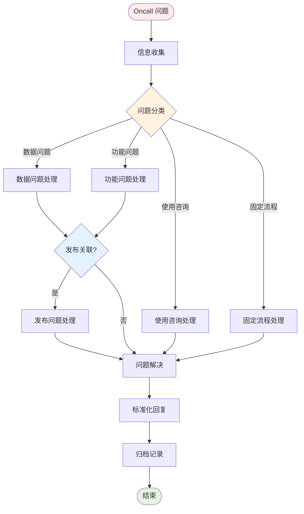

# Oncall 问题处理流程

## 流程概览



---

## 一、信息收集阶段

### 1.1 问题信息收集

**目的：** 收集完整的问题信息

**执行操作：**
1. 记录问题描述
2. 收集问题发生时间
3. 收集问题影响范围
4. 收集用户信息（用户ID、账号等）
5. 收集环境信息（设备、版本等）

**关键信息清单：**
- 问题现象描述
- 发生时间点
- 影响用户/范围
- 复现步骤（如有）
- 错误信息/截图
- 用户联系方式

**门禁条件：**
- [ ] 问题描述清晰
- [ ] 时间信息完整
- [ ] 影响范围明确

---

## 二、问题分类阶段

### 2.1 问题分类路由

**目的：** 准确识别问题类型，路由到正确处理流程

**分类决策树：**

```
问题现象
├── 数据错误/数据缺失 → 数据问题
├── 功能异常/报错 → 功能问题
├── 不了解如何使用 → 使用咨询
└── 标准化操作请求 → 固定流程
```

**分类特征：**

| 问题类型 | 关键特征 | 典型问题 |
|---------|---------|---------|
| 数据问题 | 数据错误、数据缺失、数据不一致 | 订单金额错误、数据未同步 |
| 功能问题 | 功能报错、功能异常、功能缺失 | 接口报错、页面崩溃、按钮无响应 |
| 使用咨询 | 不了解使用方法、功能疑问 | 如何配置、如何操作、功能说明 |
| 固定流程 | 标准化操作请求 | 数据修复、工单审批、权限申请 |

**门禁条件：**
- [ ] 问题类型已确定
- [ ] 路由方向明确

---

## 三、问题处理阶段

### 3.1 数据问题处理

**目的：** 定位和修复数据问题

**执行流程：**

1. **数据定位**
   - 查询问题数据（使用数据库查询工具）
   - 确认数据错误类型
   - 分析数据错误原因

2. **发布关联分析**
   - 查询最近发布记录
   - 对比问题发生时间与发布时间
   - 判断是否为发布引入的问题

3. **问题修复**
   - 数据修复（走数据修复流程）
   - 或反馈给开发团队修复

**门禁条件：**
- [ ] 数据问题已定位
- [ ] 根因已分析
- [ ] 修复方案已确定

### 3.2 功能问题处理

**目的：** 快速响应功能问题

**执行流程：**

1. **问题复现**
   - 尝试复现问题
   - 记录复现步骤
   - 收集错误日志

2. **发布关联分析**
   - 查询最近发布记录
   - 对比问题发生时间与发布时间
   - 判断是否为发布引入的问题

**发布关联判断规则：**
```
if 问题发生时间在发布后 2 小时内:
    高度疑似发布问题
elif 问题发生时间在发布后 24 小时内:
    可能是发布问题
else:
    非发布问题
```

3. **问题分级**
   - P0：影响核心功能，需立即处理
   - P1：影响重要功能，需当天处理
   - P2：影响次要功能，可排队处理

4. **问题处理**
   - P0/P1：立即转交开发团队，进入 Hotfix 流程
   - P2：记录问题，排期处理

**门禁条件：**
- [ ] 问题已复现或确认
- [ ] 发布关联已分析
- [ ] 问题已分级
- [ ] 已转交或记录

### 3.3 使用咨询处理

**目的：** 快速解答用户疑问

**执行流程：**

1. **问题理解**
   - 理解用户真实需求
   - 确认用户当前状态

2. **答案检索**
   - 检索知识库
   - 检索文档
   - 检索历史咨询记录

3. **答案提供**
   - 提供操作指引
   - 提供文档链接
   - 必要时提供截图/视频

**门禁条件：**
- [ ] 用户问题已理解
- [ ] 答案已提供

### 3.4 固定流程处理

**目的：** 执行标准化操作流程

**常见固定流程：**

| 流程类型 | 处理方式 | 所需信息 |
|---------|---------|---------|
| 数据修复 | 执行数据修复脚本 | 数据ID、修复内容 |
| 工单审批 | 审批工单 | 工单ID、审批意见 |
| 权限申请 | 分配权限 | 用户ID、权限类型 |
| 配置变更 | 执行配置变更 | 配置项、变更内容 |

**执行流程：**
1. 确认流程类型
2. 收集必要信息
3. 执行标准操作
4. 确认操作结果

**门禁条件：**
- [ ] 流程类型已确认
- [ ] 必要信息已收集
- [ ] 操作已完成

---

## 四、发布问题处理

### 4.1 发布关联分析

**目的：** 快速判断是否为发布引入的问题

**分析步骤：**

1. **查询发布时间**
   ```bash
   # 查询最近发布记录
   NPM_CONFIG_REGISTRY=http://bnpm.byted.org npx -y @bytedance-dev/bytedcli@latest --json tce search-service --keyword "<PSM>"
   ```

2. **时间对比**
   - 问题发生时间
   - 最近发布时间
   - 计算时间差

3. **影响范围对比**
   - 发布影响的功能模块
   - 问题影响的功能模块
   - 判断是否有交集

**判断标准：**

| 时间差 | 判断结果 | 处理方式 |
|-------|---------|---------|
| < 2小时 | 高度疑似 | 立即回滚或热修复 |
| 2-24小时 | 可能相关 | 深入分析后决定 |
| > 24小时 | 不太相关 | 按常规问题处理 |

**门禁条件：**
- [ ] 发布记录已查询
- [ ] 时间对比已完成
- [ ] 关联判断已得出

### 4.2 发布问题处理

**目的：** 快速处理发布引入的问题

**处理方式：**
1. **紧急回滚**：影响严重，立即回滚
2. **热修复**：影响可控，快速修复
3. **降级处理**：临时关闭功能

**门禁条件：**
- [ ] 处理方式已确定
- [ ] 处理已完成

---

## 五、标准化回复阶段

### 5.1 回复话术模版

**目的：** 提供专业、一致的回复

**通用回复模版：**

```
【问题确认】
您好，已收到您反馈的问题：{问题描述}
我们正在处理中，预计 {时间} 给您反馈。

【问题处理中】
您好，关于您反馈的问题，我们正在排查中。
当前进展：{进展描述}
预计完成时间：{时间}

【问题已解决】
您好，您反馈的问题已解决。
问题原因：{原因说明}
解决方案：{解决方案}
如有疑问，请随时联系我们。

【问题跟进】
您好，您反馈的问题已转交开发团队处理。
工单编号：{工单ID}
预计处理时间：{时间}
我们会持续跟进并及时反馈。
```

**分类回复模版：**

**数据问题：**
```
您好，您反馈的数据问题已确认。
问题数据：{数据标识}
问题原因：{原因}
修复状态：{已修复/修复中}
预计完成时间：{时间}
```

**功能问题：**
```
您好，您反馈的功能问题已收到。
问题现象：{现象描述}
当前状态：{排查中/已定位/修复中}
我们会在 {时间} 内给您反馈。
```

**使用咨询：**
```
您好，关于您咨询的 {问题}：
{解答内容}

详细文档：{文档链接}
如有其他疑问，请随时联系。
```

**固定流程：**
```
您好，您申请的 {流程类型} 已完成。
处理结果：{结果}
如有疑问，请随时联系。
```

**发布问题：**
```
您好，您反馈的问题是由系统升级引起的。
我们已紧急处理，当前状态：{状态}
预计恢复时间：{时间}
给您带来的不便，敬请谅解。
```

**门禁条件：**
- [ ] 回复内容已发送
- [ ] 用户已收到回复

---

## 六、归档记录阶段

### 6.1 归档记录

**目的：** 沉淀问题处理经验

**执行操作：**
1. 记录问题分类
2. 记录处理过程
3. 记录解决方案
4. 更新知识库（如需要）

**归档内容：**
- 问题描述
- 问题分类
- 处理过程
- 解决方案
- 处理时长
- 经验总结

**门禁条件：**
- [ ] 归档记录已完成
- [ ] 知识库已更新（如需要）

---

## 最佳实践

### 问题分类原则
- **快速判断**：根据关键特征快速分类
- **准确路由**：确保路由到正确的处理流程
- **动态调整**：处理过程中可调整分类

### 发布关联分析
- **时间优先**：优先对比问题时间与发布时间
- **范围对比**：对比发布影响范围与问题影响范围
- **快速决策**：高度疑似发布问题时，优先回滚

### 回复原则
- **及时响应**：收到问题后 5 分钟内响应
- **进度透明**：定期同步处理进度
- **专业友好**：使用标准化话术，保持专业和友好

### 时间要求
| 问题级别 | 响应时间 | 处理时间 |
|---------|---------|---------|
| P0 | 5分钟 | 30分钟 |
| P1 | 15分钟 | 2小时 |
| P2 | 30分钟 | 24小时 |

### 知识库维护
- 新问题类型：及时更新分类规则
- 常见问题：更新到知识库
- 处理经验：定期总结沉淀
