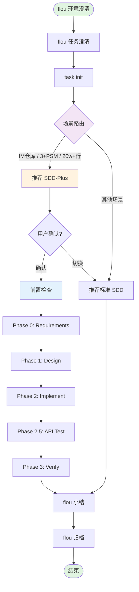

# SDD-Plus 复杂需求流程

## 变量说明

| 变量 | 说明 | 示例 |
|------|------|------|
| `$TASK_ID` | flou 任务 ID | `TASK-20260416-login` |
| `$FEATURE_DIR` | 功能目录 | `/repo/docs/features/2026-04-16-login` |
| `$USER_INPUT` | 用户原始需求描述 | `"实现用户登录功能"` |
| `$FLOU_CONTEXT` | flou 上下文 JSON | `{"task_id":"...","dev_mode":"single",...}` |

## 流程概览



---

## 一、场景路由阶段

### 1.1 路由条件检测

**目的：** 判断当前需求是否应使用 SDD-Plus 流程

**执行操作：**
1. 在 `task init` 命令执行时自动检测上述条件
2. 如满足任一条件，输出提示：推荐使用 SDD-Plus 流程
3. 用户可选择使用 SDD-Plus 或标准 SDD 流程

**门禁条件：**
- [ ] 路由条件已检测
- [ ] 流程推荐已生成

### 1.2 用户确认

**目的：** 确认流程选择

**执行操作：**
1. 展示路由条件和推荐结果
2. 用户确认或手动选择其他流程

**门禁条件：**
- [ ] 用户确认流程选择

---

## 二、前置检查阶段

### 2.1 依赖检查

**目的：** 确保 SDD-Plus 所需依赖已安装

**执行操作：**
1. 检查 SDD-Plus skill 是否已安装（`$SKILLS_DIR/spec-coder/SKILL.md` 存在）
2. 如缺失，执行安装：
   ```bash
   flou-cli install --skills spec-coder --source feature-doc
   flou-cli install --skills feature-clarify --source feature-doc
   ```

**门禁条件：**
- [ ] spec-coder skill 已安装
- [ ] feature-clarify skill 已安装

### 2.2 上下文构造

**目的：** 将 flou 澄清阶段的输出构造为 SDD-Plus 输入

**执行操作：**
1. 提取任务信息（task_id, user_input, dev_mode, branch, test_env, repos）
2. 构造 SDD-Plus 输入 JSON：
   ```json
   {
     "protocol_version": "v1",
     "title": "<从任务描述提取的标题>",
     "current_phase": "Phase 0",
     "user_feedback": "<flou 环境澄清和任务澄清的摘要>",
     "flou_context": {
       "feature_dir_name": "<TASK-ID>",
       "dev_mode": "<single/multi>",
       "branch": "<branch-name>",
       "test_env": "<env>",
       "repos": ["<repo1>", "<repo2>"],
       "workspace_dir": "<path>"
     }
   }
   ```

**门禁条件：**
- [ ] 上下文 JSON 已构造
- [ ] 必填字段完整（title, current_phase）

---

## 三、执行 SDD-Plus 阶段

### 3.1 执行 SDD-Plus

**目的：** 按 SDD-Plus 流程执行复杂需求开发

**执行操作：**
1. 调用 spec-coder skill，传入构造的输入 JSON
2. SDD-Plus 按 Phase 顺序执行：Phase 0 → Phase 1 → Phase 2 → Phase 2.5 → Phase 3
3. 每个 Phase 完成后，解析执行结果：
   - `status: PASSED` → 继续下一 Phase
   - `status: BLOCKED` → 停止推进，向用户报告阻塞点
   - `next_phase: DONE` → SDD-Plus 执行完成
4. 若 Phase 2 Implement、Phase 2.5 API Test 或 Phase 3 Verify 过程中出现实现方案调整、接口契约变化、数据模型变化、外部依赖变化或测试反馈导致的方案变更，必须先同步 spec-coder 的事实来源产物：`FEATURE_DIR/docs/spec.md`（需求/范围/验收变化）、`FEATURE_DIR/docs/plan.md`（设计/依赖/验证策略变化）、必要时 `FEATURE_DIR/docs/task.md`（修复清单/任务影响），并更新 `FEATURE_DIR/todo-flow.md` 关键决策列表后，才能继续下一 Phase 或进入小结

**关键约束：**
- SDD-Plus 内部状态机（`last_feature_dir`）自行管理
- flou 不干预 SDD-Plus 的 Phase 间门禁判断
- SDD-Plus 的子代理执行机制不变
- SDD-Plus/spec-coder 的事实来源是 `FEATURE_DIR/docs/spec.md`、`FEATURE_DIR/docs/plan.md`、`FEATURE_DIR/docs/task.md`、`FEATURE_DIR/docs/analysis-report.md` 和 `FEATURE_DIR/todo-flow.md`；不要要求更新标准 SDD 的 `docs/design.md` / `docs/requirement.md`

**门禁条件：**
- [ ] SDD-Plus 返回 `next_phase: DONE`
- [ ] FEATURE_DIR 产物完整（spec.md, plan.md, task.md, analysis-report.md）
- [ ] 如有方案变更，已完成 `FEATURE_DIR/docs/spec.md`、`FEATURE_DIR/docs/plan.md`、必要时 `FEATURE_DIR/docs/task.md` 与 `FEATURE_DIR/todo-flow.md` 关键决策列表同步

### 3.2 执行异常处理

**目的：** 处理 SDD-Plus 执行过程中的异常

**执行操作：**
1. 同一 Phase 连续 BLOCKED 3 次 → 停止推进，请求用户介入
2. Phase 2 ↔ 2.5 循环超过 3 轮 → 停止推进，请求用户介入
3. 输出解析失败 → 视为 BLOCKED，提示用户重试
4. 如 Troubleshooting 后需要调整开发方案，必须同步更新 `FEATURE_DIR/docs/spec.md`（需求/范围/验收变化）、`FEATURE_DIR/docs/plan.md`（设计/依赖/验证策略变化）、必要时 `FEATURE_DIR/docs/task.md`（修复清单/任务影响），并在 `FEATURE_DIR/todo-flow.md` 的“关键决策列表”记录变更原因、最终决策、影响范围、关联文档和确认状态

**门禁条件：**
- [ ] 异常已处理或已请求用户介入
- [ ] 如有方案变更，已同步 `FEATURE_DIR/docs/spec.md`、`FEATURE_DIR/docs/plan.md`、必要时 `FEATURE_DIR/docs/task.md` 和 `FEATURE_DIR/todo-flow.md` 关键决策列表

---

## 四、小结阶段

### 4.1 成果汇总

**目的：** 汇总 SDD-Plus 执行成果

**执行操作：**
1. 读取 FEATURE_DIR 下的产物清单
2. 汇总各 Phase 执行状态
3. 提取关键决策和变更文件
4. 校验方案变更记录是否已同步到 `FEATURE_DIR/docs/spec.md`、`FEATURE_DIR/docs/plan.md`、必要时 `FEATURE_DIR/docs/task.md` 和 `FEATURE_DIR/todo-flow.md` 关键决策列表
5. 生成小结文档

**小结文档内容：**
- 执行流程：SDD-Plus（Phase 0 → Phase 3）
- FEATURE_DIR 路径
- 关键产出文件链接（spec.md, plan.md, task.md, analysis-report.md）
- 关键决策列表（含方案变更来源、依据、影响范围、关联文档、确认状态）
- 变更文件列表

**门禁条件：**
- [ ] 小结文档已生成
- [ ] 用户确认小结内容

---

## 五、归档阶段

### 5.1 知识沉淀

**目的：** 将 SDD-Plus 执行经验沉淀到项目记忆

**执行操作：**
1. 提取可归档的经验（技术决策、问题解决方案、最佳实践）
2. 使用 `flou-cli memory add` 写入记忆
3. 归档任务文件

**门禁条件：**
- [ ] 记忆已更新
- [ ] 任务文件已归档

---

## 最佳实践

### 流程选择建议
- 首次使用 SDD-Plus 时，建议先在小型需求上验证
- 场景路由仅作推荐，用户可手动覆盖
- 复杂需求建议使用 SDD-Plus，简单需求使用标准 SDD

### 上下文传递建议
- `user_feedback` 应包含 flou 澄清阶段的关键信息摘要
- `flou_context` 为扩展字段，SDD-Plus 可读取但不依赖
- 确保 `title` 字段简洁明确，便于 SDD-Plus 生成 FEATURE_DIR

### 小结归档建议
- 小结应引用 FEATURE_DIR 的具体文件，便于后续追溯
- 归档时重点沉淀技术决策和问题解决方案
- 开发方案修改必须先完成 spec-coder 事实来源产物（`FEATURE_DIR/docs/spec.md`、`FEATURE_DIR/docs/plan.md`、必要时 `FEATURE_DIR/docs/task.md`）和 `FEATURE_DIR/todo-flow.md` 关键决策列表同步，再进入小结归档
