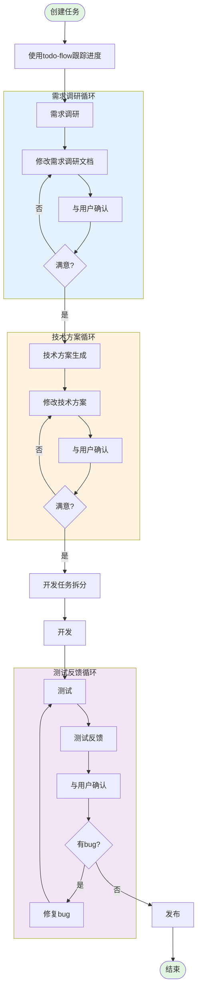
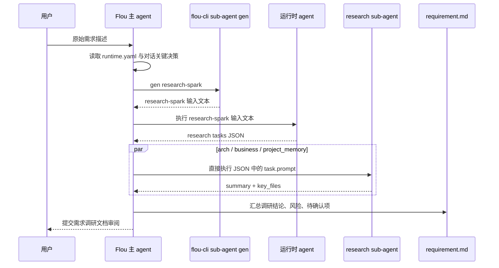

# 软件开发流程（SDD）

## 流程概览



---

## 一、任务初始化阶段

### 1.1 创建任务

**目的：** 明确任务目标，启动开发流程

**执行操作：**
1. 接收用户任务描述
2. 解析任务意图和范围
3. 创建任务追踪记录

**门禁条件：**
- [ ] 任务描述清晰，目标明确
- [ ] 任务范围已界定

### 1.2 Todo-flow 跟踪

**目的：** 建立进度追踪机制

**执行操作：**
1. 初始化 Todo 列表
2. 拆分子任务
3. 设置任务优先级

**门禁条件：**
- [ ] Todo 列表已创建
- [ ] 至少有一个待办项

---

## 二、需求调研阶段

### 2.1 需求调研

**目的：** 明确修改范围、修改方式、影响风险，**以运行事实作为依据**

**调研执行链路：**
需求调研必须先生成 `research-spark` 输入文本，由当前运行时 agent 执行拆解，再并发派发多个 `research` sub-agent 收集信息，最后由主 agent 汇总。禁止跳过拆解直接进入方案设计。



**research-spark 输入要求：**
传入 `research-spark` 的 query 必须包含三类上下文，缺一不可：

1. `runtime.yaml` 地址：当前任务对应的 `$FLOU_DIR/memory/runtime.yaml` 绝对路径或仓库相对路径。
2. 原始需求描述：保留用户原话，不要提前改写成技术方案。
3. 对话关键决策上下文：只放已确认事实、约束和用户明确选择，不放 agent 未验证推断；若暂无已确认决策，显式写 `暂无已确认决策`。

推荐 query 模板：

```text
runtime.yaml: <path/to/.flou/memory/runtime.yaml>

原始需求:
<用户原始需求描述>

对话关键决策上下文:
- <已确认决策1>
- <已确认决策2>
- <仍待确认但会影响调研方向的问题>
```

**生成 research-spark 输入文本：**

```bash
flou-cli sub-agent gen research-spark "<按上述模板拼接后的 query>" > "$FLOU_DIR/tasks/${TASK_ID}/docs/research-spark.prompt.txt"
```

`gen` 只负责输出要交给运行时 agent 的完整输入文本，不执行 agent、不召回、不写文档。主 agent 必须优先使用当前运行时的子 agent 能力执行 `docs/research-spark.prompt.txt` 的内容，并将执行得到的 JSON 保存到 `$FLOU_DIR/tasks/${TASK_ID}/docs/research-spark-tasks.json`，作为后续调研和测试报告的可观察证据。

如果当前运行时没有可用的子 agent 能力，使用 OpenCode 兜底执行输入文本：

```bash
flou-cli sub-agent chat --provider opencode --input "$FLOU_DIR/tasks/${TASK_ID}/docs/research-spark.prompt.txt" > "$FLOU_DIR/tasks/${TASK_ID}/docs/research-spark-tasks.raw.txt"
```

主 agent 必须从 `research-spark-tasks.raw.txt` 提取 JSON 数组，并保存为 `research-spark-tasks.json`。

**多 sub-agent research 派发：**

1. 读取 `research-spark` 返回的 JSON 数组。
2. JSON 中每个子任务的 `prompt` 已经是可直接交给运行时子 agent 的完整 research 指令；主 agent 不再调用 `flou-cli sub-agent gen research` 二次包装。
3. 主 agent 优先使用当前运行时的子 agent 能力，按 `arch`、`business`、`project_memory` 三个分层并发执行这些 `prompt`，并将原始输出分别保存为 `docs/research-arch.raw.txt`、`docs/research-business.raw.txt`、`docs/research-project-memory.raw.txt`。
4. 如果当前运行时没有可用的子 agent 能力，主 agent 将 JSON 中的 `prompt` 写入对应临时文件后使用 OpenCode 兜底执行每个 prompt：

```bash
flou-cli sub-agent chat --provider opencode --input "$FLOU_DIR/tasks/${TASK_ID}/docs/research-arch.prompt.txt" > "$FLOU_DIR/tasks/${TASK_ID}/docs/research-arch.raw.txt"
flou-cli sub-agent chat --provider opencode --input "$FLOU_DIR/tasks/${TASK_ID}/docs/research-business.prompt.txt" > "$FLOU_DIR/tasks/${TASK_ID}/docs/research-business.raw.txt"
flou-cli sub-agent chat --provider opencode --input "$FLOU_DIR/tasks/${TASK_ID}/docs/research-project-memory.prompt.txt" > "$FLOU_DIR/tasks/${TASK_ID}/docs/research-project-memory.raw.txt"
```

5. 每个 research sub-agent 必须执行其 prompt 中列出的 `flou-cli memory recall ... --layers <layer>` 命令，并只基于 recall 结果整理 `summary` 和 `key_files`。
6. 如果某个维度无召回结果，该维度输出 `暂无`。
7. 主 agent 汇总所有子任务输出到需求调研文档，并保留每个维度的关键文件地址。

**验证导向：**
需求分析阶段必须通过测试能力获取运行事实，避免仅凭代码分析做出假设：
- **现象验证**：通过浏览器或接口实际调用，观察问题表现
- **数据验证**：通过日志查询，确认实际返回的数据
- **范围验证**：通过测试用例执行，确认影响范围

**执行操作：**
1. 收集 `runtime.yaml` 地址、用户原始需求和对话关键决策上下文
2. 使用 `flou-cli sub-agent gen research-spark ...` 生成 spark 输入文本，并调用运行时子 agent 执行；无子 agent 能力时回退到 `flou-cli sub-agent chat --provider opencode --input ...`
3. 解析 `research-spark` 返回的 JSON，直接取每个维度的 `prompt` 派发给运行时子 agent
4. 优先调用运行时子 agent 按分层执行 JSON 中的 prompt；无子 agent 能力时把 prompt 写入文件并回退到 `flou-cli sub-agent chat --provider opencode --input ...`
5. 汇总 sub-agent 输出，识别需求涉及的功能模块、受影响代码模块、业务约束和待确认问题
6. **主动调用测试能力验证**：
   - 提供网站链接：调用 auto-test-case 进行页面探索和接口录制
   - 提供接口信息：调用 bam-query 请求接口，获取实际响应数据
   - 提供 logid：调用 bytedance-log 查询日志，确认错误数据
7. 识别模糊信息并询问用户

**门禁条件：**
- [ ] 需求调研文档已创建于 `$FLOU_DIR/tasks/${TASK_ID}/docs/requirement.md`
- [ ] `research-spark` 输入包含 `runtime.yaml` 地址、原始需求描述、对话关键决策上下文
- [ ] `research-spark` 输入文本已保存到 `docs/research-spark.prompt.txt`
- [ ] `research-spark` 输出已保存到 `docs/research-spark-tasks.json`
- [ ] 已优先使用运行时子 agent 按 `arch/business/project_memory` 分层派发 research；若不可用，已使用 `flou-cli sub-agent chat --provider opencode --input ...` 兜底，或记录无法执行的原因
- [ ] research 输入文本已保存到 `docs/research-arch.prompt.txt`、`docs/research-business.prompt.txt`、`docs/research-project-memory.prompt.txt`
- [ ] 需求调研文档包含多 sub-agent 调研汇总、关键文件地址、待确认问题
- [ ] 核心需求点已记录
- [ ] 包含验证结果（浏览器验证截图、接口响应数据、日志分析结果）

### 2.2 需求确认循环

**目的：** 确保需求理解准确

**执行操作：**
1. 展示需求文档
2. 收集用户反馈
3. 修改完善文档

**门禁条件：**
- [ ] 用户明确确认满意
- [ ] 无待澄清的需求点

**退出条件：** 用户确认满意

---

## 三、技术方案阶段

### 3.1 技术方案生成

**目的：** 设计技术实现路径

**执行操作：**
1. 分析技术可行性
2. 设计系统架构
3. 确定技术选型
4. 规划实现步骤

**方案文档结构：**
- 背景（包括原始输入）
- 概要设计（架构图）
- 详细设计
  - 流程
  - 时序图
  - 接口变更（新增、修改、删除）
  - 数据模型变更（新增、修改、删除）
- 外部依赖

**门禁条件：**
- [ ] 技术方案文档已创建于 `$FLOU_DIR/tasks/${TASK_ID}/docs/design.md`
- [ ] 架构设计完整

### 3.2 技术方案确认循环

**目的：** 确保技术方案符合预期

**执行操作：**
1. 展示技术方案
2. 收集用户反馈
3. 调整优化方案

**门禁条件：**
- [ ] 用户明确确认满意
- [ ] 技术风险已评估

**退出条件：** 用户确认满意

### 3.3 方案变更同步

**触发条件：** 开发执行、测试反馈或 Troubleshooting 过程中发现原方案不可行、风险变化、接口/数据模型/依赖需要调整。

**目的：** 保证实际执行方案、需求边界与进度记录一致，避免只改代码不改设计和调研结论。

**执行操作：**
1. 记录变更依据：失败用例、接口响应、logid、错误栈、依赖限制或用户反馈。
2. 更新技术方案文档 `$FLOU_DIR/tasks/${TASK_ID}/docs/design.md` 的相关段落（概要设计、详细设计、异常处理、实现计划、外部依赖、方案变更记录）。
3. 更新需求调研文档 `$FLOU_DIR/tasks/${TASK_ID}/docs/requirement.md` 的相关段落（需求范围、验收标准、验证结果、风险识别、方案变更影响）。
4. 更新 `$FLOU_DIR/tasks/${TASK_ID}/todo-flow.md` 的“关键决策列表”，记录变更原因、最终决策、影响范围、关联文档和确认状态。
5. 若变更影响验收口径或任务范围，重新向用户确认后再继续开发。

**门禁条件：**
- [ ] `$FLOU_DIR/tasks/${TASK_ID}/docs/design.md` 已同步更新
- [ ] `$FLOU_DIR/tasks/${TASK_ID}/docs/requirement.md` 已同步更新
- [ ] `$FLOU_DIR/tasks/${TASK_ID}/todo-flow.md` 关键决策列表已记录
- [ ] 影响验收口径的变更已获得用户确认

---

## 四、开发执行阶段

### 4.1 开发任务拆分

**目的：** 将技术方案转化为可执行任务

**执行操作：**
1. 分解开发任务
2. 确定任务依赖关系
3. 更新 Todo 列表

**门禁条件：**
- [ ] 任务拆分完成
- [ ] 任务粒度适中（单个任务可独立完成）

### 4.2 开发

**目的：** 实现功能代码

**执行操作：**
1. 按任务列表逐项开发
2. 编写代码和单元测试
3. 代码审查
4. 如开发中需要调整实现方案，先执行“3.3 方案变更同步”，同步 `$FLOU_DIR/tasks/${TASK_ID}/docs/design.md`、`$FLOU_DIR/tasks/${TASK_ID}/docs/requirement.md` 和 `$FLOU_DIR/tasks/${TASK_ID}/todo-flow.md` 关键决策列表
5. 关联开发任务并推送代码
6. 确认部署状态（使用 bytedance-env 技能查询）

**门禁条件：**
- [ ] 代码编译通过
- [ ] 单元测试通过
- [ ] 代码符合规范

**输出物：**
- 功能代码
- 单元测试代码
- 代码审查记录

---

## 五、测试反馈阶段

### 5.1 测试

**目的：** 以运行事实作为依据，确认系统行为是否符合预期

**前提条件：**
- **部署状态校验**：研发环境测试前，必须确认代码已成功部署
- **编译成功**：代码编译无错误，构建产物已生成
- **部署成功**：服务已启动，健康检查通过（使用 bytedance-env 技能查询）
- **环境就绪**：测试环境配置正确，依赖服务可用

**测试角色目标：**
- **现象验证**：观察页面显示、接口响应的实际表现
- **数据验证**：通过日志查询、接口请求，确认返回数据的准确性
- **范围验证**：通过测试用例执行，确认修改的影响范围
- **闭环验证**：从需求分析到测试完成，每个阶段都有运行事实支撑

**执行流程：**

1. **确定测试范围**
   - 根据需求分析和方案设计文档确定用例测试、接口测试范围
   - 检索已有用例库，对没有的模块测试路径进行探索

2. **部署测试环境**
   - 配置 ppe 环境
   - 检查 ppe 环境部署状态

3. **执行主动验证**

| 验证类型 | 触发条件 | 执行动作 | 输出物 |
|----------|----------|----------|--------|
| 浏览器验证 | 提供网站链接 | auto-test-case 页面探索 | 页面截图、接口调用记录、logid |
| 日志验证 | 获取到 logid | bytedance-log 查询分析 | 日志分析结果、错误数据确认 |
| 接口验证 | 提供接口信息或 PSM | bam-query 请求接口 | 接口响应数据、字段值对比 |
| 用例测试 | 需要验证特定功能 | auto-test-case 执行用例 | 测试报告、失败用例列表 |

4. **测试结果汇总**
   - 汇总所有验证结果
   - 对比预期结果与实际结果
   - 如果存在失败用例，进入 Debug 流程

**门禁条件：**
- [ ] 测试用例执行完成
- [ ] 测试报告已生成

### 5.2 Debug 流程

**触发条件：** 测试失败

**目标：** 快速定位问题、分析根因、修复并验证

**行为规范：**
- **主动推进**：发现问题后直接规划 todo，继续执行修复和测试
- **避免输出详细记录**：不要输出问题现象、排查方法、根本原因等详细排查记录
- **持续执行**：持续推动 debug 流程，直到需要用户介入时才询问用户

**执行流程：**

1. **定位问题接口**
   - 分析测试失败表现
   - 结合代码对比 master 分支 diff
   - 定位到具体的问题接口或代码位置

2. **日志分析**
   - 根据测试录制的 logid
   - 调用 bytedance-log 查询分析日志
   - 分析错误堆栈、异常信息、请求响应数据

3. **问题修复**
   - 根据日志分析结果定位根因
   - 如根因要求调整开发方案，先执行“3.3 方案变更同步”
   - 修复代码问题
   - 提交修复代码

4. **重新测试**
   - 部署修复后的代码
   - 重新执行失败的测试用例
   - 验证问题是否解决
   - 如果仍有问题，重复 debug 流程

**输出物：**
- 问题定位报告
- 日志分析结果
- 修复代码提交记录
- 重新测试结果

**退出条件：** 用户确认无 Bug

---

## 六、发布阶段

### 6.1 发布

**目的：** 预发布验证、正式发布、发布后监控

**执行操作：**
1. 预发布环境验证
2. 正式发布
3. 发布后监控

**门禁条件：**
- [ ] 所有 Todo 项已完成
- [ ] 代码已提交
- [ ] 文档已更新
- [ ] 发布验证通过

---

## 工具使用指引

详见 [tools-guide.md](../references/tools-guide.md)
