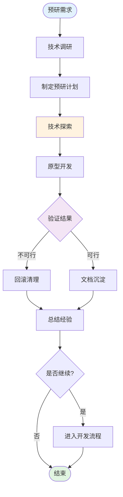

# Spike 技术预研流程

## 流程概览

---

## 一、预研规划阶段

### 1.1 技术调研

**目的：** 了解技术背景和可行性

**执行操作：**
1. 收集技术资料和文档
2. 调研类似技术方案
3. 评估技术风险

**门禁条件：**
- [ ] 技术资料已收集
- [ ] 风险点已识别

### 1.2 制定预研计划

**目的：** 明确预研目标和验证方式

**执行操作：**
1. 定义预研目标
2. 确定验证标准
3. 规划时间周期

**门禁条件：**
- [ ] 预研目标明确
- [ ] 验证标准清晰
- [ ] 时间周期合理

---

## 二、技术探索阶段

### 2.1 技术探索

**目的：** 深入探索技术方案

**执行操作：**
1. 搭建实验环境
2. 尝试不同技术路径
3. 记录探索过程

**门禁条件：**
- [ ] 实验环境已搭建
- [ ] 探索记录完整

### 2.2 原型开发

**目的：** 开发最小可行原型验证方案

**执行操作：**
1. 开发核心功能原型
2. 验证关键技术点
3. 性能和稳定性测试

**门禁条件：**
- [ ] 原型已开发
- [ ] 关键技术点已验证

---

## 三、验证评估阶段

### 3.1 验证结果

**目的：** 评估技术方案可行性

**执行操作：**
1. 对比验证标准
2. 评估性能指标
3. 分析风险和成本

**门禁条件：**
- [ ] 验证结果明确
- [ ] 可行性结论清晰

### 3.2 回滚清理

**目的：** 清理不可行的预研代码

**执行操作：**
1. 删除实验代码
2. 清理实验环境
3. 恢复到稳定状态

**门禁条件：**
- [ ] 实验代码已清理
- [ ] 环境已恢复

---

## 四、总结沉淀阶段

### 4.1 文档沉淀

**目的：** 记录预研成果和经验

**执行操作：**
1. 编写技术方案文档
2. 记录关键决策点
3. 整理最佳实践

**门禁条件：**
- [ ] 技术文档已完成
- [ ] 关键决策已记录

### 4.2 总结经验

**目的：** 沉淀经验教训

**执行操作：**
1. 总结成功经验
2. 分析失败原因
3. 提出改进建议

**门禁条件：**
- [ ] 经验总结完成
- [ ] 改进建议明确

---

## 最佳实践

### 预研原则
- **允许失败**：预研失败是正常的，及时止损
- **快速迭代**：快速验证，避免过度投入
- **文档优先**：及时记录，方便后续参考

### 时间控制
- 单次预研周期：30min
- 复杂预研可分期进行
- 定期同步进度

### 决策标准
- 技术可行性
- 性能达标
- 成本可控
- 风险可接受
