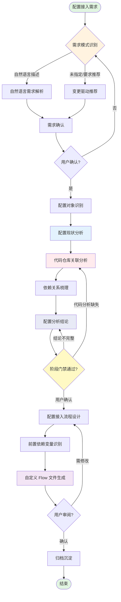

# TCC 配置自助接入流程

## 变量说明

| 变量                 | 说明            | 示例                                                   |
| ------------------ | ------------- | ---------------------------------------------------- |
| `$TASK_ID`         | flou 任务 ID    | `TASK-20260507-tcc-config`                           |
| `$PSM`             | 服务 PSM 标识     | `ies.kefu.bubble`                                    |
| `$NAMESPACE`       | TCC 命名空间      | `ies.kefu.bubble`                                    |
| `$REGION`          | TCC 区域        | `CN` / `China-East`                                  |
| `$ENV`             | 目标环境          | `boe` / `ppe` / `prod`                               |
| `$REPO_PATH`       | 业务代码仓库路径      | `/path/to/repo`                                      |
| `$FLOW_OUTPUT_DIR` | 自定义 Flow 输出目录 | `.flou/memory/flows/`                                |
| `$CONFIG_OBJECTS`  | 配置对象清单 JSON   | `[{"name":"switch","dir":"/default","type":"json"}]` |

## 流程概览



***

## 一、需求收集阶段

### 1.1 需求模式识别

**目的：** 确定用户配置接入需求的输入模式，路由到对应的收集策略

**两种模式：**

| 模式 | 触发条件 | 输入来源 | 时间方向 | 目标已知性 |
|------|----------|----------|----------|------------|
| 自然语言描述 | 用户直接描述配置接入需求 | 用户原始输入 | 当前/未来 | 用户已知目标 |
| 变更驱动推荐 | 用户未指定具体需求，或要求从变更中推荐 | TCC 版本历史 + 当前配置状态 + 近期变更频率 | 过去事实 + 当下状态 | 由 agent 基于事实生成目标 |

**路由规则：**

```
if 用户输入包含明确的配置接入描述:
    → 自然语言描述模式
else:
    → 变更驱动推荐模式
```

**门禁条件：**

- [ ] 需求模式已确定
- [ ] 路由方向明确

### 1.2 自然语言需求解析

**目的：** 从用户自然语言描述中提取配置接入需求

**触发条件：** 模式 = 自然语言描述

**执行操作：**

1. **解析需求意图**
   - 识别配置接入类型：新增配置 / 修改配置 / 迁移配置 / 配置开关
   - 提取关键实体：PSM、配置名、环境、区域
   - 识别业务场景：功能开关 / 限流降级 / 动态参数 / 灰度策略
2. **结构化需求提取**
   - 配置接入目标：需要接入什么配置
   - 业务场景：配置用于什么业务目的
   - 期望行为：配置变更后期望的系统行为
   - 影响范围：配置影响的功能模块
3. **模糊信息澄清**
   - PSM 不明确 → 询问用户或从代码仓库推断
   - 配置类型不明确 → 根据业务场景推荐
   - 环境不明确 → 默认从 PPE 开始

**门禁条件：**

- [ ] 需求意图已识别
- [ ] 关键实体已提取
- [ ] 模糊信息已澄清

### 1.3 变更驱动推荐

**目的：** 综合 TCC 版本历史、当前配置状态与近期变更频率，结合代码引用，梳理场景变更影响面，推荐对应的需求场景

> **⚠️ 推荐依据三角约束：** 变更驱动推荐必须同时基于以下三类证据，缺一不可——
> 1. **变更事实**：TCC 版本历史（`tcc config version list` 推导变更次数与时间趋势）+ 当前配置状态（`tcc config get` 多环境对比） + 近期变更频率（版本列表筛选近 30 天条目）
> 2. **代码引用结合**：配置在业务代码仓库中的引用位置和消费方式（具体代码搜索与门禁验证落在 2.3 代码仓库关联分析）
> 3. **场景变更影响面**：从代码引用反推到接口/模块，梳理变更对业务链路的影响范围
>
> 仅凭变更频率推荐场景属于不充分推荐，必须同步给出代码与影响面层面的初步判断（精细化代码门禁在 2.3 强制把关）。

**触发条件：** 模式 = 变更驱动推荐

**执行操作：**

1. **枚举配置列表**
   ```bash
   NPM_CONFIG_REGISTRY=http://bnpm.byted.org npx -y @bytedance-dev/bytedcli@latest tcc config list "$NAMESPACE" --region "$REGION" --keyword "" --dir-path "/default"
   ```
   - 产出 namespace 下所有配置的名称、目录、类型等基础信息
   - 此步骤仅完成配置枚举，不包含变更历史数据

2. **收集变更事实（变更维度）**
   - 对步骤 1 枚举出的每个候选配置，逐个查询版本历史：
   ```bash
   NPM_CONFIG_REGISTRY=http://bnpm.byted.org npx -y @bytedance-dev/bytedcli@latest tcc config version list "$NAMESPACE" "$CONFIG_NAME" --region "$REGION" --dir "/default" --env "$ENV" --page 1 --page-size 50
   ```
   - **指标推导规则**：
     - **变更次数**：版本列表的总条目数
     - **最近变更时间**：最新一条版本的创建时间
     - **近期变更次数**：筛选创建时间在最近 30 天内的版本条目数（≥ 2 次视为高频）
     - **是否未发布**：对比最新版本的创建时间与最近一次 deployment 的时间，若版本创建后无对应 deployment 则视为未发布
     - **多环境差异**：分别对 BOE / PPE / Prod 执行 `tcc config get`，对比返回值是否一致
   - **数据边界说明**：`tcc config version list` 返回的是配置版本创建记录，可推导变更次数与时间趋势，但不含变更触发场景（需求驱动/故障修复/策略调整）。变更触发场景需结合代码仓库 commit 历史与团队协作记录人工判断，不作为门禁强制项
3. **代码引用结合（代码维度）**
   - 对候选配置，在业务代码仓库中初步检索引用位置（`SearchCodebase` / `grep`）
   - 标注每个配置的关键引用文件，作为场景命名与边界的依据
   - 仅做"够用即可"的轻量检索，目的是辅助场景识别；完整代码引用清单与门禁在 2.3 强制产出
4. **场景变更影响面梳理（影响面维度）**
   - 从代码引用反向追溯到 HTTP/RPC 接口、定时任务、上下游依赖
   - 评估变更影响等级：P0（核心链路）/ P1（重要功能）/ P2（辅助功能）
   - 标注典型变更可能引发的故障形态（请求堆积、限流穿透、降级失效等）
5. **候选识别规则**
   - 近期频繁变更的配置（近期变更 ≥ 2 次，由 `tcc config version list` 推导）
   - 多环境差异较大的配置（BOE/PPE/Prod 值不一致，由 `tcc config get` 多环境对比推导）
   - 新增但未发布的配置（版本创建后无对应 deployment，由版本列表与 deployment 时间对比推导）
   - 加密配置（涉及密钥/凭证类配置）
   - 历史变更链路具备共性，可沉淀为可复用流程的配置（来自版本历史归纳）
6. **需求场景映射**
   - 将候选配置关联到具体需求场景（如：限流配置频繁变更 → 限流策略调整场景；密钥多次轮换 → 密钥轮换场景）
   - 每个推荐场景必须同时附带：变更事实证据、关键代码引用位置、影响面摘要
   - 按优先级排序，展示推荐理由和预期收益

**推荐优先级：**

| 优先级 | 需求场景 | 推荐理由 |
|--------|----------|----------|
| P0 | 多环境差异大的配置对应场景 | 容易因环境不一致引发线上问题 |
| P0 | 频繁变更的配置对应场景 | 手动操作风险高，需要标准化流程 |
| P1 | 新增未发布的配置对应场景 | 需要建立从创建到发布的完整流程 |
| P1 | 加密配置对应场景 | 需要安全的配置管理流程 |
| P1 | 历史链路具备共性的场景 | 可沉淀团队过往实践，降低未来变更成本 |
| P2 | 常规配置对应场景 | 可按标准流程接入 |

**门禁条件：**

- [ ] 配置列表已枚举（`tcc config list` 已执行）
- [ ] 变更事实已收集（版本历史已查询：变更次数 + 最近变更时间 + 近期频率，由 `tcc config version list` 推导；多环境差异由 `tcc config get` 对比）
- [ ] 候选配置已结合代码做轻量引用检索，关键引用位置已记录
- [ ] 每个推荐场景的变更影响面已初步梳理（影响接口 / 模块 / 等级）
- [ ] 推荐场景已生成，且每条推荐均同时附带「变更事实 + 代码引用 + 影响面」三类证据
- [ ] 用户已选择或确认推荐场景

### 1.4 需求确认

**目的：** 确保配置接入需求理解准确

**执行操作：**

1. **展示需求摘要**
   - 配置接入目标
   - 业务场景描述
   - 涉及的 PSM / Namespace
   - 目标环境和区域
2. **收集用户反馈**
   - 确认需求理解是否准确
   - 补充遗漏信息
   - 调整优先级
3. **更新需求文档**

**门禁条件：**

- [ ] 用户明确确认需求理解准确
- [ ] 无待澄清的需求点

**退出条件：** 用户确认满意

***

## 二、配置分析阶段

### 2.1 配置对象识别

**目的：** 识别本次配置接入涉及的所有配置对象

**执行操作：**

1. **枚举配置对象**
   ```bash
   # 列出 namespace 下的配置
   NPM_CONFIG_REGISTRY=http://bnpm.byted.org npx -y @bytedance-dev/bytedcli@latest tcc config list "$NAMESPACE" --region "$REGION" --dir-path "/default"
   ```
2. **配置对象分类**
   | 配置类型 | 说明        | 典型示例                        |
   | ---- | --------- | --------------------------- |
   | 功能开关 | 控制功能启停    | `feature_switch`            |
   | 限流降级 | 流量控制和降级策略 | `rate_limit_config`         |
   | 动态参数 | 运行时可调参数   | `timeout_ms`, `retry_count` |
   | 灰度策略 | 灰度发布规则    | `gray_rule`                 |
   | 凭证密钥 | 加密类配置     | `db_password`, `api_key`    |
   | 白名单  | IP/用户白名单  | `ip_whitelist`              |
3. **确定配置对象清单**
   - 配置名称
   - 所属目录
   - 配置类型（json / yaml / text）
   - 是否加密

**门禁条件：**

- [ ] 配置对象已枚举
- [ ] 配置类型已分类
- [ ] 配置对象清单已生成

### 2.2 配置现状分析

**目的：** 分析配置对象的当前状态，识别接入差异

**执行操作：**

1. **获取配置详情**
   ```bash
   # 获取配置当前值
   NPM_CONFIG_REGISTRY=http://bnpm.byted.org npx -y @bytedance-dev/bytedcli@latest tcc config get "$NAMESPACE" "$CONFIG_NAME" --region "$REGION" --dir "/default"

   # 获取加密配置明文（如需要）
   NPM_CONFIG_REGISTRY=http://bnpm.byted.org npx -y @bytedance-dev/bytedcli@latest tcc config get "$NAMESPACE" "$CONFIG_NAME" --region "$REGION" --dir "/encrypt" --decrypt
   ```
2. **多环境对比**
   - 对比 BOE / PPE / Prod 环境的配置值差异
   - 识别环境特有配置项
   - 标记需要环境隔离的配置
3. **配置元数据分析**
   ```bash
   # 查询环境级配置元数据
   NPM_CONFIG_REGISTRY=http://bnpm.byted.org npx -y @bytedance-dev/bytedcli@latest tcc config meta list --env "$ENV"
   ```
4. **现状总结**
   - 配置是否已存在
   - 各环境配置值是否一致
   - 是否有未发布的变更
   - 是否需要审批流程
5. **配置字段含义解析**
   - 逐字段解析配置 JSON/YAML 中每个 key 的业务含义
   - 标注字段类型、取值范围、默认值
   - 识别字段间的逻辑关系（互斥、依赖、条件生效）
   - 标记敏感字段（密钥、凭证、内部 IP 等）

**门禁条件：**

- [ ] 配置详情已获取
- [ ] 多环境差异已分析
- [ ] 现状总结已完成
- [ ] 配置字段含义已逐字段解析并记录

### 2.3 代码仓库关联分析

**目的：** 分析配置在代码仓库中的引用情况，确认接入影响范围

> **⚠️ 强制要求：** 本步骤不可跳过。代码仓库关联分析是配置变更影响面评估的唯一可靠来源，缺少代码分析将导致后续流程无法准确评估变更风险。若代码仓库暂不可访问，必须向用户说明并获取明确授权后才可继续，否则流程暂停。

**执行操作：**

1. **搜索配置引用（必须产出具体证据）**
   - 在代码仓库中搜索配置名称的引用，使用 `SearchCodebase` 或 `grep` 工具执行搜索
   - 记录每个引用的文件路径和行号
   - 识别配置读取代码位置（如 `config.Get("xxx")`、`viper.GetString("xxx")` 等）
   - 识别配置变更回调逻辑（如 `OnChange(func(){...})`、`Watch("xxx", handler)` 等）
   - **产出物**：配置引用清单，格式为 `配置名 → [{文件路径, 行号, 引用方式, 代码片段}]`
2. **分析配置消费模式**
   - 配置读取方式：SDK 注入 / API 拉取 / 文件挂载
   - 配置变更监听：是否注册了回调
   - 配置默认值：代码中是否有 fallback 逻辑
   - **产出物**：每个配置的消费模式描述
3. **影响范围评估**
   - 配置变更影响的接口列表（从引用代码反向追溯到 HTTP/RPC handler）
   - 配置变更影响的功能模块
   - 配置变更的上下游依赖
   - **产出物**：影响面清单，格式为 `配置名 → {影响接口, 影响模块, 上下游依赖}`

**门禁条件：**

- [ ] 配置引用已搜索，且产出包含具体文件路径和行号的引用清单（非空）
- [ ] 每个配置对象至少有 1 条代码引用记录；若搜索结果为空，必须说明原因并经用户确认
- [ ] 消费模式已分析，且产出每个配置的消费模式描述
- [ ] 影响范围已评估，且产出影响面清单
- [ ] 代码引用清单已作为阶段结论的输入，不可缺失

### 2.4 依赖关系梳理

**目的：** 梳理配置对象之间的依赖关系和前置条件

**执行操作：**

1. **配置间依赖**
   - 配置 A 的值是否依赖配置 B
   - 配置变更顺序约束
   - 配置组合生效规则
2. **外部依赖**
   - TCC namespace 权限
   - 审批流程依赖
   - 环境部署依赖
3. **前置条件清单**
   - 必须先创建的配置
   - 必须先获取的权限
   - 必须先部署的服务

**门禁条件：**

- [ ] 配置间依赖已梳理
- [ ] 外部依赖已识别
- [ ] 前置条件清单已生成

### 2.5 配置分析结论

**目的：** 汇总配置分析阶段的全部产出，形成结构化结论，作为后续流程归纳阶段的必要输入

> **⚠️ 强制要求：** 本步骤是配置分析阶段的必经出口，未产出配置分析结论前，禁止进入流程归纳阶段。

**执行操作：**

1. **汇总配置变更影响面**
   - 整合 2.3 产出物，按配置对象列出变更影响面
   - 标注影响等级：P0（核心链路）/ P1（重要功能）/ P2（辅助功能）
   - 标注是否需要灰度发布或分批发布
2. **汇总配置字段含义**
   - 整合 2.2 产出的字段含义解析
   - 按配置对象逐字段列出：字段名、类型、含义、取值范围、默认值、是否敏感
   - 标注本次变更涉及的字段及变更内容
3. **汇总关联代码**
   - 整合 2.3 产出的配置引用清单和消费模式
   - 按配置对象列出：引用文件、行号、引用方式、消费模式
   - 标注本次变更可能影响的代码路径
4. **汇总依赖关系及顺序**
   - 整合 2.4 产出的依赖关系和前置条件
   - 列出配置变更的推荐执行顺序
   - 列出必须前置完成的操作（权限申请、服务部署等）
5. **生成配置分析结论文档**
   - 按以下结构输出：

   ```
   ## 配置分析结论

   ### 1. 配置变更影响面
   | 配置对象 | 影响等级 | 影响接口 | 影响模块 | 是否需要灰度 |
   |---------|---------|---------|---------|------------|
   | ...     | ...     | ...     | ...     | ...        |

   ### 2. 配置字段含义
   | 配置对象 | 字段名 | 类型 | 含义 | 取值范围 | 默认值 | 敏感 | 本次变更 |
   |---------|-------|------|------|---------|-------|------|---------|
   | ...     | ...   | ...  | ...  | ...     | ...   | ...  | ...     |

   ### 3. 关联代码
   | 配置对象 | 文件路径 | 行号 | 引用方式 | 消费模式 |
   |---------|---------|------|---------|---------|
   | ...     | ...     | ...  | ...     | ...     |

   ### 4. 依赖关系及顺序
   - 执行顺序：配置A → 配置B → 配置C
   - 前置条件：[权限/部署/审批...]
   - 组合约束：[互斥/依赖/条件生效...]
   ```

**门禁条件：**

- [ ] 配置变更影响面已汇总，且每个配置对象的影响等级已标注
- [ ] 配置字段含义已汇总，且本次变更涉及的字段已标注
- [ ] 关联代码已汇总，且引用清单非空（与 2.3 门禁联动）
- [ ] 依赖关系及顺序已汇总，且执行顺序已明确
- [ ] 配置分析结论文档已生成

**阶段级门禁（配置分析阶段 → 流程归纳阶段）：**

- [ ] 2.1 ~ 2.5 所有子步骤门禁条件均已通过
- [ ] 配置分析结论文档已产出且内容完整
- [ ] 用户已确认配置分析结论

**退出条件：** 用户确认配置分析结论完整准确

***

## 三、流程归纳阶段

### 3.1 配置接入流程设计

**目的：** 归纳针对需求场景的配置接入流程

> **⚠️ 骨架统一说明：** 所有接入类型均产出**多场景骨架**（详见 3.3），接入类型差异仅体现在「场景路由表」与「按场景修改」章节的填法上，**不影响产物结构**。当 N=1 时按 3.3 的「N=1 退化规则」简化呈现。

**执行操作：**

1. **流程步骤编排**
   - 根据配置对象和依赖关系编排步骤顺序
   - 确定每步的输入、输出和验证方式
   - 设计异常处理和回滚策略
2. **接入类型 → 路由表填法映射**
   | 接入类型 | 路由表「变更字段」填法 | 核心命令链路 | 典型场景数 |
   | ---- | ------------- | ----------------------------------------------------------- | ------ |
   | 新增配置 | 整体配置（首次创建）  | `config create` → flou-test verify → `deployment deploy`        | 通常 1  |
   | 修改配置 | 具体字段路径      | `config update` → flou-test verify → `deployment deploy`        | 1 ~ N  |
   | 迁移配置 | 整体配置（含来源标注） | `config get` → `config create` → flou-test verify → deploy → cleanup | 通常 1  |
   | 配置开关 | 开关字段路径      | `config create` → code integrate → flou-test verify → `deployment deploy` | 通常 1  |
   | 场景化批量 | 多组字段路径并列    | `config update` 多次 → flou-test verify 矩阵 → `deployment deploy`  | N ≥ 2  |
   > **格式化要求**：执行 `config create` 或 `config update` 时，`--value` 参数必须传入格式化文本。JSON 类型配置默认按 4 个空格缩进格式化（使用 `python3 -m json.tool --indent 4`），YAML 类型配置需保持缩进层级清晰，禁止传入压缩单行文本。
   >
   > **接入类型选择规则**：
   > - 1.2 自然语言 → 根据用户描述匹配「新增/修改/迁移/开关」其一，路由表通常 1 行
   > - 1.3 变更驱动推荐 → 当推荐场景 ≥ 2 时选「场景化批量」；推荐场景 = 1 时回退到「修改配置」
3. **环境策略设计**
   - BOE 验证 → PPE 验证 → Prod 发布
   - 每个环境的验证使用 Flou 内置测试流程（flou-test）执行，验证配置变更后系统行为是否符合预期
   - 跨环境配置同步策略

**门禁条件：**

- [ ] 流程步骤已编排
- [ ] 接入类型已选择，路由表填法已确定
- [ ] 环境策略已设计

### 3.2 前置依赖变量识别

**目的：** 识别流程执行所需的前置依赖变量

**执行操作：**

1. **变量提取**
   - 从流程步骤中提取所有可变参数
   - 区分必填变量和可选变量
   - 为每个变量提供说明和示例
2. **变量分类**
   | 变量类别 | 说明                    | 示例                                           |
   | ---- | --------------------- | -------------------------------------------- |
   | 身份标识 | PSM / Namespace 等服务标识 | `$PSM`, `$NAMESPACE`                         |
   | 环境参数 | 区域 / 环境 / 站点          | `$REGION`, `$ENV`, `$SITE`                   |
   | 配置内容 | 配置名 / 配置值 / 目录        | `$CONFIG_NAME`, `$CONFIG_VALUE`, `$DIR_PATH` |
   | 发布策略 | 发布模式 / 审批方式           | `$PUBLISH_MODE`, `$REVIEW_REQUIRED`          |
   | 仓库信息 | 代码路径 / 分支             | `$REPO_PATH`, `$BRANCH`                      |
3. **变量校验规则**
   - 必填变量缺失时，流程不可启动
   - 变量格式校验（PSM 格式、环境名格式等）
   - 变量间依赖关系（如 `$NAMESPACE` 通常与 `$PSM` 一致）

**门禁条件：**

- [ ] 变量已提取并分类
- [ ] 必填/可选已区分
- [ ] 校验规则已定义

### 3.3 自定义 Flow 文件生成

**目的：** 生成业务项目的自定义 Flow 文件

> **⚠️ 产物格式硬约束：** 生成的 Flow 文件必须严格遵循下方「产物骨架」，且骨架中标注为必填的章节与字段不可省略。任何 Flow 产物若缺失「场景路由表」或「场景路由表中的引用数列」，视为不合规，必须打回重写。

**执行操作：**

1. **确定输出路径与文件命名**
   ```
   $FLOW_OUTPUT_DIR/FLOW-tcc-config-change-$NAMESPACE.md
   ```
   > **⚠️ 命名约束：** 产物 Flow 聚焦 TCC 配置**变更**（修改 / 发布 / 回滚），不是配置接入元流程。文件名固定以 `FLOW-tcc-config-change-` 开头，禁止写成 `FLOW-tcc-config-access-` 或 `FLOW-tcc-config-integration-`。
2. **Flow 文件产物骨架（固定结构，按顺序生成）**

   | 序号 | 章节 | 必填 | 内容要求 |
   |----|----|----|----|
   | 1 | YAML Front Matter | 是 | 字段齐备：`name` / `description` / `version` / `tags` / `created_at`。**`name` 必须为「TCC 配置变更流程 - $NAMESPACE」**；`description` 须体现"配置变更"，禁止写"配置接入"；`tags` 必须包含 `TCC`、`配置变更` |
   | 2 | 变量说明表 | 是 | 列出 Flow 执行所需变量及示例值 |
   | 3 | 流程概览（Mermaid） | 是 | 包含「场景路由 → 通用执行链路」结构，路由分支需覆盖所有场景 |
   | 4 | **场景路由表** | **是** | 列：场景ID \| 场景名称 \| 配置 \| 变更字段 \| 影响等级 \| **引用数（必填）** |
   | 5 | 一、读取当前配置 | 是 | 含 `tcc config get` 命令；含可选解密分支（如有 S* 涉及加密） |
   | 6 | 二、按场景修改配置 | 是 | 每个场景独立子节，必含：变更字段、典型变更项表（字段\|类型\|含义\|默认值\|变更场景）、**影响模块（具体文件路径，引用数与 §4 路由表一致）**、关联约束、门禁条件 |
   | 7 | 三、场景化校验 | 是 | JSON 格式校验 + 字段完整性校验 + 场景关联校验 |
   | 8 | 四、更新 PPE 并发布 | 是 | `tcc config update --env ppe` + `tcc deployment deploy --env ppe` |
   | 9 | 五、PPE 场景化验证 | 是 | 含「场景验证矩阵」：场景 \| 验证方法 \| 验证要点 |
   | 10 | 六、更新 Prod 并发布 | 是 | `tcc config update --env prod` + `tcc deployment deploy --env prod`；标注审批要求 |
   | 11 | 七、Prod 场景化验证 | 是 | 复用 §9 验证矩阵，落到 Prod 环境执行 |
   | 12 | 八、回滚配置 | 是 | 通过 TCC 版本回滚；不通过备份重写 |
   | 13 | 最佳实践 | 是 | 变更原则 + 场景优先级 + 关联约束 |
   | 14 | 故障排查 | 是 | 问题 \| 原因 \| 解决方案 |

   **YAML Front Matter 参考模板：**
   ```yaml
   ---
   name: TCC 配置变更流程 - $NAMESPACE
   description: $NAMESPACE 服务 TCC 配置变更场景化流程，覆盖 <配置列表> 的 N 个 <P0/P1/P2> 变更场景
   version: 1.0.0
   tags: [TCC, 配置变更, $NAMESPACE]
   created_at: YYYY-MM-DD
   ---
   ```

3. **场景一致性约束**
   - §4 场景路由表中出现的每个场景 ID，必须在 §6（按场景修改）、§7（场景关联校验）、§9（场景验证矩阵）三处分别有对应子节或行
   - 三处的场景顺序、命名、变更字段必须一致，禁止局部出现/缺失
   - 影响模块必须落到具体文件路径，且文件路径来自 2.3 代码仓库关联分析的引用清单

4. **「引用数」字段强制要求**
   - 场景路由表每行的「引用数」列**必填**，不允许留空或写「-」
   - 引用数来源：2.3 代码引用清单中该配置/字段的去重引用条数（包含字段引用与配置整体引用）
   - 若代码搜索结果为 0，必须停止生成 Flow，回到 2.3 重新分析或与用户确认是否仍需此场景

5. **N=1 退化规则（单场景适配）**
   - 所有 Flow 无论来自自然语言（1.2）还是变更驱动推荐（1.3），**统一采用多场景骨架**，以保证产物格式一致、可平滑扩展
   - 当场景路由表只有 1 行（N=1）时，允许按下列方式简化，但**骨架章节结构不变**：
     - §3 流程概览 Mermaid 可省略路由分支判断，画成线性图
     - §6 / §7 / §9 各只出现 1 个场景子节，无需附加"场景对照表"
     - §4 场景路由表**仍必须保留**（1 行），且「引用数」字段**仍必填**
   - 未来若需要扩展到 N≥2，只需在路由表追加行、在 §6/§7/§9 追加子节，无需重构文件

6. **生成 Flow 文件**
   - 按上述骨架顺序填充章节
   - 填充具体的执行命令（`NPM_CONFIG_REGISTRY=http://bnpm.byted.org npx -y @bytedance-dev/bytedcli@latest tcc ...`）
   - 填充门禁条件（命令执行结果校验）
   - 填充前置依赖变量表（来自 3.2）

7. **归档到记忆**
   ```bash
   flou-cli memory add "流程概述：TCC配置变更流程-$NAMESPACE, 文件地址：.flou/memory/flows/FLOW-tcc-config-change-$NAMESPACE.md" --tags "项目流程,TCC配置变更"
   ```

**门禁条件：**

- [ ] Flow 文件已生成，且按 §2 骨架顺序产出 14 个必填章节
- [ ] **YAML Front Matter `name` 字段值为「TCC 配置变更流程 - $NAMESPACE」，禁止写成「配置接入」**
- [ ] **`description` 字段体现"配置变更"，`tags` 包含 `TCC` 与 `配置变更`**
- [ ] **文件名以 `FLOW-tcc-config-change-` 开头**
- [ ] 场景路由表已生成，且每行「引用数」非空（必填硬约束）
- [ ] §4 / §6 / §7 / §9 四处场景 ID、命名、顺序完全一致
- [ ] §6 每个场景的「影响模块」均落到具体文件路径
- [ ] 所有执行命令包含 `NPM_CONFIG_REGISTRY` 与 `npx -y @bytedance-dev/bytedcli@latest`
- [ ] 已归档到项目记忆

### 3.4 用户审阅确认

**目的：** 确保生成的 Flow 文件符合用户预期

**执行操作：**

1. **展示 Flow 文件内容**
   - 流程概览图
   - 阶段详情摘要
   - 前置依赖变量清单
2. **收集用户反馈**
   - 流程步骤是否完整
   - 门禁条件是否合理
   - 变量定义是否准确
   - 是否需要补充异常处理
3. **迭代修改**
   - 根据反馈调整流程设计
   - 更新 Flow 文件
   - 重新提交审阅

**门禁条件：**

- [ ] 用户明确确认 Flow 文件
- [ ] 无待修改项

**退出条件：** 用户确认满意

***

## 最佳实践

### 需求收集原则

- **优先自然语言**：用户直接描述需求时，优先解析自然语言，避免强制填表
- **变更驱动复用**：用户未指定目标时，由变更驱动推荐综合「版本历史 + 当前配置状态 + 近期变更频率」生成候选场景，复用团队已有实践
- **推荐需有依据**：变更驱动推荐必须同时附带「变更事实 + 代码引用 + 影响面」三类证据，禁止仅凭单一维度生成场景

### 配置分析原则

- **现状优先**：先获取配置当前状态，再分析差异，避免基于假设设计流程
- **代码验证**：配置引用必须通过代码搜索验证，不能仅凭文档推断
- **依赖显式化**：所有前置依赖必须在变量表中明确列出

### 配置变更原则

- **文本格式化**：TCC 配置变更时，配置值必须使用格式化文本。JSON 类型配置默认按 4 个空格缩进格式化（`python3 -m json.tool --indent 4`），YAML 类型配置需保持缩进层级清晰，禁止传入压缩单行文本
- **回滚策略**：配置变更异常时，通过 TCC 版本回滚恢复（`deployment operate` 回退到上一版本），而非通过备份文件重写
- **增量变更**：优先只修改变更部分，避免整体覆盖导致意外丢失已有配置项
- **变更后校验**：配置变更后，使用 Flou 内置测试流程（flou-test）验证配置变更后系统行为是否符合预期，同时通过 `config get` 回读确认配置值正确

### Flow 文件设计原则

- **命令可执行**：Flow 中的执行命令必须可直接复制运行
- **门禁可验证**：门禁条件必须有明确的验证方式（命令返回值、文件存在等）
- **变量可替换**：所有可变参数必须提取为变量，支持不同项目复用
- **异常可处理**：关键步骤必须有失败处理策略

### 环境策略建议

- 新配置接入：BOE → PPE → Prod 逐级推进
- 配置修改：PPE 验证 → Prod 发布
- 加密配置：使用 `--decrypt` 验证明文，发布时注意审批流程

***

## 故障排查

### 常见问题

| 问题              | 原因                    | 解决方案                                 |
| --------------- | --------------------- | ------------------------------------ |
| namespace 搜索无结果 | PSM 与 namespace 名称不一致 | 尝试搜索 PSM 关键词，或使用 `list-starred` 查看收藏 |
| 配置获取返回空         | 目录路径不正确               | 使用 `tcc config dir list` 查看可用目录                 |
| 发布失败提示权限不足      | namespace 权限未申请       | 联系 namespace 管理员添加权限                 |
| 加密配置无法解密        | 无解密权限                 | 申请对应 namespace 的解密权限                 |
| 多环境配置不一致        | 未同步发布                 | 使用 `tcc config import` 同步基准配置              |
| 审批流程阻塞          | 发布策略要求 review         | 使用 `--publish-mode auto` 或联系审批人      |

### 调试命令

```bash
# 查询 namespace 信息
NPM_CONFIG_REGISTRY=http://bnpm.byted.org npx -y @bytedance-dev/bytedcli@latest tcc namespace search "$NAMESPACE" --scope all --page 1 --size 50

# 查看配置目录结构
NPM_CONFIG_REGISTRY=http://bnpm.byted.org npx -y @bytedance-dev/bytedcli@latest tcc config dir list "$NAMESPACE" --env "$ENV"

# 查看配置元数据
NPM_CONFIG_REGISTRY=http://bnpm.byted.org npx -y @bytedance-dev/bytedcli@latest tcc config meta list --env "$ENV"

# 查看发布详情
NPM_CONFIG_REGISTRY=http://bnpm.byted.org npx -y @bytedance-dev/bytedcli@latest tcc deployment get "$DEPLOYMENT_ID" --env "$ENV"
```

