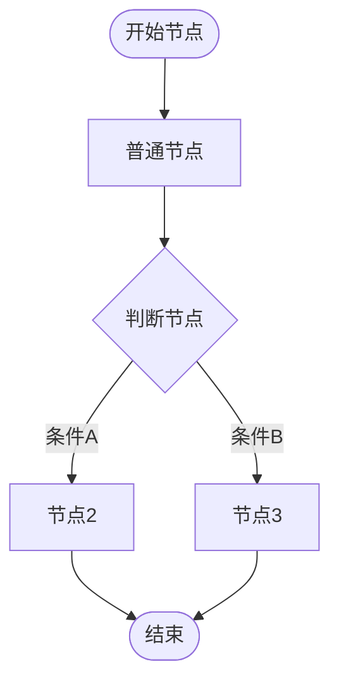
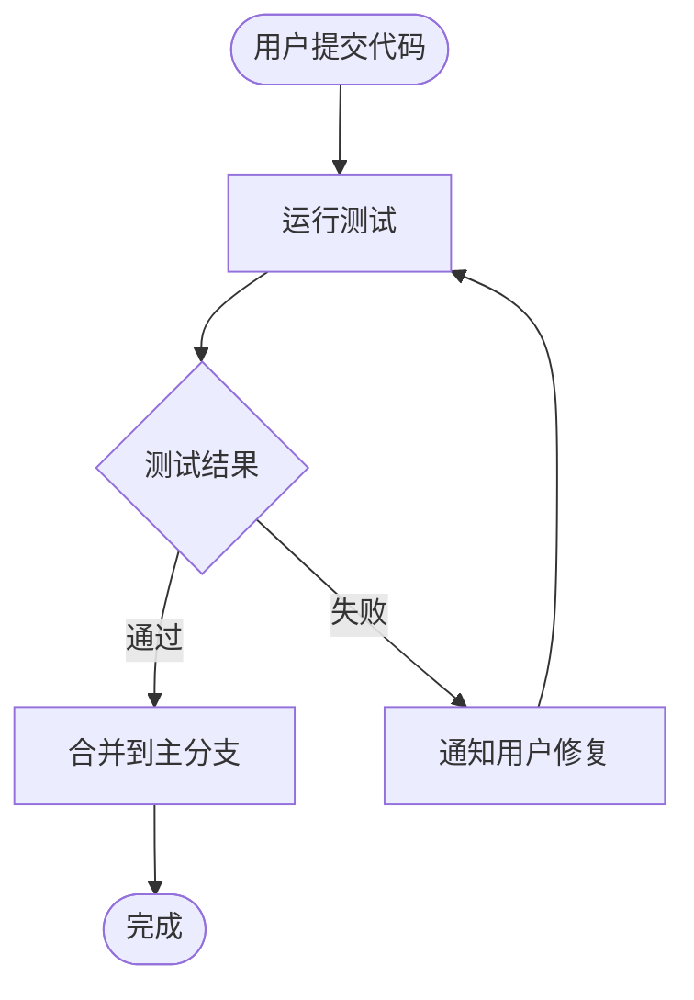
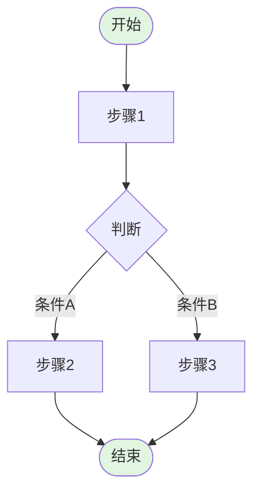
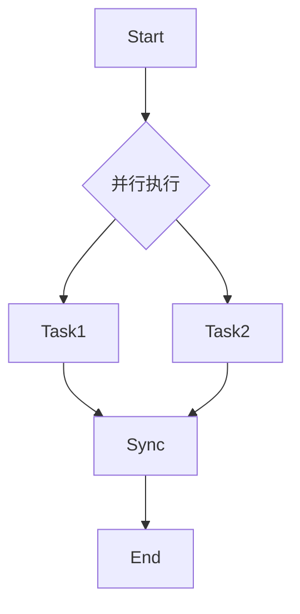

# 流程规范创建规则

本文档定义流程文件的标准格式、自然语言转换规则、以及不完整流程的引导策略。

---

## 一、流程文件标准格式

### 1.1 文件结构

流程文件采用 **分层结构**，由以下模块组成：

```
流程文件
├── 元信息（必选）
├── 变量说明（可选）
├── 流程概览（必选）
├── 阶段详情（必选）
├── 最佳实践（可选）
└── 故障排查（可选）
```

### 1.2 元信息 Schema

元信息使用 **YAML Front Matter** 格式，放置在文件头部，用 `---` 分隔：

```yaml
---
name: <流程名称>
description: <一句话描述>
version: <版本号>
author: <作者>
tags: [<标签列表>]
created_at: <创建日期>
---
```

**示例：**

```yaml
---
name: TDD 开发流程
description: 测试驱动开发的标准流程
version: 1.0.0
author: flou
tags: [开发, 测试]
created_at: 2026-03-08
---
```

### 1.3 变量说明 Schema

当流程中包含动态路径、名称等可变元素时，需定义变量表：

```markdown
## 变量说明

| 变量 | 说明 | 示例 |
|------|------|------|
| `$VAR_NAME` | <变量用途> | <示例值> |
```

**规则：**
- 变量名使用 `$UPPER_SNAKE_CASE` 格式
- 每个变量必须提供说明和示例
- 变量引用时使用 `$VAR_NAME` 语法

### 1.4 流程概览 Schema

流程概览使用 **Mermaid 流程图** 表示：



**节点类型规范：**

| 类型 | 语法 | 用途 | 样式建议 |
|------|------|------|----------|
| 开始/结束 | `([文本])` | 流程边界 | 绿色填充 |
| 普通节点 | `[文本]` | 执行步骤 | 默认样式 |
| 判断节点 | `{文本}` | 条件分支 | 菱形 |
| 子流程 | `subgraph` | 阶段分组 | 浅色背景 |

**样式规范：**

```mermaid
style Start fill:#e1f5e1    %% 开始节点：浅绿
style End fill:#e1f5e1      %% 结束节点：浅绿
style LoopName fill:#e3f2fd %% 循环块：浅蓝
```

### 1.5 阶段详情 Schema

每个阶段包含以下要素：

```markdown
## N、<阶段名称>

### N.1 <步骤名称>

**目的：** <步骤目标>

**执行命令：**
```bash
<命令内容>
```

**门禁条件：**
- [ ] <条件1>
- [ ] <条件2>

**失败处理：**
<失败时的处理方式>
```

**要素说明：**

| 要素 | 必选 | 说明 |
|------|------|------|
| 目的 | 是 | 清晰描述步骤目标 |
| 执行命令 | 否 | 具体执行的命令或操作 |
| 门禁条件 | 是 | 进入下一阶段的前置条件 |
| 失败处理 | 否 | 异常情况的处理策略 |

### 1.6 门禁条件规范

门禁条件是流程节点间传递的 **契约**，必须满足以下原则：

**SMART 原则：**

| 原则 | 说明 | 示例 |
|------|------|------|
| Specific | 具体明确 | ✅ "所有测试用例通过" ❌ "测试没问题" |
| Measurable | 可度量 | ✅ "覆盖率 >= 80%" ❌ "覆盖率够高" |
| Achievable | 可达成 | ✅ "编译无错误" ❌ "代码完美" |
| Relevant | 相关性 | 门禁与节点目标直接相关 |
| Time-bound | 有时限 | ✅ "5分钟内响应" ❌ "及时响应" |

**门禁类型：**

```yaml
gate_types:
  - type: command      # 命令执行结果
    check: "exit_code == 0"
    
  - type: file_exists  # 文件存在检查
    check: "path/to/file"
    
  - type: condition    # 条件表达式
    check: "var == expected"
    
  - type: manual       # 人工确认
    check: "user_confirmed == true"
    
  - type: external     # 外部服务调用
    check: "api_response.status == 200"
```

---

## 二、自然语言转换规则

### 2.1 输入识别

用户输入的自然语言流程，按以下维度解析：

```yaml
parsing_dimensions:
  - intent:      # 流程意图（开发/测试/部署/审查...）
  - actors:      # 参与角色（用户/Agent/系统...）
  - steps:       # 步骤序列
  - conditions:  # 分支条件
  - loops:       # 循环结构
  - artifacts:   # 产出物
```

### 2.2 结构化转换

**转换流程：**

```
自然语言输入
    ↓
意图识别 → 确定流程类型和名称
    ↓
步骤提取 → 识别关键动作和顺序
    ↓
关系推断 → 识别分支、循环、并行结构
    ↓
门禁推断 → 根据步骤目标推断验证条件
    ↓
结构化输出 → 生成流程文件
```

### 2.3 关键词映射

| 自然语言关键词 | 结构化元素 |
|---------------|-----------|
| 首先、开始、启动 | 开始节点 |
| 然后、接着、之后 | 顺序连接 |
| 如果、当、若 | 判断节点 |
| 否则、不然 | 分支路径 |
| 循环、重复、直到 | 循环结构 |
| 完成、结束 | 结束节点 |
| 确认、验证、检查 | 门禁条件 |
| 失败、出错、异常 | 失败处理 |

### 2.4 转换示例

**输入：**

> 用户提交代码后，自动运行测试。如果测试通过，合并到主分支；如果失败，通知用户修复。

**输出：**



**门禁条件：**

```yaml
gates:
  RunTest:
    - 测试命令执行完成
    - 测试报告生成
  Merge:
    - 所有测试用例通过
    - 无合并冲突
```

---

## 三、不完整流程识别规则

### 3.1 必要性检查清单

流程文件创建后，自动执行以下检查：

```yaml
completeness_check:
  - id: has_start
    description: 是否有明确的开始节点
    severity: error
    
  - id: has_end
    description: 是否有明确的结束节点
    severity: error
    
  - id: all_nodes_described
    description: 所有节点是否有描述
    severity: warning
    
  - id: all_gates_defined
    description: 所有节点是否有门禁条件
    severity: warning
    
  - id: branches_covered
    description: 所有分支是否有处理路径
    severity: error
    
  - id: loops_have_exit
    description: 所有循环是否有退出条件
    severity: error
```

### 3.2 门禁缺失识别

**识别规则：**

| 场景 | 判断依据 | 引导策略 |
|------|----------|----------|
| 节点无门禁 | 阶段详情中无门禁条件定义 | 询问"如何验证此步骤完成？" |
| 门禁模糊 | 条件不可度量 | 引导用户量化条件 |
| 门禁不可验证 | 条件无检查方法 | 提供可选验证方式 |

**示例对话：**

```
系统：检测到「运行测试」节点缺少门禁条件。
系统：请问如何验证此步骤已完成？
  1. 测试命令返回成功
  2. 测试报告生成
  3. 自定义条件
用户：1
系统：已添加门禁条件：测试命令返回成功（exit_code == 0）
```

### 3.3 描述不清识别

**识别规则：**

| 问题类型 | 判断依据 | 示例 |
|----------|----------|------|
| 节点名称模糊 | 动词不明确 | ❌ "处理" → ✅ "解析配置文件" |
| 缺少上下文 | 无前置说明 | ❌ 直接出现"检查结果" |
| 歧义表达 | 多种理解方式 | ❌ "优化代码" → ✅ "重构循环逻辑" |

**描述质量评分：**

```python
def score_description(text: str) -> float:
    score = 0.0
    
    # 包含动词（+0.2）
    if has_clear_verb(text):
        score += 0.2
    
    # 包含对象（+0.2）
    if has_clear_object(text):
        score += 0.2
    
    # 可度量（+0.3）
    if is_measurable(text):
        score += 0.3
    
    # 无歧义（+0.3）
    if is_unambiguous(text):
        score += 0.3
    
    return score
```

**评分阈值：**
- `>= 0.7`：描述清晰
- `0.4 - 0.7`：描述一般，建议优化
- `< 0.4`：描述不清，需要引导

---

## 四、用户引导策略

### 4.1 引导时机

```yaml
trigger_conditions:
  - 流程首次创建
  - 完整性检查未通过
  - 用户主动请求优化
  - 流程执行失败回溯
```

### 4.2 引导方式

**渐进式引导：**

```
Level 1: 概要引导
    ↓ 用户选择补充
Level 2: 具体问题
    ↓ 用户回答
Level 3: 选项建议
    ↓ 用户确认
Level 4: 自动补全
```

**示例：**

```
# Level 1: 概要引导
系统：流程「代码审查」存在 2 个待完善项：
  - 节点「审查代码」缺少门禁条件
  - 节点「处理反馈」描述不够清晰
是否需要补充？(y/n)

# Level 2: 具体问题
系统：节点「审查代码」需要门禁条件。
请问如何判断审查完成？
  1. 所有评论已处理
  2. 获得批准
  3. 以上都需要

# Level 3: 选项建议
系统：建议添加以下门禁条件：
  - [ ] 所有评论已解决
  - [ ] 至少一位审查者批准
  - [ ] 无阻塞性问题
确认添加？(y/n)

# Level 4: 自动补全
系统：已自动补全门禁条件，更新流程文件。
```

### 4.3 引导模板

**门禁引导模板：**

```markdown
节点「{node_name}」需要门禁条件。

当前步骤目标：{step_goal}

建议的验证方式：
1. {option_1}
2. {option_2}
3. {option_3}
4. 自定义

请选择或输入：
```

**描述优化模板：**

```markdown
节点「{node_name}」描述可以更清晰。

当前描述：{current_desc}
建议描述：{suggested_desc}

改进点：
- {improvement_1}
- {improvement_2}

是否采纳建议？(y/n/修改)
```

### 4.4 智能建议生成

基于流程上下文，自动生成建议：

```yaml
suggestion_rules:
  - trigger: "测试相关节点"
    suggest_gate: "测试通过 + 覆盖率达标"
    
  - trigger: "代码变更节点"
    suggest_gate: "编译成功 + 静态检查通过"
    
  - trigger: "部署节点"
    suggest_gate: "健康检查通过 + 无告警"
    
  - trigger: "审查节点"
    suggest_gate: "所有评论处理 + 获得批准"
    
  - trigger: "合并节点"
    suggest_gate: "无冲突 + CI通过"
```

---

## 五、流程文件模板

### 5.1 最小可用模板

```markdown
---
name: {流程名称}
description: {一句话描述}
version: 1.0.0
tags: [{标签列表}]
created_at: {日期}
---
# {流程名称}

## 流程概览


## 一、{阶段名称}

### 1.1 {步骤名称}

**目的：** {步骤目标}

**门禁条件：**
- [ ] {条件1}
```

### 5.2 完整模板

```markdown
---
name: {流程名称}
description: {一句话描述}
version: 1.0.0
tags: [{标签列表}]
created_at: {日期}
---
# {流程名称}

## 变量说明

| 变量 | 说明 | 示例 |
|------|------|------|
| `$VAR` | {说明} | {示例} |

## 流程概览



## 一、{阶段名称}

### 1.1 {步骤名称}

**目的：** {步骤目标}

**执行命令：**
```bash
{命令内容}
```

**门禁条件：**
- [ ] {条件1}
- [ ] {条件2}

**失败处理：**
{处理方式}

## 最佳实践

{实践建议}

## 故障排查

{常见问题和解决方案}
```

---

## 六、附录

### 6.1 流程质量评分

```python
def score_workflow(workflow: dict) -> dict:
    """评估流程文件质量"""
    
    scores = {
        "completeness": check_completeness(workflow),
        "clarity": check_clarity(workflow),
        "gates": check_gates(workflow),
        "structure": check_structure(workflow)
    }
    
    scores["total"] = sum(scores.values()) / len(scores)
    
    return scores
```

**评分维度：**

| 维度 | 权重 | 检查项 |
|------|------|--------|
| 完整性 | 30% | 开始/结束节点、必要阶段 |
| 清晰度 | 25% | 描述质量、无歧义 |
| 门禁 | 25% | 条件完整、可验证 |
| 结构 | 20% | 流程图正确、分支覆盖 |

### 6.2 常见问题 FAQ

**Q: 门禁条件必须是自动验证的吗？**

A: 不一定。门禁可以是：
- 自动验证（命令、API调用）
- 半自动（工具辅助+人工确认）
- 人工确认（复杂判断场景）

**Q: 流程文件必须包含 Mermaid 图吗？**

A: 是的。流程概览图是必选项，它提供了流程的全局视图，便于快速理解。

**Q: 如何处理并行执行的节点？**

A: 使用 Mermaid 的并行语法：



---

## 七、版本历史

| 版本 | 日期 | 变更说明 |
|------|------|----------|
| 1.0.0 | 2026-03-08 | 初始版本 |
