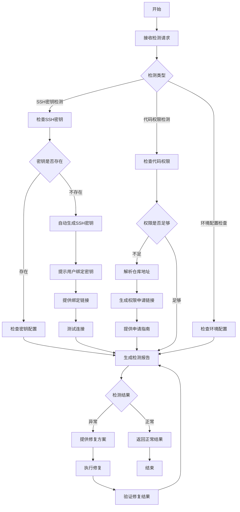

# 配置检测流程

## 流程概述

本流程定义了配置检测的标准操作流程，包括Git SSH密钥检测、代码权限检测和环境配置检查。

## 流程图



## 详细步骤

### 1. Git SSH密钥检测

**触发条件**：用户需要检查Git SSH密钥配置

**执行步骤**：
1. 检查SSH密钥文件是否存在（~/.ssh/id_rsa 和 ~/.ssh/id_rsa.pub）
2. **如果密钥不存在**：
   - 自动生成新的SSH密钥
   - 提示用户输入公司邮箱
   - 设置密钥权限（600）
   - 添加密钥到SSH代理
   - 显示公钥内容
   - 提供密钥绑定链接：https://code.byted.org/profile/keys
   - 引导用户完成绑定步骤
   - 等待用户完成绑定后测试连接
3. **如果密钥存在**：
   - 检查密钥文件权限是否正确（600 权限）
   - 检查密钥是否添加到SSH代理
   - 测试与代码平台的SSH连接
   - 验证密钥是否配置到代码平台

**输出**：
- SSH密钥状态
- 自动生成结果（如果需要）
- 密钥绑定链接：https://code.byted.org/profile/keys
- 连接测试结果
- 问题修复建议

### 2. 代码权限检测

**触发条件**：用户需要检查代码仓库访问权限

**执行步骤**：
1. 确认目标代码仓库地址
2. 尝试克隆仓库测试访问权限
3. **如果权限不足**：
   - 解析仓库地址（提取项目和仓库名称）
   - 自动生成权限申请链接
   - 提供详细的申请步骤
   - 显示其他申请方式
4. **如果权限正常**：
   - 检查当前用户的权限级别
   - 验证分支保护规则
   - 测试推送权限（如果需要）

**输出**：
- 仓库访问状态
- 当前权限级别
- 权限申请链接（如果需要）
- 申请步骤指南
- 权限问题诊断
- 解决方案

### 3. 环境配置检查

**触发条件**：用户需要检查开发环境配置

**执行步骤**：
1. 检查Git版本和配置
2. 检查操作系统和网络环境
3. 检查防火墙和代理设置
4. 检查SSL证书配置
5. 验证系统环境变量

**输出**：
- 环境配置状态
- 版本信息
- 网络连接状态
- 问题修复建议

## 检测工具

### 1. 自动化检测脚本

```bash
#!/bin/bash

# 配置检测脚本

echo "=== 配置检测工具 ==="
echo "检测时间: $(date)"
echo ""

# 1. SSH密钥检测
echo "1. SSH密钥检测"
echo "-----------------"

# 检查密钥文件
if [ -f ~/.ssh/id_rsa ]; then
    echo "✓ 私钥文件存在: ~/.ssh/id_rsa"
    # 检查权限
    PERM=$(ls -l ~/.ssh/id_rsa | awk '{print $1}')
    if [ "$PERM" == "-rw-------" ]; then
        echo "✓ 私钥权限正确: $PERM"
    else
        echo "✗ 私钥权限错误: $PERM (应为 -rw-------)"
        echo "  修复命令: chmod 600 ~/.ssh/id_rsa"
    fi
else
    echo "✗ 私钥文件不存在"
    echo "  生成命令: ssh-keygen -t rsa -b 4096 -C "your-email@bytedance.com""
fi

if [ -f ~/.ssh/id_rsa.pub ]; then
    echo "✓ 公钥文件存在: ~/.ssh/id_rsa.pub"
else
    echo "✗ 公钥文件不存在"
    echo "  生成命令: ssh-keygen -t rsa -b 4096 -C "your-email@bytedance.com""
fi

# 检查SSH代理
echo ""
echo "2. SSH代理检测"
echo "-----------------"

ssh-add -l > /dev/null 2>&1
if [ $? -eq 0 ]; then
    echo "✓ SSH代理正常运行"
    ssh-add -l
else
    echo "✗ SSH代理未运行或无密钥"
    echo "  启动命令: ssh-add ~/.ssh/id_rsa"
fi

# 测试Git连接
echo ""
echo "3. Git连接测试"
echo "-----------------"

ssh -T git@code.byted.org > /dev/null 2>&1
if [ $? -eq 1 ]; then  # 正常情况下返回1
    echo "✓ Git连接正常"
else
    echo "✗ Git连接异常"
    echo "  可能原因: 密钥未配置、网络问题、权限不足"
fi

# 检查Git配置
echo ""
echo "4. Git配置检查"
echo "-----------------"

GIT_VERSION=$(git --version 2>/dev/null)
if [ $? -eq 0 ]; then
    echo "✓ Git已安装: $GIT_VERSION"
    
    # 检查用户配置
    USER_NAME=$(git config user.name)
    USER_EMAIL=$(git config user.email)
    
    if [ -n "$USER_NAME" ]; then
        echo "✓ 用户名称已配置: $USER_NAME"
    else
        echo "✗ 用户名称未配置"
        echo "  配置命令: git config --global user.name "Your Name""
    fi
    
    if [ -n "$USER_EMAIL" ]; then
        echo "✓ 用户邮箱已配置: $USER_EMAIL"
    else
        echo "✗ 用户邮箱未配置"
        echo "  配置命令: git config --global user.email "your-email@bytedance.com""
    fi
else
    echo "✗ Git未安装"
    echo "  请安装Git后重试"
fi

# 网络连接检查
echo ""
echo "5. 网络连接检查"
echo "-----------------"

ping -c 3 code.bytedance.net > /dev/null 2>&1
if [ $? -eq 0 ]; then
    echo "✓ 网络连接正常"
else
    echo "✗ 网络连接异常"
    echo "  检查网络连接和防火墙设置"
fi

# 总结
echo ""
echo "=== 检测完成 ==="
echo "请根据检测结果进行相应的修复"
```

### 2. 权限检测工具

```bash
#!/bin/bash

# 权限检测脚本

function check_repo_access() {
    local repo_url=$1
    echo "检查仓库: $repo_url"
    
    # 尝试克隆测试
    TMP_DIR=$(mktemp -d)
    git clone --depth 1 $repo_url $TMP_DIR > /dev/null 2>&1
    
    if [ $? -eq 0 ]; then
        echo "✓ 克隆成功，权限正常"
        # 检查推送权限
        cd $TMP_DIR
        echo "test" > test.txt
        git add test.txt
        git commit -m "test" > /dev/null 2>&1
        git push origin HEAD > /dev/null 2>&1
        
        if [ $? -eq 0 ]; then
            echo "✓ 推送权限正常"
        else
            echo "⚠ 推送权限受限（可能是分支保护）"
        fi
        
        cd ..
    else
        echo "✗ 克隆失败，权限不足或地址错误"
    fi
    
    rm -rf $TMP_DIR
}

if [ $# -eq 0 ]; then
    echo "用法: $0 <repo_url>"
    exit 1
fi

check_repo_access "$1"
```

## 修复流程

### 1. SSH密钥问题修复

**执行步骤**：
1. 生成新的SSH密钥（如果不存在）
2. 修复密钥权限（如果不正确）
3. 添加密钥到SSH代理
4. 复制公钥到代码平台
5. 测试连接

**自动执行脚本**：

```bash
#!/bin/bash

# 自动配置SSH密钥脚本
echo "=== 自动SSH密钥配置 ==="

# 检查并生成SSH密钥
if [ ! -f ~/.ssh/id_rsa ]; then
    echo "生成新的SSH密钥..."
    ssh-keygen -t rsa -b 4096 -C "your-email@bytedance.com" -N "" -f ~/.ssh/id_rsa
    if [ $? -eq 0 ]; then
        echo "✓ SSH密钥生成成功"
    else
        echo "✗ SSH密钥生成失败"
        exit 1
    fi
else
    echo "✓ SSH密钥已存在"
fi

# 修复密钥权限
echo "修复密钥权限..."
chmod 600 ~/.ssh/id_rsa
chmod 644 ~/.ssh/id_rsa.pub
echo "✓ 密钥权限修复完成"

# 添加密钥到SSH代理
echo "添加密钥到SSH代理..."
ssh-add ~/.ssh/id_rsa > /dev/null 2>&1
if [ $? -eq 0 ]; then
    echo "✓ 密钥添加到SSH代理成功"
else
    echo "⚠ 密钥添加到SSH代理失败，可能需要先启动SSH代理"
    echo "  启动命令: eval \`ssh-agent -s\` && ssh-add ~/.ssh/id_rsa"
fi

# 显示公钥内容
echo "\n=== SSH公钥内容 ==="
echo "请将以下内容复制到代码平台的SSH密钥设置中："
echo "----------------------------"
cat ~/.ssh/id_rsa.pub
echo "----------------------------"
echo "\n=== SSH密钥配置步骤 ==="
echo "1. 登录代码平台：https://code.byted.org"
echo "2. 进入SSH密钥设置：https://code.byted.org/profile/keys"
echo "3. 粘贴上述公钥内容"
echo "4. 点击添加密钥按钮"
echo "5. 验证密钥是否添加成功"

# 测试连接
echo "\n测试Git连接..."
ssh -T git@code.byted.org > /dev/null 2>&1
if [ $? -eq 1 ]; then
    echo "✓ Git连接测试成功"
else
    echo "✗ Git连接测试失败"
    echo "  请确保公钥已添加到代码平台"
fi

echo "\n=== 自动配置完成 ==="
echo "请按照上述提示完成公钥配置"
```

**验证步骤**：
- 确认密钥文件存在且权限正确
- 确认SSH代理包含密钥
- 确认Git连接测试通过

### 2. 权限问题修复

**执行步骤**：
1. 确认权限不足的具体原因
2. 联系仓库管理员申请权限
3. 提供必要的个人信息
4. 等待权限审批
5. 验证权限生效

**验证步骤**：
- 确认能够成功克隆仓库
- 确认能够执行需要的操作
- 确认权限级别符合需求

### 3. 环境配置修复

**执行步骤**：
1. 安装或更新Git
2. 配置Git用户信息
3. 检查网络连接
4. 配置代理（如果需要）
5. 修复防火墙设置

**验证步骤**：
- 确认Git版本符合要求
- 确认网络连接正常
- 确认环境变量配置正确

## 异常处理

### 1. SSH连接失败

**处理步骤**：
1. 检查网络连接
2. 检查SSH配置
3. 检查防火墙设置
4. 重新生成密钥
5. 重新配置代码平台

**输出**：
- 错误原因分析
- 修复步骤
- 验证方法

### 2. 权限申请被拒

**处理步骤**：
1. 确认申请信息是否完整
2. 了解拒绝原因
3. 重新提交申请或提供更多信息
4. 寻求其他解决方案

**输出**：
- 拒绝原因
- 解决建议
- 替代方案

### 3. 环境配置冲突

**处理步骤**：
1. 识别冲突原因
2. 分析配置依赖
3. 制定修复方案
4. 执行修复
5. 验证修复结果

**输出**：
- 冲突原因
- 修复方案
- 验证结果

## 最佳实践

1. **定期检测**：定期运行配置检测，确保环境正常
2. **备份配置**：备份SSH密钥和Git配置
3. **使用标准工具**：使用官方推荐的Git客户端和工具
4. **遵循安全规范**：保持密钥安全，定期更换
5. **文档记录**：记录配置变更和问题解决方案
6. **权限最小化**：只申请必要的权限级别

## 度量指标

### 1. 检测覆盖率

- **SSH密钥检测覆盖率**：检测到的SSH配置问题比例
- **权限检测覆盖率**：检测到的权限问题比例
- **环境检测覆盖率**：检测到的环境配置问题比例

### 2. 修复成功率

- **SSH问题修复率**：成功修复的SSH问题比例
- **权限问题修复率**：成功修复的权限问题比例
- **环境问题修复率**：成功修复的环境问题比例

### 3. 用户满意度

- **检测准确性**：检测结果的准确程度
- **修复有效性**：修复方案的有效程度
- **响应时间**：从检测到修复的时间

## 持续改进

1. **工具优化**：不断改进检测工具和脚本
2. **流程简化**：简化检测和修复流程
3. **自动化**：增加自动化检测和修复能力
4. **知识库**：建立常见问题和解决方案库
5. **培训**：提供配置管理培训

## 总结

配置检测流程确保用户的开发环境配置正确，能够正常访问代码仓库。通过标准化的检测和修复流程，提高了开发环境的可靠性和稳定性，减少了因配置问题导致的开发障碍。
