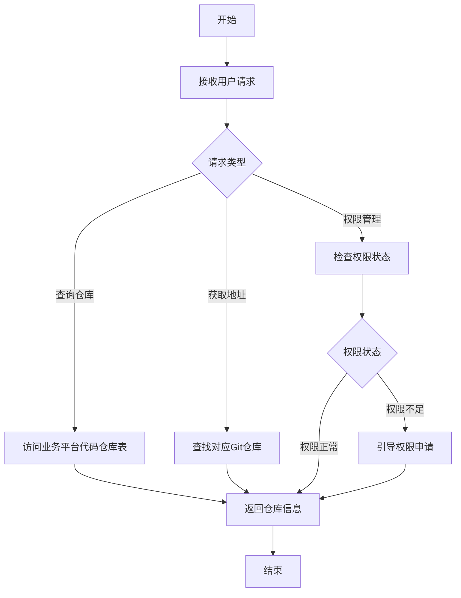

# 代码仓库管理流程

## 流程概述

本流程定义了代码仓库管理的标准操作流程，包括业务平台代码仓库查询、Git仓库地址获取和权限管理。

## 流程图



## 详细步骤

### 1. 业务平台代码仓库查询

**触发条件**：用户需要了解某个业务平台的代码仓库信息

**执行步骤**：
1. 接收用户请求，确认业务平台名称
2. 打开业务平台代码仓库表文档：[https://bytedance.larkoffice.com/wiki/RwpAwBKQqiu3zgkUKF1cexa6n1u](https://bytedance.larkoffice.com/wiki/RwpAwBKQqiu3zgkUKF1cexa6n1u)
3. 在文档中查找对应业务平台的记录
4. 提取Git仓库地址和相关信息
5. 验证仓库地址的有效性
6. 返回完整的仓库信息给用户

**输出**：
- 业务平台名称
- Git仓库地址（SSH和HTTPS格式）
- 仓库描述
- 管理员信息

### 2. Git仓库地址获取

**触发条件**：用户需要获取特定业务平台的Git仓库地址

**执行步骤**：
1. 确认用户需要的业务平台
2. 查询业务平台代码仓库表
3. 获取对应仓库的SSH和HTTPS地址
4. 验证地址的可访问性
5. 提供地址给用户，并推荐使用SSH格式
6. 提供克隆仓库的命令示例

**输出**：
- SSH格式仓库地址
- HTTPS格式仓库地址
- 克隆命令示例
- 推荐使用的地址格式

### 3. 仓库权限管理

**触发条件**：用户需要管理仓库权限或遇到权限问题

**执行步骤**：
1. 确认用户的权限需求
2. 检查用户当前权限状态
3. 如果权限不足：
   - **自动解析仓库地址**
     - 从 Git URL 中提取项目和仓库名称
     - 支持 SSH 和 HTTPS 格式
   - **自动生成权限申请链接**
     - 代码平台权限申请页面：`https://code.byted.org/<project>/<repo>/project_members`
   - **提供详细申请指南**
     - 方式一：访问权限申请页面
     - 方式二：仓库页面直接申请
     - 方式三：联系仓库管理员
   - **显示申请步骤**
     1. 点击权限申请链接
     2. 点击 'Request Access' 按钮
     3. 填写申请理由
     4. 提交申请并等待审批
4. 如果权限正常：
   - 验证权限有效性
   - 提供权限管理建议
5. 跟踪权限申请进度
6. 确认权限生效

**输出**：
- 当前权限状态
- 权限申请链接（自动生成）
- 申请步骤指南
- 管理员联系方式
- 权限生效确认

### 4. 权限申请链接生成

**触发条件**：用户需要申请代码仓库权限

**执行步骤**：
1. 确认目标仓库地址
2. 解析仓库路径信息
3. 生成权限申请链接
4. 提供申请指南

**输出**：
- 仓库权限申请链接
- 申请步骤指南
- 所需信息清单

**权限申请链接格式**：
- 代码平台权限申请：`https://code.byted.org/<project>/<repo>/project_members`

## 权限检查流程

### 1. 前置检查

**执行步骤**：
1. 检查用户是否有Git账号
2. 检查用户是否配置了SSH密钥
3. 检查用户网络连接状态

**输出**：
- 前置检查结果
- 问题修复建议

### 2. 仓库访问测试

**执行步骤**：
1. 尝试克隆目标仓库
2. 检查克隆是否成功
3. 分析失败原因
4. 如果权限不足，生成权限申请链接

**输出**：
- 访问测试结果
- 失败原因分析
- 解决方案
- 权限申请链接

### 3. 权限级别确认

**执行步骤**：
1. 确认用户需要的权限级别
2. 检查当前权限级别
3. 评估权限需求的合理性
4. 生成对应权限级别的申请链接

**输出**：
- 当前权限级别
- 所需权限级别
- 权限申请建议
- 权限申请链接

## 异常处理

### 1. 仓库表访问失败

**处理步骤**：
1. 检查网络连接
2. 确认文档地址是否正确
3. 尝试备用访问方式
4. 联系文档管理员

**输出**：
- 错误原因
- 备用方案
- 联系信息

### 2. 仓库地址不存在

**处理步骤**：
1. 确认业务平台名称是否正确
2. 检查仓库表是否有更新
3. 联系业务平台负责人
4. 提供临时解决方案

**输出**：
- 错误原因
- 解决建议
- 联系方式

### 3. 权限申请失败

**处理步骤**：
1. 确认申请信息是否完整
2. 检查审批流程状态
3. 联系审批人
4. 提供替代方案

**输出**：
- 失败原因
- 解决建议
- 联系信息

## 最佳实践

1. **信息准确性**：确保提供的仓库地址和信息准确无误
2. **安全性**：优先推荐使用SSH格式的仓库地址
3. **权限最小化**：只申请必要的权限级别
4. **流程透明**：清晰说明权限申请流程和时间预期
5. **问题追踪**：跟踪权限申请和解决进度
6. **文档更新**：定期更新业务平台代码仓库表

## 工具集成

### 1. 仓库查询工具

- **飞书文档**：存储业务平台代码仓库表
- **Git客户端**：验证仓库地址和权限
- **权限管理系统**：管理用户权限

### 2. 自动化脚本

```bash
#!/bin/bash

# 仓库查询脚本
function query_repo() {
    local platform=$1
    echo "查询业务平台: $platform"
    echo "正在查询仓库表..."
    echo "请访问飞书文档获取仓库地址: https://bytedance.larkoffice.com/wiki/RwpAwBKQqiu3zgkUKF1cexa6n1u"
    echo "在文档中查找 '$platform' 相关的仓库记录"
    echo ""
    echo "=== 操作步骤 ==="
    echo "1. 打开上述飞书文档链接"
    echo "2. 在文档中搜索业务平台名称: $platform"
    echo "3. 找到对应的Git仓库地址"
    echo "4. 复制仓库地址并使用"
    echo ""
    echo "=== 示例仓库地址格式 ==="
    echo "SSH格式: git@code.byted.org:<project>/<repo>.git"
    echo "HTTPS格式: https://code.byted.org/<project>/<repo>.git"
}

# 权限检查脚本
function check_permission() {
    local repo_url=$1
    echo "检查仓库权限: $repo_url"
    # 尝试克隆测试
    git clone --depth 1 $repo_url /tmp/test_repo > /dev/null 2>&1
    if [ $? -eq 0 ]; then
        echo "✓ 权限正常"
        rm -rf /tmp/test_repo
    else
        echo "✗ 权限不足或地址错误"
        # 生成权限申请链接
        if [[ $repo_url =~ git@code\.byted\.org:(.*)/(.*)\.git ]]; then
            local project=${BASH_REMATCH[1]}
            local repo=${BASH_REMATCH[2]}
            echo "\n=== 权限申请信息 ==="
            echo "项目: $project"
            echo "仓库: $repo"
            echo "权限申请链接:"
            echo "  代码平台: https://code.byted.org/$project/$repo/project_members"
            echo "\n请使用以上链接申请仓库权限"
        elif [[ $repo_url =~ https://code\.byted\.org/(.*)/(.*)\.git ]]; then
            local project=${BASH_REMATCH[1]}
            local repo=${BASH_REMATCH[2]}
            echo "\n=== 权限申请信息 ==="
            echo "项目: $project"
            echo "仓库: $repo"
            echo "权限申请链接:"
            echo "  代码平台: https://code.byted.org/$project/$repo/project_members"
            echo "\n请使用以上链接申请仓库权限"
        else
            echo "\n=== 权限申请信息 ==="
            echo "请先从飞书文档获取正确的仓库地址:"
            echo "https://bytedance.larkoffice.com/wiki/RwpAwBKQqiu3zgkUKF1cexa6n1u"
            echo "\n然后使用获取到的仓库地址重新检查权限"
        fi
    fi
}

# 主函数
if [ "$1" == "query" ]; then
    query_repo "$2"
elif [ "$1" == "check" ]; then
    check_permission "$2"
else
    echo "用法: $0 query <platform> 或 $0 check <repo_url>"
fi
```

## 度量指标

### 1. 流程效率

- **查询响应时间**：从接收到请求到返回结果的时间
- **权限申请处理时间**：从申请到权限生效的时间
- **问题解决率**：成功解决的权限问题比例

### 2. 用户满意度

- **查询准确率**：提供准确仓库信息的比例
- **权限申请成功率**：成功申请到权限的比例
- **用户反馈评分**：用户对服务的满意度评分

## 持续改进

1. **流程优化**：定期回顾和优化流程步骤
2. **工具升级**：引入更高效的仓库管理工具
3. **自动化**：增加自动化检查和处理能力
4. **知识库**：建立常见问题和解决方案库
5. **培训**：提供仓库管理和权限申请培训

## 总结

代码仓库管理流程确保用户能够快速、准确地获取业务平台的代码仓库信息，并解决相关的权限问题。通过标准化的流程和工具集成，提高了代码仓库管理的效率和可靠性。
